# NGO Salesforce Skills

**Author:** Brian Miller (Senion Solution Engineer @ Salesforce) 

**Co-Author:** Opus 4.6

A curated collection of Cursor Agent Skills I've built and maintain for Salesforce development on the Nonprofit Cloud platform. These aren't just coding helpers -- they represent a fundamentally different way of working with Salesforce.

What this collection makes possible:

- **Fully automated demo generation** — hand Cursor a set of raw discovery notes from a client meeting and it produces a complete, presentation-ready demo: a structured narrative with named personas, a verbatim step-by-step click path, seeded Salesforce data matched to the story, and a Playwright test suite that runs as an automated pre-flight check before you walk into the room. What used to take days of prep now takes minutes.
- **Autonomous demo validation and repair** — `sf-demo-validate` reads your demo script and simulates delivering the demo end-to-end: it walks every click path step, takes Playwright screenshots to visually verify the UI matches what you expect, executes the full demo flow as the specific named demo user (shift sign-ups, intake form submissions), and loads the Experience Cloud portal as both a guest and a logged-in member. Anything that fails, it fixes: missing metadata gets generated and deployed, stale data gets re-seeded, broken flows get repaired, permission gaps get patched. Then it re-validates and gives you a scored pass/fail report -- all without a human touching the org.
- **Integration storytelling and "art of the possible" simulation** — for demo environments where a live integration doesn't exist, the agent can show what an integration *would* look like: a Mermaid sequence diagram with a verbatim presenter talking track and a prepared answer for "is this live?", or Anonymous Apex that simulates the integration as real data (fake inbound payloads, records stamped as if they arrived from an external system, Platform Events fired as if triggered by third-party software). The audience sees the capability. No external system required.
- **Deep Salesforce domain expertise on demand** — 47 skills covering every layer of the Salesforce platform: Apex, LWC, Flow, Metadata, SOQL, Deployment, Data Operations, Permissions, Integration, Connected Apps, Data Cloud (all 5 phases), Agentforce (build, test, observe, persona, script), OmniStudio (OmniScript, Integration Procedure, Data Mapper, FlexCard), and the full Nonprofit Cloud stack (fundraising, grants, program management, Experience Cloud). Each skill encodes the standards, patterns, and scoring rubrics I use -- so the agent produces production-quality output, not generic boilerplate.
- **End-to-end nonprofit-specific intelligence** — from NPSP migration guidance and NPC data modeling to donor lifecycle management, grant pipelines, volunteer intake, program enrollment, and the portal experiences that serve constituents -- the agent knows the nonprofit platform the way a specialized architect does.

These skills encode my approach to Salesforce architecture, coding standards, and demo delivery into reusable instructions that give any AI agent the domain knowledge to work the way I would -- with the depth, precision, and nonprofit context that generic AI assistance can't provide. The skills are written in standard markdown and work identically in **Cursor** (native skill system, auto-triggered) and **Claude** (via Claude Projects or direct conversation). See [CLAUDE.md](CLAUDE.md) for Claude-specific setup.

## Getting Started

Skills work in both **Cursor** and **Claude**. The SKILL.md files are standard markdown -- no conversion needed.

### Cursor

**Install** — open Cursor and prompt:

```
Clone https://github.com/brianmiller_sfemu/NGOsfskills.git into my
Cursor skills directory and set up all the skills so they're available
in my environment.
```

**Verify** — prompt with any trigger phrase:

```
Write an Apex class that handles volunteer intake
```

The `sf-apex` skill activates automatically and follows its 5-phase workflow and 150-point scoring rubric.

**Update** — prompt:

```
Pull the latest changes from the NGOsfskills repo and update my Cursor skills.
```

---

### Claude

> **Note:** Unlike Cursor, Claude cannot clone repositories or install files automatically. The setup below is a one-time manual process (~2 minutes) after which Claude routes and applies skills identically to Cursor.

**Claude Projects (recommended)** — full automatic skill routing, persistent across all conversations:

1. In [Claude.ai](https://claude.ai), create a new Project (e.g., `NGO Salesforce Skills`)
2. Upload all `SKILL.md` files from the `skills/` folder as project knowledge
3. Paste the project instructions from [CLAUDE.md](CLAUDE.md) into **Edit project instructions**

Once set up, Claude routes to the right skill automatically based on your prompt — no explicit invocation needed. You can also be direct:

```
Using sf-demo-author, take these notes and generate a demoscript.md: [notes]
```

**Claude without Projects** — paste a single skill's content at the start of a conversation for focused sessions. See [CLAUDE.md](CLAUDE.md).

**Claude API / custom integrations** — generate a bundled system prompt from all skills:

```bash
./scripts/generate-claude-bundle.sh > claude-system-prompt.txt
./scripts/generate-claude-bundle.sh --domain nonprofit > claude-nonprofit-bundle.txt
./scripts/generate-claude-bundle.sh --skill sf-demo-author > claude-demo-author.txt
```

---

## How It Works: End-to-End Demo Workflow

Once the skills are installed, the full demo lifecycle runs through a 7-step pipeline. You provide raw notes from a client meeting, and the agent handles everything from there -- connecting to your org, building the demo script, seeding data, validating the environment, and producing a presenter-ready package. Here's the ideal workflow:

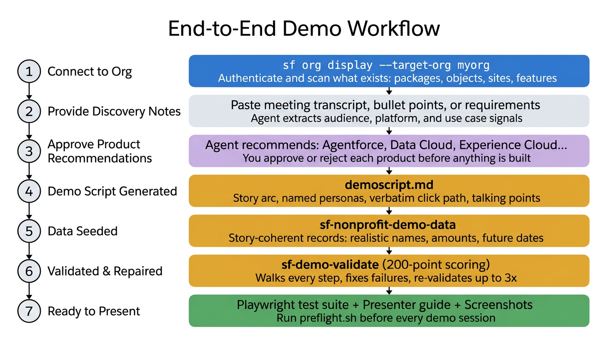

### Step 1: Connect to the org

Before anything else, the agent authenticates to your Salesforce org and runs a baseline scan. It discovers what's already there -- installed packages (NPC, NPSP, V4S), custom objects, active Experience Cloud sites, whether Person Accounts are enabled, and which add-on products (Agentforce, Data Cloud, OmniStudio) are provisioned. This baseline informs every decision downstream.

```
Connect to my org "bth-demo" and show me what's installed
```

### Step 2: Provide discovery notes

Paste in whatever you have -- a meeting transcript, bullet points from a discovery call, an email thread, or even a rough outline. The agent reads through it and extracts what it needs: who's in the audience, what they care about, which Salesforce products are relevant, what the core use case is, and where the "wow moment" should land.

```
Here are my notes from the BTH discovery call:
- Audience: VP of Programs, IT Director, 2 volunteer coordinators
- They manage 200+ volunteers across 5 sites
- Pain: volunteer scheduling is manual, coordinators email spreadsheets
- Want to see: volunteer self-service portal, shift sign-up, intake automation
- Interested in AI for matching volunteers to programs
```

### Step 3: Approve product recommendations

Based on your notes and the org baseline, the agent recommends which Salesforce products to include in the demo. It switches to plan mode and presents a structured list -- products already enabled in the org, products it recommends adding (with setup effort estimates), and products it's not recommending. You approve or reject each one before anything gets built. This prevents scope creep and ensures the demo stays focused on what the audience actually wants to see.

### Step 4: Demo script generated

The agent produces a complete `demoscript.md` -- a structured document with a narrative story arc (Situation, Challenge, Journey, Resolution), named personas with realistic details (not "User 1"), and a verbatim click-by-click path that a presenter can follow without guesswork. Every step includes the exact app, tab, button, field, and value to interact with, plus business-value talking points tied to the story. The script also includes YAML frontmatter listing demo users, a prerequisites section, data seed requirements, and a teardown section for cleanup.

### Step 5: Data seeded

The agent reads the personas and data requirements from the demoscript and generates story-coherent Salesforce records. Volunteers have real names, realistic application dates, and tutoring backgrounds that match the story. Shifts are future-dated 7-21 days out so they always look fresh. Gift histories span multiple years with plausible amounts. Everything is scoped to `@demo.` email domains so teardown never touches real data. The agent seeds the data using Anonymous Apex, `sf data` CLI commands, or JSON tree imports -- whatever fits the data shape.

### Step 6: Validated and repaired

`sf-demo-validate` reads the demoscript and systematically walks every step against the live org. It checks platform prerequisites, metadata, data quality, permissions, automations, UI rendering, Experience Cloud sites, and end-to-end user simulations (actually submitting forms, signing up for shifts, creating records as specific demo personas). When something fails -- a missing field, a stale record, a broken flow, a permission gap -- it delegates the fix to the appropriate skill, applies it, and re-validates. This loop runs up to 3 times before escalating anything it can't fix. The result is a scored pass/fail report across all validation categories.

### Step 7: Ready to present

The agent generates a Playwright test suite (`demo-preflight.spec.js`) that you run before every demo session as an automated pre-flight check. It also produces a `PRESENTER-GUIDE.md` with embedded screenshots, per-step talking points, and a quick-reference table. Run `scripts/preflight.sh` before you walk into the room -- if all tests pass, you're ready. If any fail, the report tells you exactly what broke and what to fix.

```bash
./scripts/preflight.sh --target-org bth-demo
# ✅ All 12 tests passed — ready to demo
```

### What this looks like in practice

The entire workflow -- from pasting discovery notes to having a validated, presenter-ready demo -- typically takes **15-30 minutes** of hands-on time. The agent does the heavy lifting: building the narrative, generating metadata, seeding data, and validating the environment. You review, approve product recommendations, and make any adjustments to the story. What used to take days of manual prep now fits into a single working session.

---

## Repository Structure

```
skills/                          # Salesforce-domain skills (47 skills)
CLAUDE.md                        # Claude setup guide (Projects, per-conversation, API)
scripts/
  generate-claude-bundle.sh      # Generates a bundled Claude system prompt from all skills
  nonprofit-knowledge-engine.py  # Scrapes SF docs, compartmentalizes NPSP vs NPC, builds keyword index
  refresh-nonprofit-content.sh   # One-command refresh for release-day updates
  requirements-knowledge-engine.txt  # Python dependencies for the knowledge engine
assets/
  images/                        # Rendered architecture diagrams (generated from Mermaid source)
content/                         # Auto-generated knowledge base (populated by the engine)
  keyword-index.json             # Keyword→skill routing index (135+ keywords across 7 skills)
  npsp/                          # NPSP-classified content sections
  npc/                           # NPC-classified content sections
  shared/                        # Cross-platform content sections
  npsp-vs-npc-comparison.md      # Implementation rules for platform separation
.cursor/
  hooks.json                     # Cursor hook config for auto-skill-routing
  hooks/nonprofit-skill-router.* # Hook that auto-detects nonprofit keywords in prompts
  rules/nonprofit-auto-router.md # Always-applied rule with keyword index for auto-routing
  rules/org-discovery.mdc        # Always-applied rule: org connection, product approval, query-before-create
```

## Architecture

The skills are organized into layered domains that mirror the Salesforce platform stack. The agent reads a user's prompt, matches it against each skill's trigger conditions, and activates the appropriate skill. Skills that share boundaries have explicit routing rules so only one fires at a time.

### Domain overview

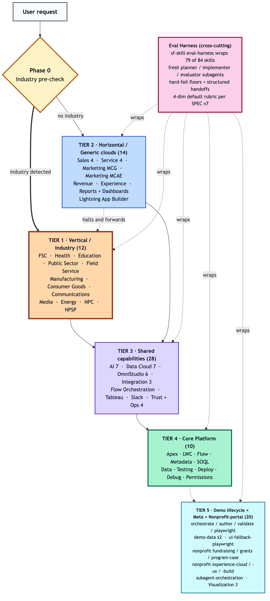

> **Core Platform** is the foundation -- every other Salesforce domain depends on it. **Agentforce**, **Nonprofit Cloud**, and **OmniStudio** each extend Core with domain-specific capabilities. **Data Cloud** feeds telemetry into Agentforce observability. **Integration & Security** provides external connectivity via Apex callouts. The **Demo Workflow** is a 4-skill pipeline: raw notes flow through `sf-demo-author` (demoscript authoring), `sf-nonprofit-demo-data` (data seeding), and `sf-demo-playwright` (test suite + presenter guide), before **Demo Validation** (`sf-demo-validate`) validates the entire stack end-to-end. **Visualization & Docs** is a cross-cutting utility.

### Demo Validation in the architecture

Demo Validation (`sf-demo-validate`) is the skill that ties everything together. It operates as an autonomous validation and repair loop that exercises every other domain:

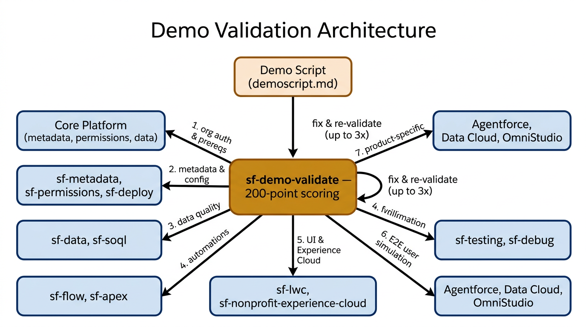

The demo script (`demoscript.md`) is the source of truth. It defines the demo story -- the narrative, the personas, and the step-by-step walkthrough. `sf-demo-validate` reads this script and systematically validates that the org can deliver every step:

1. **Org connection & prerequisites** -- confirms `sf` CLI auth, org type, installed packages, and platform features (Person Accounts, Record Types, queues, etc.)
2. **Metadata & configuration** -- verifies custom objects, fields, page layouts, apps, and permission sets exist and are correctly configured
3. **Data quality & freshness** -- checks that demo data is complete, future-dated, free of stale artifacts, and correctly related
4. **Automations** -- validates Flows, triggers, and scheduled jobs fire as expected
5. **UI & Experience Cloud** -- HTTP-pings public sites, verifies guest and member portal pages render with live data
6. **End-to-end user simulation** -- executes transactional demo paths (form submissions, record creation) as specific demo personas via Anonymous Apex
7. **Product-specific checks** -- validates Agentforce agents, Data Cloud pipelines, OmniStudio components, and any other products referenced in the script

When a step fails, `sf-demo-validate` delegates the fix to the appropriate domain skill (e.g., `sf-apex` for code fixes, `sf-permissions` for access issues, `sf-data` for missing records), then re-validates -- looping up to 3 times before escalating. The result is a scored pass/fail report covering all 10 validation categories.

---

## Salesforce Skills (`skills/`)

### Agentforce & AI

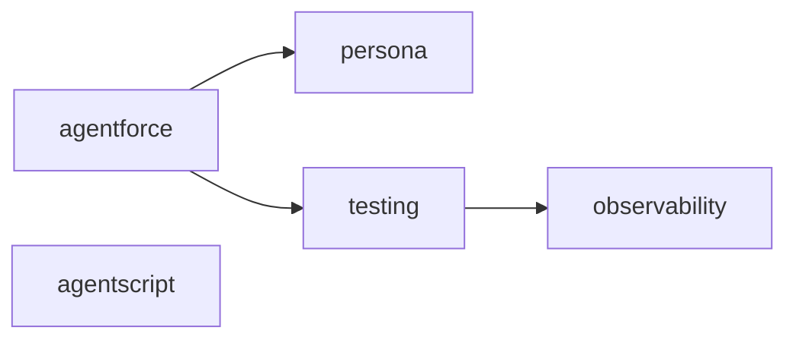

| Skill | Description |
|---|---|
| **sf-ai-agentforce** | Build Agentforce agents via the Setup UI -- topics, actions, PromptTemplates, and `.genAiFunction` / `.genAiPlugin` metadata. |
| **sf-ai-agentforce-observability** | Extract and analyze Agentforce session traces (STDM data) from Data Cloud, including `.parquet` telemetry files. |
| **sf-ai-agentforce-persona** | Deep persona design for Agentforce agents with a 50-point scoring rubric covering identity, tone, voice, and register. |
| **sf-ai-agentforce-testing** | Dual-track testing workflow for Agentforce agents with 100-point scoring -- test specs, topic routing validation, and coverage analysis via `sf agent test`. |
| **sf-ai-agentscript** | Author deterministic Agentforce agents using the Agent Script DSL (`.agent` files) -- FSM-based state machines, slot filling, and instruction resolution. |

<details>
<summary><strong>Under the hood</strong></summary>

The Agentforce skills split agent development into two tracks -- **declarative** (Setup UI) and **programmatic** (Agent Script DSL) -- that never overlap.

- **sf-ai-agentforce** is the entry point. It owns the Setup UI workflow: creating topics, mapping actions to Apex/Flow invocables, authoring PromptTemplates, and generating `.genAiFunction` / `.genAiPlugin` metadata XML. It requires API v66.0+ (Spring '26). When the user needs to define the agent's personality, it hands off to **sf-ai-agentforce-persona**, which runs a 50-point scoring rubric across identity, tone, voice register, and guardrails.
- **sf-ai-agentforce-testing** takes over once the agent is built. It runs `sf agent test` with structured test specs that validate topic routing, action invocation, and response quality using a dual-track workflow (unit tests for individual topics + integration tests for multi-turn conversations). When tests fail or need deeper analysis, it delegates to **sf-ai-agentforce-observability**.
- **sf-ai-agentforce-observability** extracts STDM (Session Trace Data Model) data from Data Cloud, parses `.parquet` telemetry files, and produces session timeline analysis, step distribution reports, and message-level debugging. It includes Python scripts for auth, Data Cloud querying, and analysis.
- **sf-ai-agentscript** is fully independent -- it covers the code-first FSM approach using `.agent` files, slot filling, instruction resolution, and the `sf agent generate/publish` CLI. It never triggers alongside the Setup UI skill.

</details>

### Core Platform Development

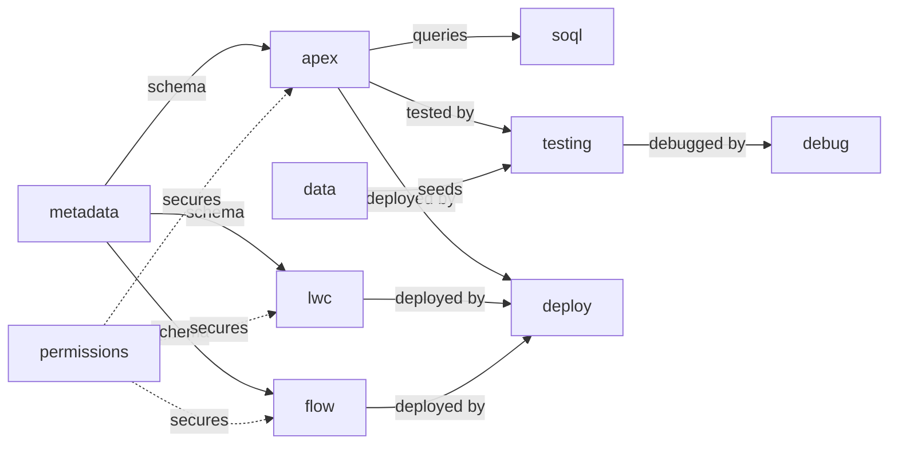

| Skill | Description |
|---|---|
| **sf-apex** | Generate and review Apex classes, triggers, batch/queueable/schedulable jobs, and test classes with a 150-point scoring rubric. |
| **sf-lwc** | Lightning Web Components using the PICKLES methodology with 165-point scoring -- wire service, SLDS, Jest tests, and `.js-meta.xml` config. |
| **sf-flow** | Create and validate Salesforce Flows (record-triggered, screen, autolaunched, scheduled) and `.flow-meta.xml` files with 110-point scoring. |
| **sf-metadata** | Generate and query Salesforce metadata -- custom objects, fields, validation rules, and associated `-meta.xml` files with 120-point scoring. |
| **sf-soql** | SOQL/SOSL query generation, optimization, relationship queries, aggregates, and performance analysis with 100-point scoring. |
| **sf-testing** | Apex test execution, code coverage analysis, and test-fix loops with 120-point scoring for `*Test.cls` files. |
| **sf-debug** | Debug log analysis and troubleshooting -- governor limits, stack traces, and `.log` files with 100-point scoring. |
| **sf-deploy** | DevOps automation using `sf` CLI v2 -- metadata deploys, scratch orgs, sandboxes, and CI/CD pipelines. |
| **sf-data** | Salesforce data operations with 130-point scoring -- test data creation, bulk import/export, `sf data` CLI commands, and data factory patterns. |
| **sf-permissions** | Permission Set analysis, hierarchy visualization, and access auditing for `.permissionset-meta.xml` and `.permissionsetgroup-meta.xml`. |

<details>
<summary><strong>Under the hood</strong></summary>

Core Platform is 10 skills that mirror the Salesforce development lifecycle. They follow a build-test-debug-deploy loop:

- **sf-metadata** starts the cycle. It generates custom objects, fields, validation rules, and all `-meta.xml` files. Its output defines the schema that **sf-apex**, **sf-lwc**, and **sf-flow** build on top of.
- **sf-apex** generates and reviews Apex using a 5-phase workflow: (1) gather requirements, (2) scaffold structure, (3) generate code with a 150-point scoring rubric across 8 categories, (4) generate matching test class, (5) validate and deploy. It enforces SOLID principles, bulkification, governor limit awareness, and the Trigger Action Framework (TAF) pattern for triggers.
- **sf-lwc** uses the **PICKLES methodology** -- a structured architecture framework for component design. It scores across 8 categories up to 165 points, covering wire service patterns, SLDS 2 styling with dark mode support, Apex/GraphQL integration, event handling (CustomEvent, LMS, pubsub), lifecycle management, Jest testing, and WCAG accessibility.
- **sf-flow** creates Flow XML for all flow types (record-triggered, screen, autolaunched, scheduled) with 110-point scoring. It generates the full `.flow-meta.xml` and validates decision logic, loop patterns, and fault paths.
- **sf-soql** handles query generation separately from Apex. It optimizes relationship queries, aggregates, TYPEOF, and query plan analysis. It triggers on `.soql` files or when the user is purely focused on query construction.
- **sf-testing** runs Apex tests via `sf apex run test`, analyzes code coverage, and enters a test-fix loop: run tests, identify failures, fix code, re-run. It scores at 120 points and works with `*Test.cls` files.
- **sf-debug** takes over when tests fail unexpectedly. It parses debug logs, identifies governor limit issues, reads stack traces, and analyzes execution timing. It scores at 100 points.
- **sf-deploy** handles the deployment pipeline using `sf` CLI v2 -- metadata deploys, scratch org creation, sandbox management, and CI/CD pipeline configuration.
- **sf-data** manages data operations: test data factories, bulk import/export, `sf data` CLI commands, and JSON tree files for hierarchical data seeding.
- **sf-permissions** audits access. It answers "who has access to X?" by analyzing permission sets, permission set groups, and their hierarchies. It reads `.permissionset-meta.xml` files and can visualize the permission inheritance chain.

The routing rules ensure clean handoffs: Apex-only work stays in `sf-apex`, SOQL-only queries go to `sf-soql`, test execution goes to `sf-testing`, and deployment goes to `sf-deploy`. They never step on each other.

</details>

### Integration & Security

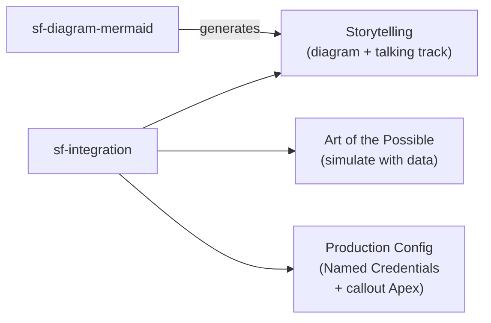

| Skill | Description |
|---|---|
| **sf-integration** | Integration architecture with three modes: **Storytelling** (Mermaid diagram + presenter talking track), **Art of the Possible** (simulate the integration with Anonymous Apex, fake payloads, and Platform Events), and **Production Config** (Named Credentials, External Services, REST/SOAP callouts, CDC). 120-point scoring applies to production mode. |
| **sf-connected-apps** | Connected Apps and OAuth configuration with 120-point scoring -- OAuth flows, JWT bearer auth, and `.connectedApp-meta.xml` files. Production orgs only; not required in demo environments. |

<details>
<summary><strong>Under the hood</strong></summary>

**sf-integration** determines which mode to apply before generating any artifacts:

- **Mode 1 — Storytelling**: The user wants to explain or discuss what an integration would look like. The skill generates a Mermaid sequence diagram (delegated to `sf-diagram-mermaid`) paired with a presenter talking track and a prepared "If They Ask Is This Live?" response. No configuration is generated.
- **Mode 2 — Art of the Possible**: The user wants the integration to feel real during a demo without a live connection. The skill generates Anonymous Apex that simulates the integration as real data: fake inbound payloads (a payment processor confirming a gift), seed records stamped as if they arrived from an external CRM (with realistic external IDs and source system fields), Platform Events that fire as if triggered by third-party software, and integration log records that make outbound calls visible in the UI. Each pattern ships with a presenter talking track.
- **Mode 3 — Production Config**: The user explicitly asks to build the real integration. Full 5-phase workflow: Named Credentials (OAuth 2.0, JWT Bearer, Certificate, API Key), External Service registrations from OpenAPI specs, REST/SOAP callout patterns (sync and async Queueable), and Platform Event/CDC configuration. 120-point scoring applies.

**sf-connected-apps** is the companion skill for production auth. It owns the authentication layer before `sf-integration` builds the callout on top: OAuth flows, `.connectedApp-meta.xml`, and JWT bearer cert setup. In demo environments, this skill is rarely needed because Mode 1 and Mode 2 don't require live OAuth flows.

</details>

### Data Cloud

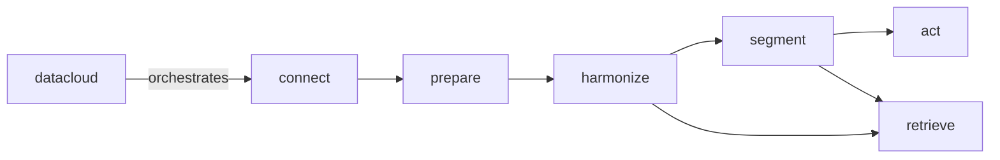

| Skill | Description |
|---|---|
| **sf-datacloud** | Product orchestrator for the full Data Cloud lifecycle: connect, prepare, harmonize, segment, act. Routes to phase-specific skills. |
| **sf-datacloud-connect** | Data Cloud Connect phase -- manage connections, connectors, source objects, and database configuration. |
| **sf-datacloud-prepare** | Data Cloud Prepare phase -- data streams, DLOs, transforms, Document AI, and ingestion configuration. |
| **sf-datacloud-harmonize** | Data Cloud Harmonize phase -- DMOs, field mappings, relationships, identity resolution, and unified profiles. |
| **sf-datacloud-retrieve** | Data Cloud Retrieve phase -- SQL queries, async queries, vector search, search-index workflows, and metadata introspection. |
| **sf-datacloud-segment** | Data Cloud Segment phase -- segment creation, calculated insights, audience SQL, and membership analysis. |
| **sf-datacloud-act** | Data Cloud Act phase -- activations, activation targets, data actions, and downstream delivery. |

<details>
<summary><strong>Under the hood</strong></summary>

Data Cloud uses a **hub-and-spoke orchestrator pattern**. The orchestrator skill decides which phase-specific skill to invoke:

- **sf-datacloud** is the orchestrator. It doesn't execute commands itself -- it determines which phase the user's work falls into and routes accordingly. It also handles cross-phase concerns: data spaces, data kits, multi-phase pipeline setup, and troubleshooting that spans phases. It uses the external `sf data360` community CLI plugin as its runtime.
- The 5 pipeline phases execute in order: **Connect** (set up source systems and connectors) -> **Prepare** (create data streams, DLOs, transforms) -> **Harmonize** (map to DMOs, configure identity resolution, build unified profiles) -> **Segment** (create audiences, calculated insights) -> **Act** (activate segments to targets, configure data actions).
- **sf-datacloud-retrieve** is cross-cutting -- it serves Harmonize and Segment by providing Data Cloud SQL queries, async query execution, vector search, and metadata introspection. It's the "read" layer that any phase can call into.

Each phase skill uses `sf data360` subcommands specific to its domain. The orchestrator's job is to prevent the user from accidentally working in the wrong phase (e.g., trying to create segments before harmonization is complete).

</details>

### Industries / OmniStudio

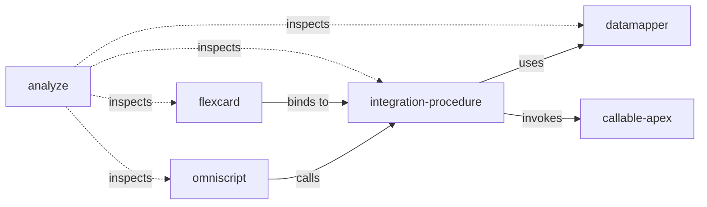

| Skill | Description |
|---|---|
| **sf-industry-commoncore-callable-apex** | `System.Callable` class generation and review with 120-point scoring -- OmniStudio extensions, `VlocityOpenInterface` migration. |
| **sf-industry-commoncore-datamapper** | OmniStudio Data Mapper (formerly DataRaptor) creation -- Extract, Transform, Load, and Turbo Extract configurations with 100-point scoring. |
| **sf-industry-commoncore-flexcard** | OmniStudio FlexCard creation with 130-point scoring -- data source bindings, Integration Procedure wiring, and accessibility. |
| **sf-industry-commoncore-integration-procedure** | OmniStudio Integration Procedure orchestration with 110-point scoring -- Data Mapper steps, Remote Actions, and HTTP callouts. |
| **sf-industry-commoncore-omniscript** | OmniStudio OmniScript creation with 120-point scoring -- guided digital experiences, multi-step forms, and element configuration. |
| **sf-industry-commoncore-omnistudio-analyze** | Cross-cutting OmniStudio analysis -- namespace detection (Core vs vlocity_cmt vs vlocity_ins), dependency visualization, and impact analysis. |

<details>
<summary><strong>Under the hood</strong></summary>

OmniStudio skills mirror the component execution stack -- each skill owns one layer:

- **sf-industry-commoncore-omniscript** is the top of the stack. OmniScripts are the declarative equivalent of Screen Flows: multi-step, interactive guided experiences. The skill generates step flows, element configurations, and conditional branching. It scores at 120 points across 6 categories. When an OmniScript needs server-side logic, it calls down to an Integration Procedure.
- **sf-industry-commoncore-integration-procedure** owns server-side orchestration. Integration Procedures chain together Data Mapper actions, Remote Actions (Apex callouts), HTTP callouts, and conditional logic. It scores at 110 points. It delegates data access to Data Mappers and code execution to Callable Apex.
- **sf-industry-commoncore-datamapper** handles data access. Data Mappers (formerly DataRaptors) come in 4 types: Extract (read), Transform (reshape), Load (write), and Turbo Extract (high-performance read). The skill generates field mappings, filter conditions, and formula expressions. It scores at 100 points.
- **sf-industry-commoncore-callable-apex** generates `System.Callable` classes that Integration Procedures invoke. It handles migration from legacy `VlocityOpenInterface` / `VlocityOpenInterface2` patterns and scores at 120 points.
- **sf-industry-commoncore-flexcard** builds at-a-glance UI cards that bind to Integration Procedures as data sources. FlexCards are the read-only complement to OmniScripts (which are read-write). It scores at 130 points and enforces accessibility standards.
- **sf-industry-commoncore-omnistudio-analyze** is the cross-cutting inspector. It detects which namespace the org uses (Core OmniStudio vs `vlocity_cmt` vs `vlocity_ins`), maps dependencies across all component types, and produces impact analysis reports. It's the skill you use before refactoring to understand what will break.

The execution flow at runtime is: **OmniScript -> Integration Procedure -> Data Mapper / Callable Apex**. FlexCards follow the same backend path but for display-only use cases. The analyze skill sits outside this chain and inspects all of them.

</details>

### Nonprofit Cloud

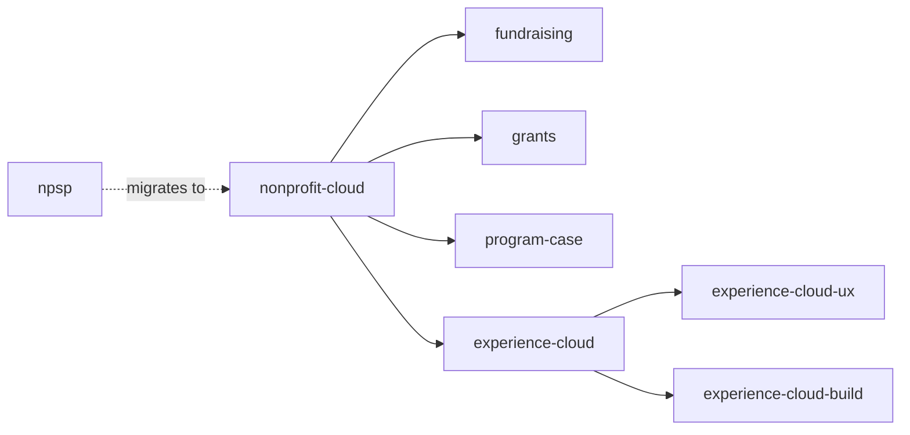

| Skill | Description |
|---|---|
| **sf-nonprofit-cloud** | Nonprofit Cloud architecture, data model design, and NPSP migration guidance with 100-point scoring. |
| **sf-nonprofit-npsp** | NPSP managed package architecture with 120-point scoring -- Opportunity-based donations, Recurring Donations, Household Accounts, Affiliations, Customizable Rollups, Engagement Plans, and `npsp__`/`npe01__`/`npo02__` namespace objects. |
| **sf-nonprofit-experience-cloud** | Nonprofit Experience Cloud architecture with 120-point scoring -- donor/volunteer/client/grantee portals, sharing rules, and guest access. |
| **sf-nonprofit-experience-cloud-ux** | Nonprofit portal UX/UI design with 100-point scoring -- branding, navigation flows, responsive design, accessibility, and wireframes. |
| **sf-nonprofit-experience-cloud-build** | Nonprofit Experience Cloud build methodology -- brand-mine a reference org website, translate into a design system (BrandingSet + theme customCSS), decompose pages into purposeful LWCs, and wire routing, guest access, and deployment for donor/giving/volunteer/member portals. |
| **sf-nonprofit-fundraising** | Fundraising architecture with 120-point scoring -- donor management, gift entry, campaigns, soft credits, recurring giving, and payment processing. |
| **sf-nonprofit-grants** | Grant management architecture with 110-point scoring -- applications, review workflows, disbursements, budgets, and compliance tracking. |
| **sf-nonprofit-program-case** | Program and case management architecture with 120-point scoring -- enrollment, service delivery, intake, outcome tracking, and referrals. |

<details>
<summary><strong>Under the hood</strong></summary>

The Nonprofit skills use a **platform-detection orchestrator** pattern with domain-specific sub-skills:

- **sf-nonprofit-cloud** is the orchestrator. Its first action is always to determine the platform: "Is this org running Nonprofit Cloud (NPC) or Nonprofit Success Pack (NPSP)?" It looks for signals -- Person Accounts and Gift Transactions mean NPC; Contact + Household Accounts and `npsp__` prefixed objects mean NPSP. Based on the answer, it routes to the correct sub-skill or provides cross-platform migration guidance. It scores at 100 points across 6 categories.
- **sf-nonprofit-npsp** handles legacy NPSP orgs. It knows the full managed package architecture: Opportunity-based donations, Recurring Donations (both legacy and Enhanced), Household Accounts, Affiliations, Customizable Rollups, GAU Allocations, Engagement Plans, Levels, and Address management. It also covers adjacent packages: Outbound Funds Module (`outfunds__`), Volunteers for Salesforce (`GW_Volunteers__`), and Program Management Module (`pmdm__`). It scores at 120 points.
- **sf-nonprofit-fundraising** owns donor management on NPC: gift entry, campaigns, soft credits, recurring giving, payment processing, and donor engagement strategies. It includes reference docs on the donor lifecycle and gift processing workflows.
- **sf-nonprofit-grants** covers the grantmaking pipeline: applications, review workflows, funding awards, disbursements, budgets, compliance tracking, and funder reporting. It includes reference docs on application pipelines and disbursement compliance.
- **sf-nonprofit-program-case** handles service delivery: program enrollment, case management, intake processes, outcome tracking, referral management, and wraparound services. It includes reference docs on enrollment patterns and case management workflows.
- **sf-nonprofit-experience-cloud** builds the portal layer: donor portals, volunteer portals, client portals, grantee portals using LWR or Aura sites. It configures sharing rules, guest access, and site membership. When the portal needs UX design work (branding, navigation, wireframes, responsive design), it hands off to **sf-nonprofit-experience-cloud-ux**. When it's time to actually build the site -- mining a reference org website for brand and IA, translating that into a BrandingSet + theme customCSS, decomposing the homepage into purposeful LWCs, and wiring custom routes, guest access, and deployment order -- it hands off to **sf-nonprofit-experience-cloud-build**.

The orchestrator prevents misrouting -- NPSP-specific questions never land in NPC skills and vice versa. Domain skills (fundraising, grants, program/case) are NPC-only; NPSP work stays in the dedicated NPSP skill.

</details>

### Visualization & Docs

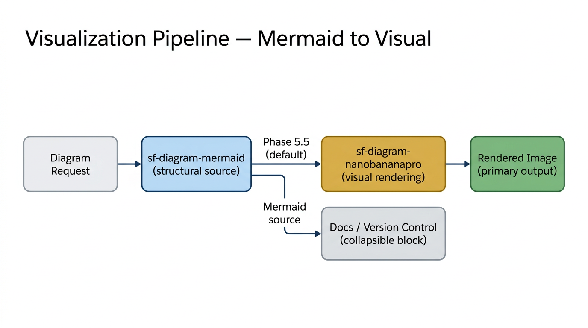

| Skill | Description |
|---|---|
| **sf-diagram-mermaid** | Salesforce architecture diagrams using Mermaid as the structural source format -- ERDs, sequence diagrams, flowcharts, and class diagrams. After generating the Mermaid code, automatically renders a polished image via `sf-diagram-nanobananapro` (Phase 5.5). The Mermaid source is retained in a collapsible block for version control and documentation. In demo environments, pairs every integration diagram with a structured presenter talking track. |
| **sf-diagram-nanobananapro** | AI-powered image generation via Nano Banana Pro -- the default visual rendering engine for all diagram output. Pattern E (Mermaid-to-Visual) converts Mermaid code into presentation-quality images using the `architect.salesforce.com` aesthetic. Also handles standalone use cases: UI mockups, wireframes, and visual ERDs from scratch. |
| **sf-docs** | Official Salesforce documentation retrieval from developer.salesforce.com and help.salesforce.com, with JS-heavy page extraction. |

<details>
<summary><strong>Under the hood</strong></summary>

These are cross-cutting utility skills that any domain can leverage:

- **sf-diagram-mermaid** generates architecture diagrams as Mermaid code -- the structural source format. It includes a library of pre-built Salesforce diagram templates: OAuth flow sequence diagrams (Authorization Code, JWT Bearer, Client Credentials, Device Authorization, PKCE, Refresh Token), API integration sequences, ERDs, class diagrams, and flowcharts. After generating the Mermaid code, the skill automatically delegates to **sf-diagram-nanobananapro** (Phase 5.5) to render a polished image. The rendered image is the primary deliverable; the Mermaid source is included in a collapsible `<details>` block for docs and version control. Users can opt out with "Mermaid only" or "no image" to skip rendering. In demo environments, the skill adds a **Demo Integration Storytelling** output mode: every integration sequence diagram is delivered with a plain-English narrative, a presenter talking track with per-arrow narration, a capability hook closing line, and a prepared answer for when an audience member asks "is this actually live?"
- **sf-diagram-nanobananapro** is the visual rendering engine. Its primary role is **Pattern E: Mermaid-to-Visual Rendering** -- converting Mermaid diagram code into presentation-quality images using the `architect.salesforce.com` aesthetic (dark borders, light translucent fills, rounded corners, Salesforce cloud-specific color coding). It parses Mermaid nodes, edges, subgraphs, and layout direction, then generates optimized Nano Banana prompts. It also handles standalone use cases: ERDs from org metadata queries (Pattern A), LWC/UI mockups (Pattern B), parallel Gemini code review (Pattern C), and documentation research (Pattern D). Supports a draft-iterate-final workflow at 1K/4K resolution.
- **sf-docs** solves the problem of Salesforce documentation pages being JS-heavy and hard to extract. It provides guidance for reliably retrieving authoritative content from developer.salesforce.com and help.salesforce.com.

</details>

### Agent Orchestration

| Skill | Description |
|---|---|
| **sf-subagent-orchestration** | Subagent delegation policy for long-running Salesforce work. Defines **when** to spawn subagents (`explore` for read-heavy discovery, `generalPurpose` for parallel independent units, `shell` for verbose CLI loops), **what contract** to pass them (mission, context, constraints, return), and **what to keep in the parent** (decisions, integration, user gates). Co-activates with every other multi-phase `sf-*` skill so per-phase `**Delegation:**` annotations have a single source of truth. |

<details>
<summary><strong>Under the hood</strong></summary>

`sf-subagent-orchestration` is a **policy skill**, not a domain skill — it doesn't generate code, query an org, or build a demo. Its job is to keep the parent agent's context window healthy on long jobs (Experience Cloud builds, end-to-end demo pipelines, multi-component features) by formalising when and how to delegate to Cursor's `Task` subagents.

Two design choices make it useful:

1. **Co-activation tier in the auto-router** — it doesn't need its own keyword trigger. The router applies it whenever any other multi-phase `sf-*` skill is selected. The parent agent then has both the domain skill (what to build) and the orchestration policy (how to split the work) loaded together.
2. **The `**Delegation:**` annotation pattern** — every multi-phase domain skill (`sf-demo-orchestrate`, `sf-nonprofit-experience-cloud-build`, `sf-apex`, `sf-lwc`, `sf-deploy`, `sf-nonprofit-experience-cloud`) annotates its phases with one short `**Delegation:**` line that names the subagent type and the mission shape. The policy itself lives in one place; the per-skill annotations are pointers, not duplicates.

Default rule of thumb baked into the skill: if the work is *generative + parallelizable* or *exploration-heavy + summary-returnable*, delegate. If it's *coordination + decisions*, keep it in the parent. The skill ships with a decision checklist, a parallel-delegation pattern (single tool-call message containing N `Task` calls), a `shell`-subagent recipe for `sf project deploy start` / `sf community publish` cycles, and an anti-pattern table (don't delegate decisions, don't pass the whole transcript as context, don't use `generalPurpose` where `explore` would do).

</details>

### Demo Workflow

These four skills form the front half of the demo pipeline -- taking you from raw notes all the way to a validated, presenter-ready demo with automated pre-flight checks. `sf-demo-orchestrate` is the single-trigger entry point that runs the whole pipeline; the other three are the phase workers it delegates to.

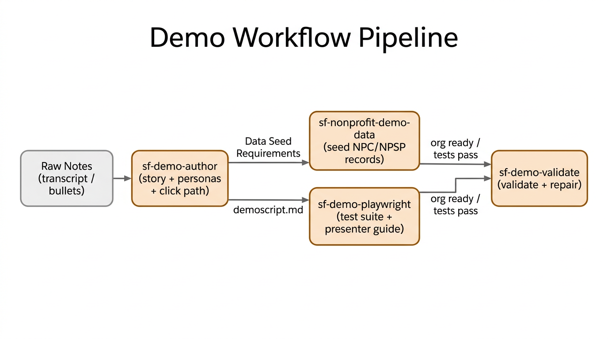

| Skill | Description |
|---|---|
| **sf-demo-orchestrate** | End-to-end demo pipeline orchestrator. From one trigger phrase ("run the full demo workflow", "build me a demo for <org>", "notes to presenter-ready"), it runs all 7 steps from the project README -- org connect + baseline, notes intake, product-approval gate, `sf-demo-author`, `sf-nonprofit-demo-data`, `sf-demo-validate` repair loop, `sf-demo-playwright` -- with a live `DEMO-PIPELINE-STATUS.md` that tracks every phase, score, and artifact. Hard stops for user approval at product recommendations and final sign-off. |
| **sf-demo-author** | Transforms raw notes, meeting transcripts, or bullet-point requirements into a fully structured `demoscript.md` with narrative story arc, named personas, verbatim click-by-click steps, and presenter talking points. Output feeds directly into the rest of the demo pipeline. |
| **sf-nonprofit-demo-data** | Nonprofit demo data factory. Reads persona definitions and data requirements from the demoscript, detects NPC vs NPSP, and generates story-coherent data packages -- JSON trees, `sf data` CLI commands, and Anonymous Apex with realistic names, amounts, and future-dated records. Includes teardown scripts that target `@demo.` email domains to never touch real data. |
| **sf-demo-playwright** | Persistent Playwright test suite and presenter guide generator. Converts the demoscript click path into a reusable `demo-preflight.spec.js`, a `PRESENTER-GUIDE.md` with embedded screenshots and talking points, and a `preflight.sh` script to run as an automated pre-flight check before every demo session. |

<details>
<summary><strong>Under the hood</strong></summary>

**sf-demo-orchestrate** (Phase 0 — Orchestration) is the single-prompt entry point for the whole pipeline. When the user says something like "run the full demo workflow for bth-demo" or "take me from these notes to presenter-ready", the auto-router prefers `sf-demo-orchestrate` over any single-phase skill. It does **not** re-implement authoring, seeding, or validation -- it delegates in order to `sf-demo-author`, `sf-nonprofit-demo-data`, `sf-demo-validate`, and `sf-demo-playwright`, and it enforces two human-in-the-loop gates that single-phase prompts sometimes skip: Phase 3 product-recommendation approval (plan mode, user must accept each product) and Phase 7 final sign-off (review the presenter package before closing the pipeline). A live `DEMO-PIPELINE-STATUS.md` at the workspace root records every phase transition, score, and artifact path, so the pipeline can resume from the last incomplete phase if interrupted.

The four demo-lifecycle skills below form the linear pipeline that `sf-demo-orchestrate` drives, in order: author -> data -> validate -> Playwright. Each one can still be invoked on its own when the user only wants that phase.

**sf-demo-author** (Phase 1 — Authoring) runs a 6-phase workflow:
0. **Org Connect + Baseline** — connects to the target org via `sf org display`, runs a baseline scan (packages, objects, sites, features), and records the results. The agent will not proceed without an org connection.
0.5. **Product Recommendation Plan** — after notes intake, switches to plan mode and presents a product-by-product recommendation (Agentforce, Data Cloud, Experience Cloud, etc.) for user approval. Only approved products are included in the demo.
1. **Notes Intake** — classifies raw input to extract audience signals (who's in the room), platform signals (NPC, NPSP, Agentforce, etc.), and use case signals (volunteer management, fundraising, program enrollment)
2. **Story Architecture** — builds a 4-beat narrative arc (Situation → Challenge → Journey → Resolution) using nonprofit-specific story patterns with pre-built emotional hooks that connect technology to mission impact
3. **Persona Definition** — creates named, realistic personas (never "User 1") with roles, motivations, and pain points. Every persona gets a Salesforce user alias that feeds into the demoscript's `users` frontmatter and the data seed requirements
4. **Click Path Generation** — translates the story into verbatim demoscript steps with specific actions, expected outcomes, step type tags, visual flags on wow moments, and business-value talking points

Output: `demoscript.md` + persona cards + data seed requirements + a presenter cheat sheet.

**sf-nonprofit-demo-data** (Phase 2 — Data Seeding) takes the persona cards and builds the data package:
1. **Platform Detection** — NPC (Person Accounts, `npc__Gift_Transaction__c`) vs NPSP (Contact + Household Account, `Opportunity` with `npsp__` fields)
2. **Persona Data Mapping** — maps each persona to the records it needs (volunteer → `IndividualApplication__c`; major donor → 3-year gift history; client → `npc__Program_Enrollment__c` + service deliveries)
3. **Generation** — JSON tree files for hierarchical records via `sf data import tree`, Anonymous Apex for complex records, `sf data` CLI for simple records
4. **Freshness + Cleanup** — applies freshness rules (shifts 7–21 days out, current-year gift dates, applications 2–7 days old) and generates teardown Apex targeting `@demo.` emails so cleanup never touches real data

**sf-demo-playwright** (Phase 3 — Automation) converts the click path into a persistent test suite:
1. **Test Suite Generation** — `demo-preflight.spec.js` with one test per step, authenticated via sf CLI session cookie injection. Patterns by step type: `navigation` (URL + title assertion), `data` (field value assertions), `automation` (SOQL flow status check), `e2e_simulation` (form fill + SOQL confirmation), `experience` (Experience Cloud load + component visibility)
2. **Presenter Guide** — `PRESENTER-GUIDE.md` with a quick-reference table, story opening/closing lines to read aloud, and per-step blocks showing the screenshot, verbatim action, expected outcome, and talking points
3. **Pre-flight Script** — `scripts/preflight.sh` that verifies auth, runs the suite, and prints "ready to demo" or "N tests failed — open the report"

When a Playwright test fails, the skill diagnoses the failure type and delegates to `sf-demo-validate` with a specific repair instruction (e.g., field value mismatch → stale demo data → re-seed via `sf-nonprofit-demo-data`).

</details>

### Org Discovery & Product Approval

Every skill that touches a Salesforce org follows three mandatory principles enforced by an always-applied Cursor rule (`org-discovery.mdc`):

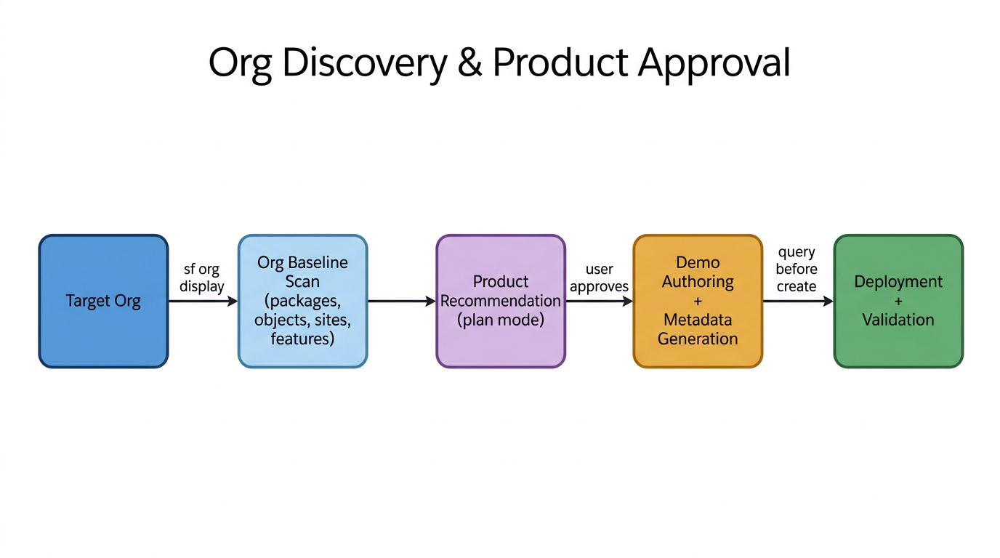

**Mandate 1 -- Org Connection Before Authoring**: Before writing a demoscript, generating metadata, or seeding data, the agent connects to the target org and runs a baseline scan: installed packages, custom objects, Experience Cloud sites, Person Accounts, Agentforce/Data Cloud/OmniStudio status. This baseline informs every downstream decision.

**Mandate 2 -- Product Recommendation Approval**: When any skill is about to recommend including a Salesforce product (Agentforce, Data Cloud, Experience Cloud, OmniStudio, etc.) in a demo, it switches to plan mode and presents the recommendation for user approval. Products already enabled in the org are pre-checked; recommended products include setup effort estimates; products not suited for the demo are listed with reasoning. The agent waits for the user to approve or reject each product before proceeding.

**Mandate 3 -- Query Before Create**: Before creating any metadata (objects, fields, record types, layouts, permission sets), the agent queries the org to check if it already exists. If it exists and matches, skip. If it exists but differs, show a diff and ask. If adding fields to layouts, query `ProfileLayout` via the Tooling API to find the correct layout -- never guess. This principle is enforced in `sf-metadata` (Phase 1.5), `sf-deploy` (Phase 1.5), and `sf-demo-validate`'s fix loop (Rule 6).

---

### Demo Validation

| Skill | Description |
|---|---|
| **sf-demo-validate** | Autonomous demo script validation and repair with 200-point scoring across 10 categories. Reads a `demoscript.md` that defines the demo story, personas, and step-by-step walkthrough, then validates the entire org can deliver it -- platform prereqs, metadata, data quality, permissions, automations, UI, Experience Cloud sites, and end-to-end user simulation. Delegates fixes to domain skills and re-validates in a loop (up to 3x). Supports Agentforce, Data Cloud, Slack, Marketing Cloud, Tableau/CRM Analytics, and OmniStudio. |

<details>
<summary><strong>Under the hood</strong></summary>

Demo Validation is the most complex skill in the collection. It orchestrates the entire skill ecosystem to guarantee a demo works end-to-end:

**The demoscript.md contract**: Every demo starts with a structured document that has 4 sections: (1) YAML frontmatter with org alias, org type, and required features/packages, (2) prerequisites listing data, users, and config that must exist, (3) ordered demo steps with action, expected outcome, and optional explicit check commands, (4) a cleanup section. The skill includes a [starter template](skills/sf-demo-validate/assets/demoscript-template.md) and a [full format spec](skills/sf-demo-validate/references/demoscript-format.md).

**The 10-category scoring rubric** (200 points total):
1. Org connection & auth (20 pts)
2. Platform prerequisites (20 pts)
3. Metadata & configuration (25 pts)
4. Data quality & freshness (25 pts)
5. Permission content validation (20 pts)
6. Automation verification (15 pts)
7. UI component validation (15 pts)
8. Experience Cloud sites (20 pts)
9. E2E user simulation (25 pts)
10. Product-specific checks (15 pts)

**The repair loop**: When a validation step fails, the skill doesn't just report the failure -- it diagnoses the root cause and delegates the fix to the appropriate domain skill. For example:
- Missing custom field -> delegates to `sf-metadata` to generate the field XML, then `sf-deploy` to push it
- Permission gap -> delegates to `sf-permissions` to identify the missing access, then generates the permission set update
- Stale demo data -> delegates to `sf-data` to re-seed with fresh, future-dated records
- Broken Flow -> delegates to `sf-flow` to analyze and repair the automation
- Experience Cloud 404 -> delegates to `sf-nonprofit-experience-cloud` to verify site config and guest access

After each fix, it re-validates that specific step. If it still fails, it tries again with a different strategy (up to 3 attempts). If all 3 fail, it escalates to the user with a detailed diagnosis.

**Visual and E2E validation**: The skill includes a [Playwright screenshot script](skills/sf-demo-validate/scripts/screenshot.js) for headless browser validation. It captures screenshots of Salesforce pages and Experience Cloud sites to visually verify the UI matches expected state. For transactional paths, it executes Anonymous Apex as specific demo personas to simulate the full user journey (e.g., submitting an intake form, signing up for a volunteer shift).

</details>

---

## Nonprofit Knowledge Engine

The knowledge engine is a Python-based pipeline that scrapes official Salesforce nonprofit documentation, compartmentalizes it into NPSP vs NPC (Nonprofit Cloud) tracks, enriches the existing skills with discovered knowledge, and builds a keyword index that enables automatic skill routing -- so users don't need to explicitly invoke skills by name.

### How It Works

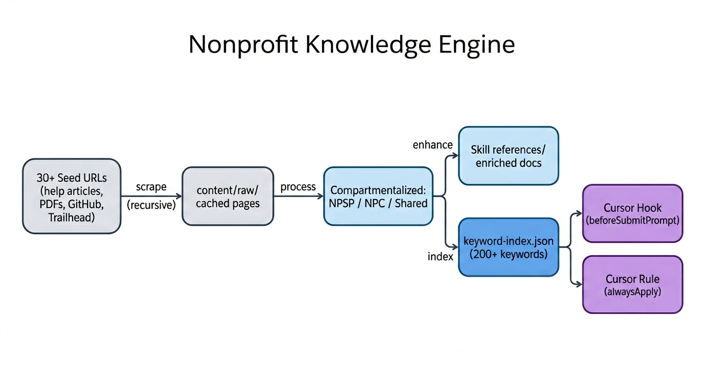

**4-phase pipeline:**

1. **Scrape** — Downloads content from 30+ seed URLs (Salesforce marketing pages, help articles, PDFs, GitHub repos, Trailhead modules). Recursively follows embedded links up to a configurable depth, respects rate limits, and caches results for 7 days.

2. **Process** — Classifies every section of downloaded content as **NPSP**, **NPC**, or **shared** using 70+ regex-based signal patterns. NPSP signals include `npsp__`, `npe01__`, `TDTM`, `CRLP`, `Household Account`, `GAU Allocation`, etc. NPC signals include `Person Account`, `Gift Transaction`, `Gift Commitment`, `Funding Award`, `Program Enrollment`, etc. Generates a `npsp-vs-npc-comparison.md` with explicit "NEVER mix" implementation rules.

3. **Enhance** — Maps processed content to each of the 7 nonprofit skills and writes filtered, topic-relevant knowledge into each skill's `references/` directory for deeper context.

4. **Index** — Builds `content/keyword-index.json` with 200+ keywords mapped across skills in four routing tiers (demo lifecycle, capability showcase, integration storytelling, nonprofit domain). Also regenerates the `.cursor/rules/nonprofit-auto-router.md` rule file.

### Automatic Skill Routing

The engine solves the problem of users forgetting to invoke skills by name. Two layers of auto-routing ensure the correct skill fires:

**Layer 1: Cursor Hook** — A `beforeSubmitPrompt` hook intercepts every prompt and scans for nonprofit keywords. When matches are found, it injects an `agent_message` telling the AI which skill(s) to apply. If both NPSP and NPC keywords are detected, it warns about platform ambiguity and routes to `sf-nonprofit-cloud` first.

**Layer 2: Cursor Rule** — An `alwaysApply: true` rule file embeds the full keyword index across four routing tiers: **Demo Lifecycle** (demo authoring, data seeding, validation, Playwright), **Capability Showcase** (Agentforce, Data Cloud, architecture diagrams), **Integration Storytelling** (conceptual diagrams, art of the possible simulation), and **Nonprofit Domain** (fundraising, grants, programs, portals, NPSP, NPC). Even if the hook doesn't fire, the rule is always loaded and instructs the AI to match keywords automatically.

### Refreshing Content

Run after each Salesforce release to pull the latest documentation:

```bash
./scripts/refresh-nonprofit-content.sh              # Standard (depth=2, 200 pages)
./scripts/refresh-nonprofit-content.sh --deep        # Deep crawl (depth=3, 500 pages)
./scripts/refresh-nonprofit-content.sh --quick       # Quick update (depth=1, 50 pages)
```

The refresh script creates a virtualenv, installs dependencies, and runs all 4 pipeline phases. Individual phases can also be run standalone:

```bash
source .venv-nke/bin/activate
python3 scripts/nonprofit-knowledge-engine.py scrape --max-depth 3
python3 scripts/nonprofit-knowledge-engine.py process
python3 scripts/nonprofit-knowledge-engine.py enhance
python3 scripts/nonprofit-knowledge-engine.py index
```

### NPSP vs NPC Compartmentalization

The engine strictly separates implementation guidance between the two nonprofit platforms:

| Concept | NPSP | NPC |
|---------|------|-----|
| Individual | Contact + Household Account | Person Account |
| Donation | Opportunity | Gift Transaction |
| Recurring giving | Recurring Donation (`npe03__`) | Gift Commitment |
| Fund accounting | GAU Allocation (`npsp__`) | Gift Designation |
| Grant management | Outbound Funds Module (`outfunds__`) | Application + Funding Award |
| Programs | PMM (`pmdm__`) or custom | Program + Program Enrollment |
| Volunteer management | V4S (`GW_Volunteers__`) | Job Position + Job Position Assignment |

Content classified as NPSP never appears in NPC skill references and vice versa. The `npsp-vs-npc-comparison.md` includes explicit rules like "Do NOT use Person Accounts in an NPSP org" and "Do NOT reference `npsp__` namespace objects in NPC implementations."

---

## Usage

1. Clone this repository into your Cursor skills directory (typically `~/.cursor/skills/`).
2. Skills are automatically discovered by Cursor when their `SKILL.md` frontmatter matches the user's current task context.
3. Each skill contains a `SKILL.md` file with trigger conditions, scoring rubrics, and step-by-step instructions that guide the AI agent.

## Skill Anatomy

Every skill follows the same structure:

```
skill-name/
  SKILL.md          # Frontmatter (name, description, triggers) + detailed instructions
  [supporting files] # Templates, reference data, examples (varies by skill)
```

The `SKILL.md` frontmatter defines:
- **name** -- unique identifier
- **description** -- what the skill does and when it triggers
- **TRIGGER when** -- conditions that activate the skill
- **DO NOT TRIGGER when** -- conditions that should route to a different skill instead
