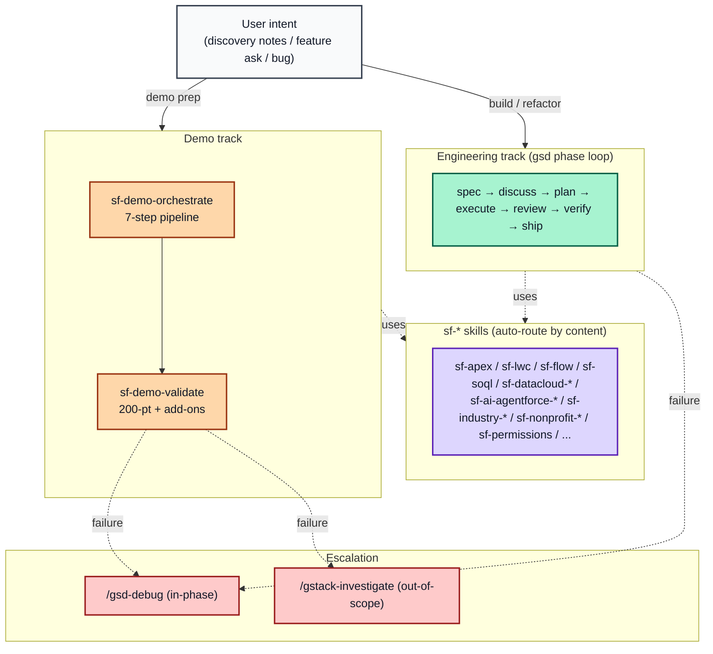

# NGO Salesforce Skills

**Author:** Brian Miller (Senior Solution Engineer @ Salesforce) · **Co-Author:** Opus 4.6

A curated collection of agent skills for Salesforce development on the Nonprofit Cloud platform. 84 `sf-*` domain skills + an adversarial evaluation harness wrapping 79 of them, working identically in **Cursor**, **Claude Code**, and **Claude.ai**.

> ## 💬 You don't type slash commands. You type plain English.
>
> Every skill auto-routes from natural language. *"Build a recurring donation flow"* → `sf-nonprofit-fundraising` activates. *"Validate this demoscript"* → `sf-demo-validate` activates. **No `/sf-apex` syntax. No skill names to memorize.** Slash commands (`/gsd-*`, `/gstack-*`, `/brainstorm`) are reserved for the vendored phase-lifecycle and cognitive-gear packs.

---

## Table of Contents

- [Quick Start](#quick-start)
- [Popular Skills — How to Kick Things Off](#popular-skills--how-to-kick-things-off)
- [What's Inside](#whats-inside)
  - [The 84 sf-* skills](#the-84-sf-skills)
  - [Adversarial Eval Harness](#adversarial-eval-harness)
  - [Vendored packs (gsd × superpowers × gstack)](#vendored-packs-gsd--superpowers--gstack)
- [How It All Composes](#how-it-all-composes)
  - [End-to-end demo workflow](#end-to-end-demo-workflow)
  - [Industry-first routing](#industry-first-routing)
  - [Org discovery + product approval mandates](#org-discovery--product-approval-mandates)
- [Installation](#installation)
  - [Cursor](#cursor)
  - [Claude Code (CLI)](#claude-code-cli)
  - [Claude.ai](#claudeai)
- [Skill Reference](#skill-reference)
- [Repository Layout](#repository-layout)
- [Maintenance](#maintenance)
- [Skill Anatomy](#skill-anatomy)

---

## Quick Start

```bash
# 1. Clone the repo
git clone https://github.com/bmillersf/NGOSkills.git ~/Cursor/Skills/NGOSkills
cd ~/Cursor/Skills/NGOSkills

# 2. Wire up symlinks for both Cursor and Claude Code
scripts/sync-skills.sh --fix

# 3. Verify drift = 0
scripts/sync-skills.sh --check
```

That's it. Open Cursor or Claude Code in any directory and type a natural-language request — the matching skill auto-fires. Test it:

```
Write an Apex trigger that handles volunteer intake
```

The agent should announce that `sf-apex` activated and follow its 5-phase workflow + 150-pt rubric (with the eval-harness three-agent loop wrapping the artifact).

For Claude.ai (no filesystem), see [Claude.ai setup](#claudeai) — uses Claude Projects with manual file uploads.

---

## Popular Skills — How to Kick Things Off

You don't need to memorize the catalog. Type the example phrase verbatim or paraphrase it — the skill auto-fires from its `TRIGGER when:` clause.

### Build a demo from scratch

| Intent | Plain-English prompt | Skill that fires |
|---|---|---|
| Full pipeline from notes | *"Prep a demo for acme-demo from these notes: [paste]"* | `sf-demo-orchestrate` (drives all 7 phases) |
| Just the demoscript | *"Turn these notes into a demoscript"* | `sf-demo-author` |
| Just seed data | *"Seed the data for this demoscript"* | `sf-nonprofit-demo-data` (NPC/NPSP) or `sf-demo-data` (cross-cloud) |
| Just validate the org | *"Validate the demo for acme-demo"* | `sf-demo-validate` (200-pt + repair loop) |
| Generate Playwright pre-flight | *"Generate Playwright tests from this demoscript"* | `sf-demo-playwright` |

### Write Salesforce code

| Intent | Plain-English prompt | Skill that fires |
|---|---|---|
| Apex class / trigger / batch | *"Write an Apex trigger for Account that..."* | `sf-apex` (150-pt) |
| LWC component | *"Build a Lightning Web Component that..."* | `sf-lwc` (165-pt PICKLES) |
| Salesforce Flow | *"Create a record-triggered flow that..."* | `sf-flow` (110-pt) |
| SOQL/SOSL query | *"Write a SOQL query that..."* | `sf-soql` (100-pt) |
| Run + fix Apex tests | *"Run the Apex tests and fix any failures"* | `sf-testing` (120-pt) |
| Debug a stack trace | *"Debug this governor limit error: [log]"* | `sf-debug` (100-pt) |
| Deploy metadata | *"Deploy this to my sandbox"* | `sf-deploy` |

### Design a Salesforce solution

| Intent | Plain-English prompt | Skill that fires |
|---|---|---|
| Nonprofit architecture | *"Should we use NPC or NPSP?"* | `sf-nonprofit-cloud` |
| Donor / fundraising | *"Set up recurring gifts in NPC"* | `sf-nonprofit-fundraising` |
| Grants management | *"Build a grant application workflow"* | `sf-nonprofit-grants` |
| Program / case management | *"Track program participants with intake"* | `sf-nonprofit-program-case` |
| Financial Services Cloud | *"Build a household with multiple members in FSC"* | `sf-industry-fsc` |
| Health Cloud | *"Design a care plan for chronic care"* | `sf-industry-health` |
| Education Cloud | *"Set up program enrollment for incoming students"* | `sf-industry-education` |
| Public Sector | *"Build a benefit application intake form"* | `sf-industry-public-sector` |

### Data Cloud + Agentforce

| Intent | Plain-English prompt | Skill that fires |
|---|---|---|
| Data Cloud pipeline | *"Set up Data Cloud for this use case"* | `sf-datacloud` (orchestrator) |
| Build an Agentforce agent | *"Build an agent that handles donor inquiries"* | `sf-ai-agentforce` |
| PromptTemplate | *"Create a Prompt Builder template for case summaries"* | `sf-ai-prompt-builder` |
| BYOM model swap | *"Swap GPT for Claude on Bedrock"* | `sf-ai-model-builder-trust-layer` |
| Test an agent | *"Run agent tests"* | `sf-ai-agentforce-testing` |
| Debug an agent session | *"Why did the agent route wrong?"* | `sf-ai-agentforce-observability` |

### Portals / Experience Cloud

| Intent | Plain-English prompt | Skill that fires |
|---|---|---|
| Portal architecture + sharing | *"Set up a donor portal with guest access"* | `sf-nonprofit-experience-cloud` |
| UX/UI design | *"Design the donor journey"* | `sf-nonprofit-experience-cloud-ux` |
| Build the actual site | *"Build out a donor portal modeled after their website"* | `sf-nonprofit-experience-cloud-build` |
| Generic (non-nonprofit) Experience Cloud | *"Stand up a customer community on LWR"* | `sf-experience-cloud` |

### Quick architecture diagrams

| Intent | Plain-English prompt | Skill that fires |
|---|---|---|
| Mermaid diagram (ERD / sequence / flowchart) | *"Diagram the OAuth flow"* | `sf-diagram-mermaid` |
| Polished image / PNG | *"Generate an ERD image of the donor data model"* | `sf-diagram-nanobananapro` |

### Recommended first run

```
Connect to my Salesforce org "acme-demo" and run a baseline scan — show me
what packages are installed, what custom objects exist, whether Person
Accounts are enabled, and which add-on products (Agentforce, Data Cloud,
OmniStudio) are provisioned.
```

The agent auto-routes to `sf-demo-orchestrate` Phase 1 (org connect + baseline) without you naming the skill. Once it finishes, paste your discovery notes and say *"prep a demo from these notes"* — the rest of the pipeline runs end-to-end.

---

## What's Inside

### The 84 sf-* skills

Domain skills that auto-route from natural language. Every skill carries a `TRIGGER when:` / `DO NOT TRIGGER when:` block in its frontmatter that the agent matches against your prompt.


The 84 skills organize into five tiers, plus a cross-cutting Eval Harness layer that wraps 79 of them:

| Tier | Count | What's there |
|---|---|---|
| **Tier 1 — Industry / Vertical** | 12 | FSC · Health · Education · Public Sector · Field Service · Manufacturing · Consumer Goods · Communications · Media · Energy · NPC · NPSP. *First line of defense; wins over generic clouds when detected.* |
| **Tier 2 — Generic clouds** | 14 | Sales (×4) · Service (×4) · Marketing (×2) · Revenue · Experience · Reports + Dashboards · Lightning App Builder. *Run Phase 0 industry pre-check; halt and forward to Tier 1 on detection.* |
| **Tier 3 — Shared capabilities** | 30 | AI (7) · Data Cloud (7) · OmniStudio (6) · Integration (3) · Tableau · Slack · Trust + Ops (4) · Flow Orchestration. *Consumed by both vertical and horizontal tracks.* |
| **Tier 4 — Core platform** | 10 | Apex · LWC · Flow · Metadata · SOQL · Data · Testing · Deploy · Debug · Permissions. *Foundation; every other skill depends on these.* |
| **Tier 5 — Demo + Nonprofit-portal + Meta** | 18 | Demo pipeline (orchestrate / author / validate / playwright + demo-data ×2 + ui-fallback) · Nonprofit-portal trio (experience-cloud / -ux / -build) · Nonprofit domain (fundraising / grants / program-case) · Meta (subagent-orchestration) · Visualization + Docs (mermaid + nanobananapro + docs). |
| **Cross-cutting — Eval Harness** | 1 wraps 79 | `sf-skill-eval-harness` (lives in `skills-cursor/`); fan-out via the harness wrap pattern in 79 of the 84 sf-* skills. |

For the full skill catalog with descriptions, see [Skill Reference](#skill-reference).

### Adversarial Eval Harness

Most skills follow a "builder-grades-own-work" pattern: the same agent that produces the artifact also scores it against the rubric. **Self-evaluation is a trap** — the producer has every incentive to score itself favorably. The classic failure mode: an agent self-rates its work 196/200, but a fresh-context evaluator finds three real bugs the producer rationalized away.

`sf-skill-eval-harness` solves this with a **three-agent closed-loop pattern** that wraps 79 of the 84 `sf-*` skills.


**How it works.** When a wrapped skill produces an artifact (Apex class, LWC, demoscript, FlexCard, segment, etc.), three subagents run in sequence — each in a fresh context:

1. **Planner** — translates the user request into `.eval-harness/SPEC.md` with falsifiable acceptance criteria, an out-of-scope list, and a test plan.
2. **Implementer** — produces the artifact + tests against the SPEC. **Does NOT see the rubric weights or hard-fail floors** — only the AC list and (on iter ≥2) the previous evaluator's prose feedback. Prevents fitting-to-rubric across iterations.
3. **Evaluator** — fresh subagent per iteration. Grades against the rubric, runs tests, builds an independent reconstruction of the coverage matrix, emits a verdict: `SHIP`, `ITERATE`, or `SPEC-DEFECT`. Quotes evidence for every score.

**Hard-fail floors prevent partial-credit gaming.** Every wrapped skill maps its existing rubric onto the SPEC §5.1 4-dimension shape (Correctness / Robustness / Fit / Performance). Any dimension below its floor → verdict is `ITERATE` regardless of total. A 92/100 with Correctness at 14 does not ship.

| Skill flavor | Heaviest floor | Why |
|---|---|---|
| Security / regulated (sf-permissions, sf-shield, sf-identity-sso, sf-industry-fsc, sf-marketing-cloud-growth, sf-datacloud-act, sf-industry-public-sector, sf-ai-model-builder-trust-layer) | Robustness 18 | Compliance failures = regulated breach with mandatory disclosure |
| Backup / disaster recovery (sf-backup-datamask) | Correctness 18 | Untested backups aren't backups |
| Health Cloud (sf-industry-health) | Robustness 18 | PHI exposure is HIPAA-regulated |
| Field Service (sf-field-service) | Correctness 18 | Case-as-Work-Order is permanent; breaks scheduling forever |
| Default | Correctness 15 / Robustness 12 / Fit 10 / Performance 12 | SPEC §5.1 4-dim default |

**Pilot results — 4 of 4 passed.** Across four real LLM-driven runs, every pilot caught at least one defect that would have shipped under self-evaluation:

| Pilot | Skill | Result | Self-eval gaps caught |
|---|---|---|---|
| NGO Pilot A — demo prep | sf-demo-validate (Phase 6) | ITERATE 77 → SHIP 89 | 3 (N+1 bulk, no dup-prevent, status string drift) |
| NGO Pilot B — demo authoring | sf-demo-author (Phase 4) | SHIP 95 (calibration miss caught) | 3 (narration anchored to wrong step, arithmetic, POV count) |
| Apex code-gen | sf-apex (Stage B) | SHIP 93 | Clean code; rules calibrated correctly |
| LWC code-gen | sf-lwc (Stage B) | SHIP 94 | 2 minor (test name collapse, a11y edge) |

**Wrap coverage — 79 of 84.** The 5 unwrapped sf-* skills are intentional non-fits, not deferrals:

- `sf-docs` — pure retrieval (no producer/evaluator gap)
- `sf-demo-orchestrate` — orchestrator-internal; its phases wrap individually, so the orchestrator wraps recursively
- `sf-subagent-orchestration` — policy / routing, no artifact
- `sf-industry-commoncore-omnistudio-analyze` — read-only dependency analysis
- `sf-ui-autonomous` — bootstrap; library awaiting its first captured flow

The harness skill itself ships in [`skills-cursor/sf-skill-eval-harness/`](skills-cursor/sf-skill-eval-harness/) with 49 pytest tests (all green). Disable per-skill by setting `eval_harness.enabled: false` in that skill's frontmatter.

### Vendored packs (gsd × superpowers × gstack)

Three upstream skill packs at pinned SHAs, composed on top of the sf-* track:

| Pack | Owns | Invocation |
|---|---|---|
| **[get-shit-done (gsd)](https://github.com/gsd-build/get-shit-done)** | Phase-based spec→plan→execute lifecycle, milestone management, verification gates | `/gsd-*` (65 commands + 33 phase agents) |
| **[superpowers](https://github.com/obra/superpowers)** | TDD, subagent-driven development, plan-writing, systematic debugging | `/brainstorm`, `/write-plan`, `/execute-plan`, plus 14 auto-triggering skills |
| **[gstack](https://github.com/garrytan/gstack)** | Cognitive-mode specialists — founder taste, paranoid review, browser QA, design exploration | `/gstack-*` (≈47 commands) |

**Composition rule (mandatory):** gstack's gears run *inside* gsd's phases, not instead of them. gsd commands write to `.planning/` and advance phase state; gstack commands are stateless cognitive passes. superpowers skills auto-fire on pattern match inside every phase. Run all three as layered rigor, not competing alternatives.

Pin bumps land as one-line diffs in `vendor-pins.txt`, reviewable before they ship to the team.

---

## How It All Composes

### End-to-end demo workflow

The simplest mental model: **gsd drives the lifecycle, superpowers enforces methodology inside every phase, gstack is the optional rigor layer for specific phases, and `sf-*` skills auto-fire from the work content** regardless of which phase you're in.

For an end-to-end nonprofit demo build:

1. User connects an org and dumps discovery notes → `sf-demo-orchestrate` fires and drives the 7-step demo pipeline. *Not* a gsd phase — `sf-demo-orchestrate` is its own self-contained workflow.
2. If the demo includes a portal / Experience Cloud surface, the orchestrator co-suggests `/gstack-design-shotgun` between product approval and demoscript authoring so the user picks a visual direction from local-host previews.
3. For deeper engineering work *inside* the demo (Apex, LWC, flow orchestration, data model changes), use the gsd phase loop: `/gsd-spec-phase` → `/gsd-discuss-phase` → `/gsd-plan-phase` → `/gsd-execute-phase` → `/gsd-code-review` → `/gsd-verify-work` → `/gsd-ship`. The relevant `sf-*` skill auto-routes inside each phase.
4. After all milestones are built, `sf-demo-validate` runs a final 200-pt org-readiness check. If self-repair is blocked, escalate to `/gsd-debug` (in-phase) or `/gstack-investigate` (out-of-scope).
5. `/gstack-retro` closes the milestone with a commit-history retrospective that feeds the next `/gsd-new-milestone`.



### Industry-first routing

**Before any generic cloud skill produces output, it must run the industry pre-check** in [`references/industry-precheck.md`](references/industry-precheck.md). If an industry package is installed (FSC, Health, Education / EDA, Public Sector, Field Service, NPC / NPSP, Manufacturing, Consumer Goods, Communications, Media, Energy) **and** the request touches an industry-owned object, the generic skill halts and forwards control to the matching `sf-industry-*` or `sf-nonprofit-*` skill. Generic skills never silently override an industry data model.

The pre-check uses three detection signals: license / feature flag from `sf org display --json`, namespace scan (`FSC__`, `HealthCloudGA__`, `hed__`, `npsp__`, `vlocity_cmt__`, `vlocity_ins__`, …), and `EntityDefinition` object-existence query.


### Org discovery + product approval mandates

Every skill that touches a Salesforce org follows three mandates enforced by an always-applied rule (`org-discovery.mdc`):

1. **Org Connection Before Authoring** — connect to the target org and run a baseline scan (packages, custom objects, Experience Cloud sites, Person Accounts, add-on products) before any artifact is generated.
2. **Product Recommendation Approval** — when about to recommend a Salesforce product (Agentforce, Data Cloud, etc.), switch to plan mode and present the recommendation for user approval. Wait for explicit approval before proceeding.
3. **Query Before Create** — before creating any metadata, query the org to check if it already exists. If exists and matches, skip. If exists but differs, show a diff and ask.

---

## Installation

### Cursor

```
Clone https://github.com/bmillersf/NGOSkills.git into my Cursor skills
directory and run scripts/sync-skills.sh --fix to wire up the per-skill
symlinks and the always-apply rules.
```

Cursor handles the clone, symlinks, and health check autonomously. Verify with:

```
Write an Apex class that handles volunteer intake
```

The `sf-apex` skill activates automatically and follows its 5-phase workflow + 150-pt rubric (with the eval-harness wrap).

### Claude Code (CLI)

```bash
git clone https://github.com/bmillersf/NGOSkills.git ~/Cursor/Skills/NGOSkills
cd ~/Cursor/Skills/NGOSkills
scripts/sync-skills.sh --fix
```

The script creates four sets of symlinks:

- `~/.claude/skills/sf-*` → 84 domain skills
- `~/.claude/skills/<vendor>` → vendored packs (gsd, superpowers, gstack)
- `~/.cursor/skills/<name>` → per-skill (84 sf-* + 3 cursor-native)
- `~/.cursor/rules/<rule>` → always-apply policy rules
- `~/.claude/CLAUDE.md` → global autonomy + routing policy

After install, restart Claude Code and all 84 sf-* skills (plus vendored packs) are available, matched automatically by their `TRIGGER when` descriptions.

### Claude.ai

Claude.ai cannot clone repos or access your filesystem. Use **Claude Projects** for one-time manual setup:

1. In [Claude.ai](https://claude.ai), create a new Project (e.g., `NGO Salesforce Skills`).
2. Upload all `SKILL.md` files from the `skills/` folder as project knowledge.
3. Paste the project instructions from [CLAUDE.md](CLAUDE.md) into **Edit project instructions**.

Once set up, Claude routes to the right skill automatically. See [CLAUDE.md](CLAUDE.md) for the per-conversation alternative + Claude API setup.

### Verifying auto-routing works

```bash
scripts/sync-skills.sh --check
# Expected: drift=0 actions=0
```

Then test natural-language routing:

```
Write an Apex trigger that bulkifies on Account
```

The agent should announce that `sf-apex` activated. If nothing activates:

- **Cursor**: confirm `.cursor/hooks.json` registers `nonprofit-skill-router.sh` and `auto-update-skills.sh`; confirm `.cursor/rules/` contains the four `.mdc` files.
- **Claude Code**: confirm `~/.claude/skills/` is a symlink to `<repo>/skills/`; confirm `~/.claude/CLAUDE.md` is a symlink to `<repo>/.cursor/rules/agent-autonomy.mdc`.
- **Both**: confirm `content/keyword-index.json` exists. Regenerate via `scripts/refresh-nonprofit-content.sh` if missing.

### Auto-update from remote

The repo includes hooks that keep your local copy current:

- **Cursor**: `.cursor/hooks.json` registers `auto-update-skills.sh` as a `beforeSubmitPrompt` hook
- **Claude Code**: `~/.claude/hooks/ngoskills-auto-update.sh` is registered via `~/.claude/settings.local.json` as a `SessionStart` hook

Both hooks call `scripts/auto-update-skills.sh`, a two-phase design (apply pending fast-forward + spawn background fetch, rate-limited to 30 min). Updates land on the *next* prompt after a successful background fetch — typically within a minute. Disable for one session with `NGOSKILLS_RATE_LIMIT=999999999`; disable permanently by removing the hook entries.

---

## Skill Reference

For brevity, the full skill catalog is grouped by domain. Each skill's SKILL.md file contains its complete rubric, workflow, and trigger conditions.

<details>
<summary><strong>Agentforce + AI primitives (7 skills)</strong></summary>

| Skill | Description |
|---|---|
| **sf-ai-agentforce** | Build Agentforce agents via Setup UI — topics, actions, PromptTemplates, `.genAiFunction` / `.genAiPlugin` metadata. |
| **sf-ai-agentforce-observability** | Extract + analyze Agentforce session traces (STDM data) from Data Cloud, including `.parquet` telemetry. |
| **sf-ai-agentforce-persona** | Persona design for Agentforce agents (50-pt). |
| **sf-ai-agentforce-testing** | Dual-track testing for agents (100-pt) — `sf agent test` specs, topic routing, coverage. |
| **sf-ai-agentscript** | Author deterministic agents via the Agent Script DSL (`.agent` files) — FSM, slot filling, instruction resolution. |
| **sf-ai-prompt-builder** | Standalone PromptTemplate authoring (130-pt) — grounding, versioning, activation. |
| **sf-ai-model-builder-trust-layer** | Einstein Trust Layer + BYOM (130-pt) — masking, zero-retention, toxicity, Audit Trail, Azure / Bedrock / Vertex endpoints. |

</details>

<details>
<summary><strong>Core platform (10 skills)</strong></summary>

| Skill | Description |
|---|---|
| **sf-apex** | Apex generation + review (150-pt) — 5-phase workflow, TAF, SOLID, governor-limit awareness. |
| **sf-lwc** | Lightning Web Components (165-pt PICKLES) — wire service, SLDS 2, Jest tests, accessibility. |
| **sf-flow** | Salesforce Flows (110-pt) — record-triggered, screen, autolaunched, scheduled. |
| **sf-metadata** | Custom objects, fields, validation rules (120-pt) — `-meta.xml` generation. |
| **sf-soql** | SOQL/SOSL (100-pt) — relationship queries, aggregates, performance. |
| **sf-testing** | Apex test execution + coverage analysis (120-pt). |
| **sf-debug** | Debug log analysis (100-pt) — governor limits, stack traces. |
| **sf-deploy** | DevOps via `sf` CLI v2 — metadata deploys, scratch orgs, sandboxes, CI/CD. |
| **sf-data** | Data operations (130-pt) — bulk import/export, test data, `sf data` CLI, factory patterns. |
| **sf-permissions** | Permission Set analysis + auditing — `.permissionset-meta.xml`, hierarchy visualization. |

</details>

<details>
<summary><strong>Data Cloud (7 skills)</strong></summary>

| Skill | Description |
|---|---|
| **sf-datacloud** | Product orchestrator — connect → prepare → harmonize → segment → act. |
| **sf-datacloud-connect** | Connections, connectors, source discovery. |
| **sf-datacloud-prepare** | Data streams, DLOs, transforms, Document AI. |
| **sf-datacloud-harmonize** | DMOs, mappings, identity resolution, unified profiles, data graphs. |
| **sf-datacloud-retrieve** | SQL, async queries, vector search, search-index workflows. |
| **sf-datacloud-segment** | Segments, calculated insights, audience SQL. |
| **sf-datacloud-act** | Activations, activation targets, data actions. |

</details>

<details>
<summary><strong>Industry Clouds (10 skills)</strong></summary>

> Industry-first routing is mandatory — every generic cloud skill defers to the matching industry skill when detected.

| Skill | Description |
|---|---|
| **sf-industry-fsc** | Financial Services Cloud (150-pt) — Households, Financial Accounts, Life Events, ARC, banking/wealth/insurance/mortgage. |
| **sf-industry-health** | Health Cloud (150-pt) — Patient/Member, Care Plans, Care Requests, Clinical Encounters, EHR/FHIR, HIPAA/PHI. |
| **sf-industry-education** | Education Cloud + EDA (150-pt) — Student, Program Enrollment, Course Connection, FERPA. |
| **sf-industry-public-sector** | Public Sector Solutions (150-pt) — Constituent intake, Benefit/License/Permit/Inspection, Section 508 / FedRAMP. |
| **sf-field-service** | Field Service (140-pt) — Work Orders, Service Appointments, Dispatcher, mobile offline, ESO. |
| **sf-industry-manufacturing** | Manufacturing Cloud (50-pt) — Sales Agreements, Account Forecasts, Rebate Programs. |
| **sf-industry-consumer-goods** | Consumer Goods Cloud (50-pt) — Retail Execution, Visits, Trade Promotions, Penny Perfect. |
| **sf-industry-communications** | Communications Cloud `vlocity_cmt__` (50-pt) — EPC, order decomposition, telecom CPQ. |
| **sf-industry-media** | Media Cloud `vlocity_cmt__` / `vlocity_media__` (50-pt) — subscriptions, ad sales, audience monetization. |
| **sf-industry-energy** | Energy & Utilities `vlocity_ins__` (50-pt) — premise / service point, meter-to-cash, AMI. |

</details>

<details>
<summary><strong>Sales / Service / Marketing / Revenue (12 skills)</strong></summary>

| Skill | Description |
|---|---|
| **sf-sales-cloud** | Sales Cloud orchestrator (150-pt) — lead-to-cash, pipeline, forecasting, engagement. |
| **sf-sales-opportunity** | Opportunity (120-pt) — Teams, Splits, Contact Roles, Pipeline Inspection, Deal Insights. |
| **sf-sales-forecasting** | Collaborative Forecasts (120-pt). |
| **sf-sales-engagement** | Sales Engagement / HVS (120-pt) — Cadences, Dialer, EAC. |
| **sf-service-cloud** | Service Cloud orchestrator (150-pt) — Case lifecycle, Console, Voice, Messaging, Einstein. |
| **sf-service-case** | Case (120-pt) — Record Types, Entitlements, Milestones, SLA. |
| **sf-service-omnichannel** | Omni-Channel routing (120-pt). |
| **sf-service-knowledge** | Lightning Knowledge (120-pt) — Article Types, Data Categories, Multi-Language. |
| **sf-marketing-cloud-growth** | Marketing Cloud Growth, Data Cloud-native (130-pt). |
| **sf-marketing-account-engagement** | Pardot / MCAE (130-pt) — Engagement Studio, Forms, Scoring, B2BMA. |
| **sf-revenue-cloud** | Revenue Cloud Advanced + legacy CPQ (140-pt) — Catalog, Quote, Order, Subscription, Billing. |
| **sf-experience-cloud** | General Experience Cloud (140-pt) — LWR + Aura, Audiences, Branding, guest access. |

</details>

<details>
<summary><strong>OmniStudio (6 skills)</strong></summary>

| Skill | Description |
|---|---|
| **sf-industry-commoncore-omniscript** | OmniScript creation (120-pt) — guided forms, multi-step. |
| **sf-industry-commoncore-integration-procedure** | IP orchestration (110-pt). |
| **sf-industry-commoncore-datamapper** | Data Mapper / DataRaptor (100-pt) — Extract / Transform / Load / Turbo Extract. |
| **sf-industry-commoncore-flexcard** | FlexCard creation (130-pt) — bindings, accessibility. |
| **sf-industry-commoncore-callable-apex** | `System.Callable` classes (120-pt) — VlocityOpenInterface migration. |
| **sf-industry-commoncore-omnistudio-analyze** | Cross-cutting analysis — namespace detection, dependency visualization. |

</details>

<details>
<summary><strong>Nonprofit Cloud (8 skills)</strong></summary>

| Skill | Description |
|---|---|
| **sf-nonprofit-cloud** | Nonprofit architecture orchestrator (100-pt) — NPC vs NPSP detection. |
| **sf-nonprofit-npsp** | NPSP managed package (120-pt) — `npsp__` / `npe01__` / `npo02__` namespace objects. |
| **sf-nonprofit-fundraising** | NPC fundraising (120-pt) — donor management, gift entry, campaigns, recurring giving. |
| **sf-nonprofit-grants** | NPC grant management (110-pt) — applications, review, disbursements, compliance. |
| **sf-nonprofit-program-case** | NPC program + case management (120-pt) — enrollment, intake, outcome tracking. |
| **sf-nonprofit-experience-cloud** | Nonprofit Experience Cloud (120-pt) — donor / volunteer / client / grantee portals. |
| **sf-nonprofit-experience-cloud-ux** | Portal UX/UI (100-pt) — branding, navigation, accessibility, wireframes. |
| **sf-nonprofit-experience-cloud-build** | Portal build methodology — brand-mine, design tokens, standard-first composition. |

</details>

<details>
<summary><strong>Integration + Trust + Platform Builder (12 skills)</strong></summary>

| Skill | Description |
|---|---|
| **sf-integration** | Three modes (120-pt) — Storytelling / Art-of-the-Possible simulation / Production Config. |
| **sf-connected-apps** | Connected Apps + OAuth (120-pt) — JWT bearer, `.connectedApp-meta.xml`. |
| **sf-mulesoft** | MuleSoft Anypoint + DataWeave (140-pt). |
| **sf-tableau** | Tableau + Tableau Next + CRM Analytics (140-pt) — workbooks, semantic models, Pulse. |
| **sf-slack** | Slack-First workflows (140-pt) — apps, Workflow Builder, Canvases, Bolt SDK. |
| **sf-shield-event-monitoring** | Shield (130-pt) — Event Monitoring, Real-Time Events, Field Audit Trail. |
| **sf-backup-datamask** | Backup + Data Mask (120-pt) — disaster recovery, sandbox masking. |
| **sf-devops-center** | DevOps Center + 1GP/2GP/Unlocked packaging (130-pt). |
| **sf-identity-sso** | Identity + SSO + MFA (130-pt) — My Domain, SAML, OIDC, JIT. |
| **sf-flow-orchestration** | Flow Orchestration (130-pt) — Stages, Steps, Approvals in Flow, Work Queue. |
| **sf-reports-dashboards** | Native Reports + Dashboards (120-pt). |
| **sf-lightning-app-builder** | Lightning App Builder (120-pt) — FlexiPage, Dynamic Forms, Dynamic Actions. |

</details>

<details>
<summary><strong>Demo + Visualization + Meta (10 skills)</strong></summary>

| Skill | Description |
|---|---|
| **sf-demo-orchestrate** | End-to-end demo pipeline orchestrator — runs all 7 phases from one trigger. |
| **sf-demo-author** | Notes → demoscript with story arc, personas, click path. |
| **sf-demo-validate** | Autonomous demo validation + repair (200-pt). |
| **sf-demo-playwright** | Playwright pre-flight suite + presenter guide. |
| **sf-demo-data** | Cross-cloud demo data factory (130-pt). |
| **sf-nonprofit-demo-data** | Nonprofit demo data factory (NPC + NPSP). |
| **sf-ui-fallback-playwright** | Reactive Playwright fallback (120-pt) for CLI dead-ends. |
| **sf-ui-autonomous** | Autonomous UI flow capture (170-pt) — bootstrap status. |
| **sf-diagram-mermaid** | Mermaid diagrams (80-pt) — ERDs, sequence, flowcharts. |
| **sf-diagram-nanobananapro** | AI image generation (80-pt) via Nano Banana Pro — visual ERDs, mockups. |

</details>

<details>
<summary><strong>Meta (3 skills)</strong></summary>

| Skill | Description |
|---|---|
| **sf-docs** | Official Salesforce documentation retrieval. |
| **sf-subagent-orchestration** | Subagent delegation policy — when to spawn `explore` / `generalPurpose` / `shell` subagents. |
| **sf-skill-eval-harness** *(in `skills-cursor/`)* | Adversarial eval orchestrator. Wraps 79 of 84 sf-* skills. |

</details>

---

## Repository Layout

```
skills/                          # 84 sf-* domain skills (79 wrapped by the eval harness)
skills-cursor/                   # Cursor-ecosystem utilities + sf-skill-eval-harness
                                 #   + sf-skill-maintenance + sf-skill-learning
references/
  industry-precheck.md           # MANDATORY Phase 0 pre-check for every generic cloud skill
  vendor-policy.md               # Supply-chain review checklist for pin bumps
content/
  keyword-index.json             # Keyword → skill routing index
assets/
  diagrams/*.mmd                 # Mermaid diagram source
  images/*.png                   # Rendered diagrams
.cursor/
  hooks.json                     # Cursor hook config (auto-skill-routing + auto-update)
  hooks/                         # Skill-router + auto-update scripts
  rules/                         # Always-applied .mdc rules (autonomy, routing, org-discovery, dashboard-UX)
scripts/
  setup.sh                       # One-shot teammate onboarding
  sync-skills.sh                 # Health-check (--check) + idempotent fix (--fix) for symlinks
  vendor-install.sh              # Materializes pinned SHAs into .vendor/<slug>/
  vendor-update.sh               # Dry-runs pin bumps; --apply rewrites vendor-pins.txt
  refresh-skills.sh              # Layer 2 — diff-scan upstream_refs, emit refresh-report.md
  auto-update-skills.sh          # Two-phase auto-update hook (apply pending + background fetch)
  generate-claude-bundle.sh      # Bundle skills into a single Claude system prompt
  com.ngoskills.refresh.plist    # macOS launchd — weekly Sunday 03:00 auto-refresh
vendor-pins.txt                  # Pinned SHAs for gsd / superpowers / gstack
.vendor/                         # Gitignored — vendored trees, materialized at pinned SHAs
CLAUDE.md                        # Claude.ai setup guide
```

---

## Maintenance

Salesforce ships three releases per year (Spring / Summer / Winter) plus continuous updates. Skills stay aligned through a 4-layer auto-refresh:

1. **Passive staleness banner** — every skill carries `release_pinned` + `docs_last_verified`. >60 days stale → banner on invocation.
2. **Scheduled diff scan** — `scripts/refresh-skills.sh` walks every skill's `upstream_refs`, recomputes hashes, emits `refresh-report.md`. Read-only.
3. **Subagent-driven PR generation** — `scripts/refresh-skills-auto.sh` takes the drift list and emits a subagent queue; subagents propose PRs.
4. **Release-cut handoff** — `scripts/release-handoff.sh <release>` cross-references release-notes TOC against every skill's `TRIGGER when:` clauses.

**Scheduled auto-refresh:** macOS launchd (`scripts/com.ngoskills.refresh.plist`, weekly Sunday 03:00) or GitHub Action (`scripts/gh-workflow-staging/refresh-skills.yml`). PRs land on `refresh-report.md` drift; never auto-merge scoring rubrics or trigger clauses.

**Health check after any `git pull`:**

```bash
scripts/sync-skills.sh --check     # read-only, exits 1 on drift
scripts/sync-skills.sh --fix       # idempotent: creates missing symlinks
```

---

## Skill Anatomy

Every skill follows the same structure:

```
skill-name/
  SKILL.md          # Frontmatter (name, description, triggers, eval_harness) + instructions
  references/       # Optional deep-dive content
  examples/         # Optional code patterns
  scripts/          # Optional helpers
```

The `SKILL.md` frontmatter defines:

- **name** — unique identifier
- **description** — what the skill does, with `TRIGGER when:` and `DO NOT TRIGGER when:` clauses
- **eval_harness** *(optional)* — hard-fail floors per dimension, automatic-hard-fail rules, test_rubric (unit / integration / smoke)
- **release_pinned** + **docs_last_verified** — staleness tracking
- **upstream_refs** — 2–5 authoritative URLs (help.salesforce.com / developer.salesforce.com / architect.salesforce.com)

Auto-routing is the contract: **the agent matches your prompt against every skill's TRIGGER clauses; the matching skill fires.** Always plain English; never slash commands for sf-* skills.

---

## License

MIT. See [LICENSE](LICENSE).
