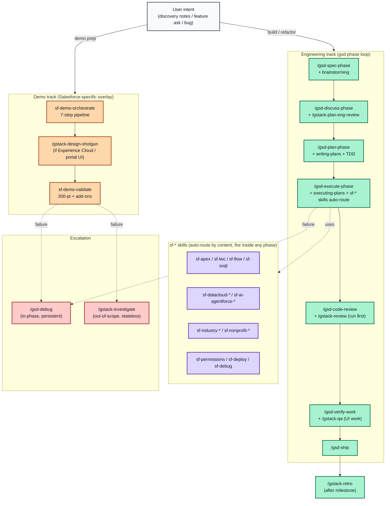
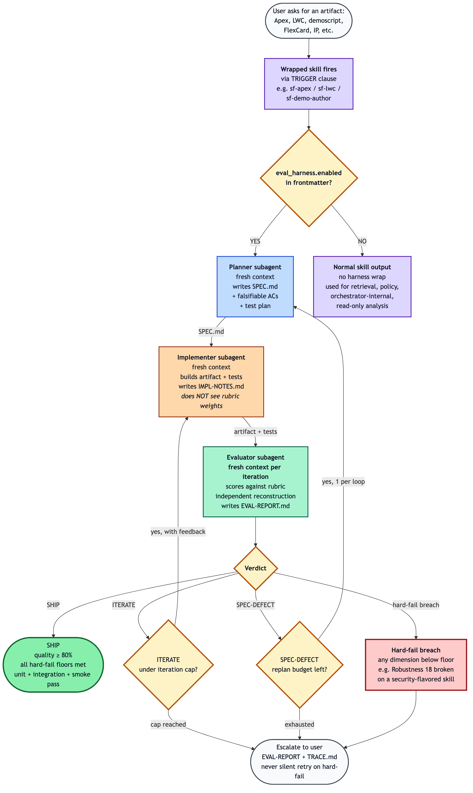
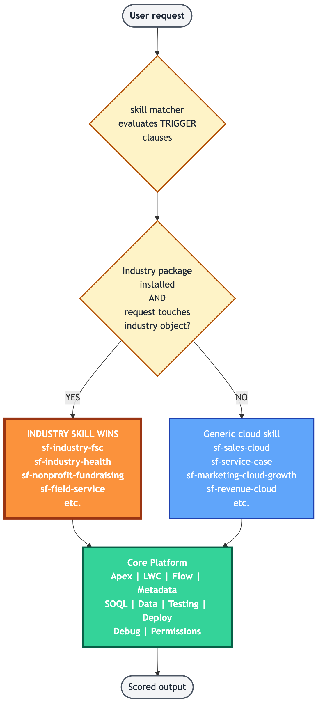
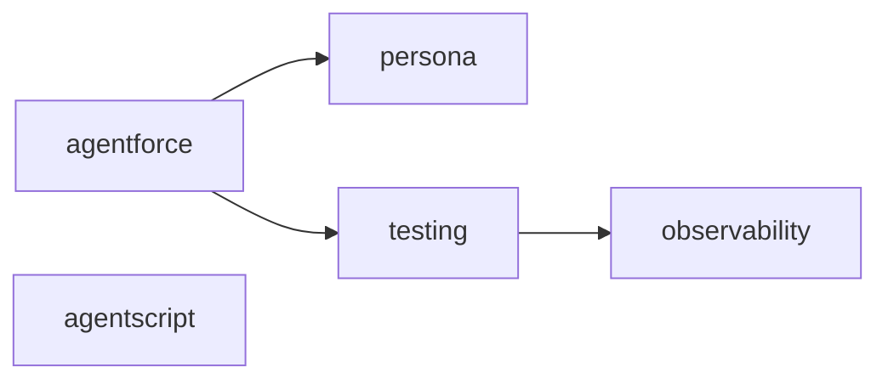
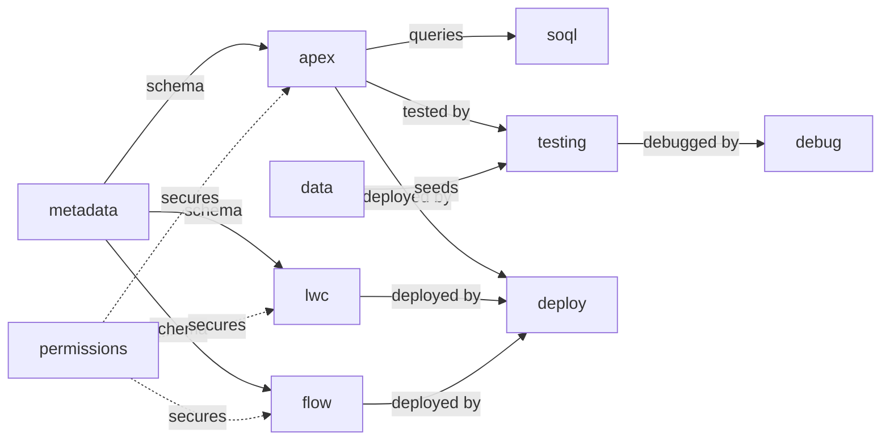
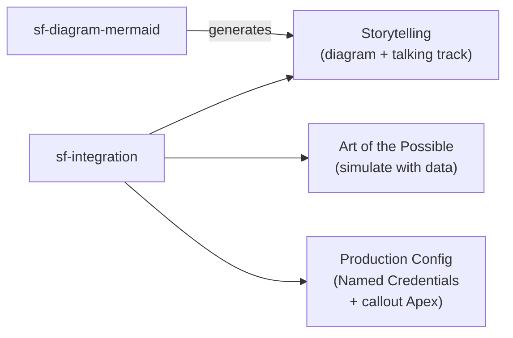
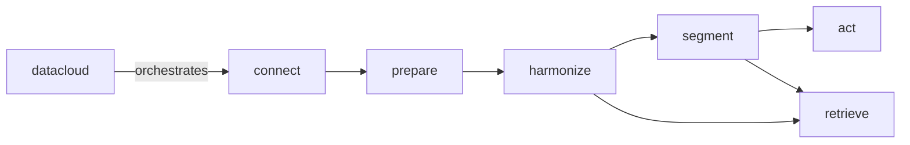
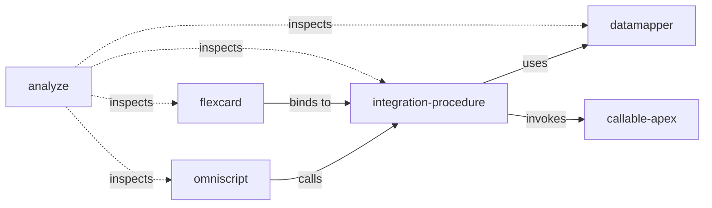
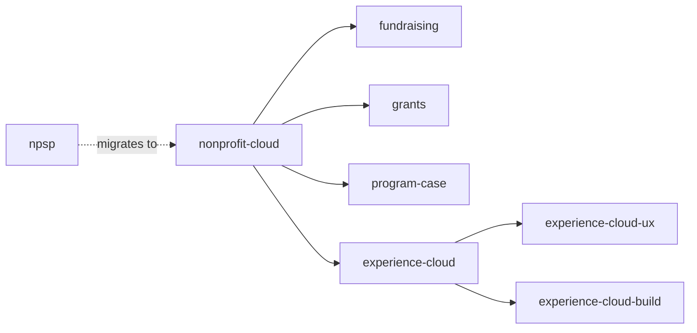
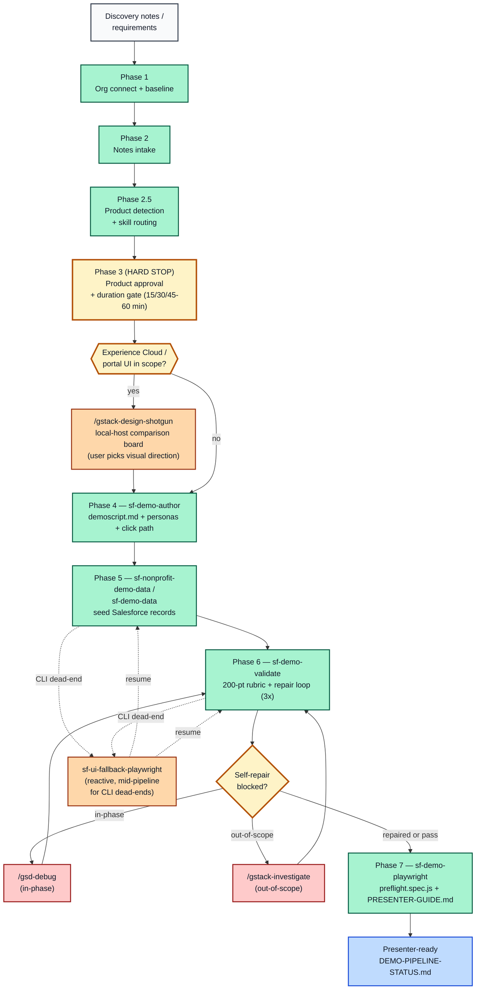

# NGO Salesforce Skills

**Author:** Brian Miller (Senior Solution Engineer @ Salesforce) 

**Co-Author:** Opus 4.6

A curated collection of Cursor Agent Skills I've built and maintain for Salesforce development on the Nonprofit Cloud platform. These aren't just coding helpers -- they represent a fundamentally different way of working with Salesforce.

> ## 💬 You don't type slash commands. You type plain English.
>
> Every skill in this repo auto-routes from natural language. You write what you want done — *"build me a demo for acme-demo"*, *"write an Apex trigger for volunteer intake"*, *"validate my Health Cloud care plan"* — and the agent picks the matching skill from its `TRIGGER when:` clauses. **No `/sf-apex` syntax. No skill names. No incantations.** Just describe the work.
>
> Slash commands (`/gsd-*`, `/gstack-*`, `/brainstorm`) are reserved for the **vendored phase-lifecycle and cognitive-gear packs** that opt into explicit invocation. The 84 `sf-*` skills do not — they all auto-trigger.
>
> The auto-routing is verified end-to-end: every skill carries a structured `TRIGGER when:` and `DO NOT TRIGGER when:` block, the matcher is wired in both Cursor (`beforeSubmitPrompt` hook + always-applied keyword index rule) and Claude Code (native description-matching), and `scripts/sync-skills.sh --check` confirms zero drift across the 84 sf-* skills + 3 cursor-native skills + 87 vendored skills/agents/commands.

What this collection makes possible:

- **Fully automated demo generation** — hand Cursor a set of raw discovery notes from a client meeting and it produces a complete, presentation-ready demo: a structured narrative with named personas, a verbatim step-by-step click path, seeded Salesforce data matched to the story, and a Playwright test suite that runs as an automated pre-flight check before you walk into the room. What used to take days of prep now takes minutes.
- **Autonomous demo validation and repair** — `sf-demo-validate` reads your demo script and simulates delivering the demo end-to-end: it walks every click path step, takes Playwright screenshots to visually verify the UI matches what you expect, executes the full demo flow as the specific named demo user (shift sign-ups, intake form submissions), and loads the Experience Cloud portal as both a guest and a logged-in member. Anything that fails, it fixes: missing metadata gets generated and deployed, stale data gets re-seeded, broken flows get repaired, permission gaps get patched. Then it re-validates and gives you a scored pass/fail report -- all without a human touching the org.
- **Adversarial evaluation harness on every artifact-producing skill** — 79 of the 84 `sf-*` skills are wrapped by `sf-skill-eval-harness`. When any of them produces an artifact (Apex class, LWC, demoscript, FlexCard, Integration Procedure, segment, etc.), three fresh-context subagents run in sequence — a planner writes acceptance criteria, an implementer builds against them blind to the rubric, and an evaluator grades in fresh context against hard-fail floors. The result: production-grade output, not "first draft that scored itself a 196/200." See [**Adversarial Eval Harness**](#adversarial-eval-harness) below for the full architecture.
- **Integration storytelling and "art of the possible" simulation** — for demo environments where a live integration doesn't exist, the agent can show what an integration *would* look like: a Mermaid sequence diagram with a verbatim presenter talking track and a prepared answer for "is this live?", or Anonymous Apex that simulates the integration as real data (fake inbound payloads, records stamped as if they arrived from an external system, Platform Events fired as if triggered by third-party software). The audience sees the capability. No external system required.
- **Deep Salesforce domain expertise on demand** — 84 `sf-*` skills covering every layer of the Salesforce platform: Apex, LWC, Flow, Metadata, SOQL, Deployment, Data Operations, Permissions, Integration, Connected Apps; Data Cloud (all 7 phases — orchestrator + Connect/Prepare/Harmonize/Segment/Act/Retrieve); Agentforce (build, test, observe, persona, script); OmniStudio (OmniScript, Integration Procedure, Data Mapper, FlexCard, Callable Apex, Analyze); Sales Cloud (orchestrator + opportunity, forecasting, engagement); Service Cloud (orchestrator + case, omnichannel, knowledge); Marketing (MC Growth, Account Engagement); Revenue Cloud; Tableau; MuleSoft; Slack; Industry Clouds (FSC, Health, Education, Public Sector, Field Service, Manufacturing, CG, Comms, Media, Energy); AI primitives (Prompt Builder, Model Builder + Trust Layer); Platform Builder (Lightning App Builder, Flow Orchestration, Reports + Dashboards, Experience Cloud); Trust + Ops (Shield, Backup + Data Mask, DevOps Center, Identity + SSO); and the full Nonprofit Cloud stack (fundraising, grants, program management, Experience Cloud trio). Industry-first routing ensures industry skills win over generic cloud skills when detected. Each skill encodes the standards, patterns, and scoring rubrics I use -- so the agent produces production-quality output, not generic boilerplate.
- **End-to-end nonprofit-specific intelligence** — from NPSP migration guidance and NPC data modeling to donor lifecycle management, grant pipelines, volunteer intake, program enrollment, and the portal experiences that serve constituents -- the agent knows the nonprofit platform the way a specialized architect does.

These skills encode my approach to Salesforce architecture, coding standards, and demo delivery into reusable instructions that give any AI agent the domain knowledge to work the way I would -- with the depth, precision, and nonprofit context that generic AI assistance can't provide. The skills are written in standard markdown and work identically in **Cursor** (native skill system, auto-triggered), **Claude Code** (native skill system via `~/.claude/skills/`, auto-triggered), and **Claude.ai** (via Claude Projects or direct conversation). See [CLAUDE.md](CLAUDE.md) for Claude-specific setup.

### Four-layer composition (what's actually loaded)

The 84 `sf-*` skills are the *domain knowledge* layer. A complete development workflow also needs a **project lifecycle**, **engineering methodology**, **cognitive-gear specialists**, and an **adversarial evaluation harness** that wraps the artifacts every domain skill produces. The four layers compose:

1. **`sf-*` skills (84)** — domain knowledge, auto-triggered from natural language. No slash commands.
2. **`sf-skill-eval-harness` (cross-cutting)** — wraps 79 of 84 sf-* skills. Three-agent loop (planner / implementer / evaluator in fresh contexts) with hard-fail floors. The 4 unwrapped are genuine non-fits (pure retrieval, orchestrator-internal, policy/router, library-bootstrap). See [**Adversarial Eval Harness**](#adversarial-eval-harness).
3. **Vendored phase-lifecycle + methodology + cognitive-gears** — three upstream packs at pinned SHAs, composed on top of the sf-* track:
   - **[get-shit-done (gsd)](https://github.com/gsd-build/get-shit-done)** — phase-based spec→plan→execute→verify→ship lifecycle, invoked as `/gsd-*` (65 commands, 33 phase agents)
   - **[superpowers](https://github.com/obra/superpowers)** — TDD, subagent-driven development, systematic debugging, plus 14 auto-triggering skills that fire on pattern match (e.g., `brainstorming`, `test-driven-development`, `executing-plans`)
   - **[gstack](https://github.com/garrytan/gstack)** — Y Combinator–grade cognitive specialists invoked as `/gstack-*` (≈47 skills: founder taste, paranoid review, browser-based QA via Chromium, design-variant exploration, release mechanics)
4. **Cursor + Claude Code routing infrastructure** — `beforeSubmitPrompt` keyword router, always-applied keyword index rule, Phase 0 industry pre-check, autonomy + parallel-delegation policy. The plumbing that turns "natural language → matched skill" into a deterministic outcome.

Pin bumps land as one-line diffs in `vendor-pins.txt`, reviewable before they ship to the team. Per-vendor post-install hooks handle builds (e.g., gstack rebuilds its Chromium binary). Read the full composition model in [**Vendored skill packs: gsd × superpowers × gstack**](#vendored-skill-packs-gsd--superpowers--gstack) below.

### How the four layers compose for a typical demo build

The simplest mental model: **gsd drives the lifecycle, superpowers enforces methodology inside every phase, gstack is the optional rigor layer for specific phases, and `sf-*` skills auto-fire from the work content** regardless of which phase you're in.

For an end-to-end nonprofit demo build the canonical flow is:

1. User connects an org and dumps discovery notes → `sf-demo-orchestrate` fires (one of the `sf-*` skills) and drives the 7-step demo pipeline. This is *not* a gsd phase — `sf-demo-orchestrate` is its own self-contained workflow.
2. If the demo includes a portal / Experience Cloud surface, the orchestrator co-suggests `/gstack-design-shotgun` between product approval and demoscript authoring so the user picks a visual direction from local-host previews before the build commits.
3. For deeper engineering work *inside* the demo (custom Apex, LWC, flow orchestration, data model changes), use the gsd phase loop: `/gsd-spec-phase` → `/gsd-discuss-phase` → `/gsd-plan-phase` → `/gsd-execute-phase` → `/gsd-code-review` → `/gsd-verify-work` → `/gsd-ship`. The relevant `sf-*` skill auto-routes inside each phase.
4. After all milestones are built, `sf-demo-validate` runs a final 200-pt org-readiness check against the demoscript. If self-repair is blocked, escalate to `/gsd-debug` (in-phase) or `/gstack-investigate` (out-of-scope).
5. `/gstack-retro` closes the milestone with a commit-history retrospective that feeds the next `/gsd-new-milestone`.

See [**How It Works: End-to-End Demo Workflow**](#how-it-works-end-to-end-demo-workflow) and [**Vendored skill packs: gsd × superpowers × gstack**](#vendored-skill-packs-gsd--superpowers--gstack) for the full diagrams.



**Reading the diagram:** the **Demo track** (orange) is its own self-contained pipeline driven by `sf-demo-orchestrate` — it does not advance gsd phase state. The **Engineering track** (green) is the gsd phase loop for any non-trivial build, with superpowers skills auto-firing inside each phase and gstack gears running as targeted rigor passes. The `sf-*` skills (purple) auto-route based on the content being produced and fire *inside* whatever phase is active. The escalation chain (red) catches any failure in either track that the active skill cannot self-repair.

---

## Popular Skills — How to Kick Things Off

You don't need to memorize the catalog. Here are the most-used entry points by intent. Type the example phrase verbatim or paraphrase it — the skill auto-fires from the `TRIGGER when:` clause in its frontmatter. **No slash command required.**

### "I want to build a demo from scratch"

| Intent | Plain-English prompt | Skill that fires |
|---|---|---|
| Full demo pipeline from notes | *"Prep a demo for acme-demo from these notes: [paste]"* | `sf-demo-orchestrate` (drives all 7 phases end-to-end) |
| Just write the demoscript | *"Turn these notes into a demoscript"* | `sf-demo-author` |
| Just seed the data | *"Seed the data for this demoscript"* | `sf-nonprofit-demo-data` (NPC/NPSP) or `sf-demo-data` (cross-cloud) |
| Just validate the org | *"Validate the demo for acme-demo"* / *"Is the demo ready?"* | `sf-demo-validate` (200-pt rubric + repair loop) |
| Generate a Playwright pre-flight suite | *"Generate Playwright tests from this demoscript"* | `sf-demo-playwright` |

### "I want to write Salesforce code"

| Intent | Plain-English prompt | Skill that fires |
|---|---|---|
| Apex class / trigger / batch / queueable | *"Write an Apex trigger for Account that..."* | `sf-apex` (150-pt) |
| LWC component | *"Build a Lightning Web Component that displays..."* | `sf-lwc` (165-pt PICKLES methodology) |
| Salesforce Flow | *"Create a record-triggered flow that..."* | `sf-flow` (110-pt) |
| SOQL/SOSL query | *"Write a SOQL query that..."* | `sf-soql` (100-pt) |
| Run + fix Apex tests | *"Run the Apex tests and fix any failures"* | `sf-testing` (120-pt) |
| Debug a stack trace | *"Debug this governor limit error: [log]"* | `sf-debug` (100-pt) |
| Deploy metadata | *"Deploy this to my sandbox"* | `sf-deploy` |

### "I want to design a Salesforce solution"

| Intent | Plain-English prompt | Skill that fires |
|---|---|---|
| Nonprofit Cloud architecture | *"Should we use NPC or NPSP for this org?"* | `sf-nonprofit-cloud` |
| Donor management / fundraising | *"Set up recurring gifts in NPC"* | `sf-nonprofit-fundraising` |
| Grants management | *"Build a grant application workflow"* | `sf-nonprofit-grants` |
| Program enrollment / case management | *"Track program participants with intake automation"* | `sf-nonprofit-program-case` |
| Financial Services Cloud | *"Build a household with multiple members in FSC"* | `sf-industry-fsc` (industry-first wins over generic Sales) |
| Health Cloud | *"Design a care plan for a chronic care patient"* | `sf-industry-health` (industry-first wins over generic Service) |
| Education Cloud / EDA | *"Set up program enrollment for incoming students"* | `sf-industry-education` |
| Public Sector Solutions | *"Build a benefit application intake form"* | `sf-industry-public-sector` |

### "I want to work with Data Cloud or Agentforce"

| Intent | Plain-English prompt | Skill that fires |
|---|---|---|
| End-to-end Data Cloud pipeline | *"Set up Data Cloud for this use case"* | `sf-datacloud` (orchestrator → routes to phase) |
| Build / configure an Agentforce agent | *"Build me an agent that handles donor inquiries"* | `sf-ai-agentforce` |
| Author a PromptTemplate | *"Create a Prompt Builder template for case summaries"* | `sf-ai-prompt-builder` |
| Trust Layer / BYOM model swap | *"Swap the default GPT model for Claude on Bedrock"* | `sf-ai-model-builder-trust-layer` |
| Test an agent | *"Run agent tests and analyze coverage"* | `sf-ai-agentforce-testing` |
| Debug an agent session | *"Why did the agent route to the wrong topic?"* | `sf-ai-agentforce-observability` |

### "I want to build a portal / Experience Cloud site"

| Intent | Plain-English prompt | Skill that fires |
|---|---|---|
| Architecture + sharing | *"Set up a donor portal with guest access"* | `sf-nonprofit-experience-cloud` |
| UX/UI design | *"Design the donor journey for this portal"* | `sf-nonprofit-experience-cloud-ux` |
| Build the actual site | *"Build out the donor portal modeled after their website"* | `sf-nonprofit-experience-cloud-build` |
| Generic (non-nonprofit) Experience Cloud | *"Stand up a customer community on LWR"* | `sf-experience-cloud` |

### "I just want a quick architecture diagram"

| Intent | Plain-English prompt | Skill that fires |
|---|---|---|
| ERD / sequence / flowchart in Mermaid | *"Diagram the OAuth flow for this integration"* | `sf-diagram-mermaid` (auto-renders via nanobananapro) |
| Polished image / PNG | *"Generate an ERD image of the donor data model"* | `sf-diagram-nanobananapro` |

### Recommended first run

If you're new to the repo, type this exact prompt into Cursor or Claude Code:

```
I just installed NGOSkills. Connect to my Salesforce org "acme-demo" and
run a baseline scan — show me what packages are installed, what custom
objects exist, whether Person Accounts are enabled, and which add-on
products (Agentforce, Data Cloud, OmniStudio) are provisioned.
```

The agent will auto-route to `sf-demo-orchestrate` Phase 1 (org connect + baseline) without you naming the skill. Once it finishes, paste your discovery notes and say *"prep a demo from these notes"* — the rest of the pipeline runs end-to-end.

---

## Adversarial Eval Harness

Most skills follow a "builder-grades-own-work" pattern: the same agent that produces the artifact also scores it against the rubric. **Self-evaluation is a trap** — the producer has every incentive to score itself favorably, and rubrics applied in the same context as production drift toward post-hoc rationalization. The classic failure mode: an agent self-rates its work 196/200, but a fresh-context evaluator finds three real bugs the producer rationalized away.

`sf-skill-eval-harness` solves this with a **three-agent closed-loop pattern** that wraps 79 of the 84 `sf-*` skills.



### How it works

When a wrapped skill produces an artifact (Apex class, LWC, demoscript, FlexCard, Integration Procedure, segment definition, etc.), three subagents run in sequence — **each in a fresh context**:

1. **Planner** — translates the user request into `.eval-harness/SPEC.md` with falsifiable acceptance criteria, an out-of-scope list, and a test plan. *Never sees the implementer's code on a re-plan; only the evaluator's spec-defect report.*
2. **Implementer** — produces the artifact + tests against the SPEC. **Does NOT see the rubric weights or hard-fail floors** — only the AC list and (on iteration ≥2) the previous evaluator's prose feedback. This prevents fitting-to-rubric across iterations.
3. **Evaluator** — fresh subagent per iteration. Grades against the rubric, runs tests, builds an independent reconstruction of the coverage matrix, and emits one of three verdicts: `SHIP`, `ITERATE`, or `SPEC-DEFECT`. Quotes evidence from the artifact for every score — "7/10" without a quote is invalid.

Each role runs in its own subagent context. No role sees the others' working memory — only structured handoff files in `.eval-harness/`.

### Hard-fail floors prevent partial-credit gaming

Every wrapped skill maps its existing N-category rubric onto the SPEC §5.1 4-dimension shape (Correctness / Robustness / Fit / Performance, 25 pts each). **Any dimension below its floor → verdict is `ITERATE` regardless of total score.** A 92/100 with Correctness at 14 does not ship.

| Skill flavor | Heaviest floor | Why |
|---|---|---|
| Security / regulated (sf-permissions, sf-shield, sf-identity-sso, sf-connected-apps, sf-industry-fsc, sf-marketing-cloud-growth, sf-datacloud-act, sf-industry-public-sector, sf-ai-model-builder-trust-layer) | Robustness 18 | Compliance failures = regulated breach with mandatory disclosure |
| Backup / disaster recovery (sf-backup-datamask) | Correctness 18 | Untested backups aren't backups |
| Health Cloud (sf-industry-health) | Robustness 18 | PHI exposure is regulated; HIPAA Technical Safeguards aren't optional |
| Field Service (sf-field-service) | Correctness 18 | Case-as-Work-Order is permanent; breaks scheduling forever |
| Default | Correctness 15, Robustness 12, Fit 10, Performance 12 | Per SPEC §5.1 4-dim default |

### Pilot results — 4 of 4 passed SPEC §8 success metrics

The harness has been validated across four real LLM-driven runs:

| Pilot | Skill | Result | Self-eval gaps caught |
|---|---|---|---|
| Children Inc demo prep | sf-demo-validate (Phase 6) | ITERATE 77 → SHIP 89 | 3 (N+1 bulk, no dup-prevent, "Scheduled" string drift vs NPC enum) |
| Riverside food bank demo | sf-demo-author (Phase 4) | SHIP 95 (calibration miss caught → tightened rubric) | 3 (narration anchored to wrong step, arithmetic, POV count) |
| Apex code-gen | sf-apex (Stage B) | SHIP 93 | Clean code; rules calibrated correctly negative-direction |
| LWC code-gen | sf-lwc (Stage B) | SHIP 94 | 2 minor (test name collapse, display:contents a11y edge) |

Every pilot caught at least one defect that would have shipped under self-evaluation. The four-of-four success rate exceeds the SPEC §8 keep-criterion (3/4).

### Wrap coverage — 79 of 84 sf-* skills

The 4 unwrapped sf-* skills are intentional non-fits, not deferrals:

- `sf-docs` — pure retrieval (per SPEC §3 non-goals: "Not for skills that don't ship artifacts")
- `sf-demo-orchestrate` — orchestrator-internal; its 7 phases are individually wrapped per SPEC §16 (the orchestrator wraps recursively via the wrapped phase skills)
- `sf-subagent-orchestration` — policy/routing skill, no artifact
- `sf-industry-commoncore-omnistudio-analyze` — read-only dependency analysis
- `sf-ui-autonomous` — bootstrap; wrap when `library/library.json` flows array has at least one captured flow to grade against

The harness skill itself ships in `skills-cursor/sf-skill-eval-harness/` with 49 pytest tests (all green) and 6 fixture sets (4 LLM pilots + 1 deterministic walkthrough + 1 Stage B apex/lwc validation). Read the full SPEC at [`content/specs/skill-eval-harness-SPEC.md`](content/specs/skill-eval-harness-SPEC.md).

### Disabling the harness for a specific skill

Set `eval_harness.enabled: false` in the skill's SKILL.md frontmatter. The skill runs as it did before, no harness wrap. The harness skill itself remains installed — its tests keep it honest — but no subagents are spawned.

---

## Getting Started

Skills work in **Cursor**, **Claude Code** (CLI), and **Claude.ai**. The same `SKILL.md` files power all three -- no conversion, no duplication. Both Cursor and Claude Code read the skills directly from this repo, so a single `git pull` updates every environment at once. Any new skill added from either system becomes instantly available in the other.

### Cursor

**Install** — open Cursor and prompt:

```
Clone https://github.com/bmillersf/NGOSkills.git into my Cursor skills
directory and set up all the skills so they're available in my environment.
Then run scripts/sync-skills.sh --fix to wire up the per-skill symlinks
and the always-apply rules.
```

**Verify** — prompt with any trigger phrase:

```
Write an Apex class that handles volunteer intake
```

The `sf-apex` skill activates automatically and follows its 5-phase workflow and 150-point scoring rubric.

**Update** — prompt:

```
Pull the latest changes from the NGOSkills repo and update my Cursor skills.
```

After a `git pull`, run `scripts/sync-skills.sh --check` to verify nothing has drifted (or `--fix` to auto-create any missing symlinks for newly added skills).

---

### Claude Code (CLI)

Claude Code has a native skill system that reads from `~/.claude/skills/` and a global behavior policy at `~/.claude/CLAUDE.md`. Point both at this repo with two symlinks so every skill becomes available globally, auto-triggered the same way Cursor handles them, and the agent inherits the same autonomy/parallel-delegation policy as Cursor.

**Install (prompt-driven)** — open Claude Code in any directory and paste:

```
Clone https://github.com/bmillersf/NGOSkills.git into ~/Cursor/Skills/NGOSkills
and install all the Claude skills from it. Run scripts/sync-skills.sh --fix
to wire up the directory-level skills symlink (~/.claude/skills), the per-skill
symlinks for Cursor, and the global autonomy policy symlink (~/.claude/CLAUDE.md).
Then run scripts/sync-skills.sh --check and confirm drift is 0. If the repo is
already cloned, just git pull and re-run --fix.
```

Claude Code will handle the clone, symlinks, and health check autonomously. Restart Claude Code once it finishes and all 84 `sf-*` skills (plus the gsd / superpowers / gstack packs) are available, matched automatically by their `TRIGGER when` descriptions, with the always-apply autonomy and parallel-delegation policy already loaded.

**Install (manual shell alternative)** — if you'd rather run it yourself:

```bash
git clone https://github.com/bmillersf/NGOSkills.git ~/Cursor/Skills/NGOSkills
cd ~/Cursor/Skills/NGOSkills
scripts/sync-skills.sh --fix
```

The script creates the directory-level skills symlink (`~/.claude/skills` → `<repo>/skills`), the per-skill symlinks for Cursor (`~/.cursor/skills/<name>` → `<repo>/skills/<name>`), the per-rule symlinks for Cursor (`~/.cursor/rules/<rule>` → `<repo>/.cursor/rules/<rule>`), and the Claude global policy symlink (`~/.claude/CLAUDE.md` → `<repo>/.cursor/rules/agent-autonomy.mdc`).

**Bidirectional parity** — because both clients read directly from this repo via symlinks, they share one source of truth:

- A skill added or edited in Cursor is instantly visible to Claude Code
- A skill added or edited via Claude Code is instantly visible to Cursor
- `git pull` updates both environments at once
- The optional `scripts/sync-skills.sh --check` health check confirms nothing has drifted; `--fix` creates symlinks for any newly added skills or rules

**Verify** — in any Claude Code session:

```
Write an Apex class that handles volunteer intake
```

The `sf-apex` skill loads automatically and applies its 5-phase workflow and 150-point scoring rubric.

**Update** — prompt Claude Code:

```
Pull the latest changes from the NGOSkills repo and update my Claude skills.
Run scripts/sync-skills.sh --fix to link any new skills and --check to
confirm drift is 0.
```

Or run manually: `git pull` in the repo, then `scripts/sync-skills.sh --check` to confirm clean state. New skills get linked automatically with `--fix`.

---

### Claude.ai

> **Note:** Unlike Cursor and Claude Code, Claude.ai cannot clone repositories or access your filesystem. The setup below is a one-time manual process (~2 minutes) after which Claude.ai routes and applies skills identically to the native environments.

**Claude Projects (recommended)** — full automatic skill routing, persistent across all conversations:

1. In [Claude.ai](https://claude.ai), create a new Project (e.g., `NGO Salesforce Skills`)
2. Upload all `SKILL.md` files from the `skills/` folder as project knowledge
3. Paste the project instructions from [CLAUDE.md](CLAUDE.md) into **Edit project instructions**

Once set up, Claude routes to the right skill automatically based on your prompt — no explicit invocation needed. You can also be direct:

```
Using sf-demo-author, take these notes and generate a demoscript.md: [notes]
```

**Claude without Projects** — paste a single skill's content at the start of a conversation for focused sessions. See [CLAUDE.md](CLAUDE.md).

**Claude API / custom integrations** — generate a bundled system prompt from all skills:

```bash
./scripts/generate-claude-bundle.sh > claude-system-prompt.txt
./scripts/generate-claude-bundle.sh --domain nonprofit > claude-nonprofit-bundle.txt
./scripts/generate-claude-bundle.sh --skill sf-demo-author > claude-demo-author.txt
```

---

## How It Works: End-to-End Demo Workflow

Once the skills are installed, the full demo lifecycle runs through a 7-step pipeline. You provide raw notes from a client meeting, and the agent handles everything from there -- connecting to your org, building the demo script, seeding data, validating the environment, and producing a presenter-ready package. Here's the ideal workflow:


### Step 1: Connect to the org

Before anything else, the agent authenticates to your Salesforce org and runs a baseline scan. It discovers what's already there -- installed packages (NPC, NPSP, V4S), custom objects, active Experience Cloud sites, whether Person Accounts are enabled, and which add-on products (Agentforce, Data Cloud, OmniStudio) are provisioned. This baseline informs every decision downstream.

```
Connect to my org "acme-demo" and show me what's installed
```

### Step 2: Provide discovery notes

Paste in whatever you have -- a meeting transcript, bullet points from a discovery call, an email thread, or even a rough outline. The agent reads through it and extracts what it needs: who's in the audience, what they care about, which Salesforce products are relevant, what the core use case is, and where the "wow moment" should land.

```
Here are my notes from the Acme discovery call:
- Audience: VP of Programs, IT Director, 2 volunteer coordinators
- They manage 200+ volunteers across 5 sites
- Pain: volunteer scheduling is manual, coordinators email spreadsheets
- Want to see: volunteer self-service portal, shift sign-up, intake automation
- Interested in AI for matching volunteers to programs
```

### Step 3: Approve products and confirm demo duration

Based on your notes and the org baseline, the agent recommends which Salesforce products to include in the demo. It switches to plan mode and presents a structured list -- products already enabled in the org, products it recommends adding (with setup effort estimates), and products it's not recommending. You approve or reject each one before anything gets built. This prevents scope creep and ensures the demo stays focused on what the audience actually wants to see.

The agent also asks for the **demo duration** at this gate: Short (15 min, ~5–7 steps), Standard (30 min, ~10–12 steps), or Deep (45–60 min, ~15–18 steps). Duration bounds story depth, step density, and visual count for the rest of the pipeline. Default is Short if you don't specify.

If the discovery notes mention an **Experience Cloud / portal / public-facing UI**, the agent will proactively co-suggest `/gstack-design-shotgun` between this step and Step 4. It generates multiple AI design variants and opens a local-host comparison board so you pick a visual direction *before* the demoscript locks in the click path. This is what people sometimes remember as "the localhost UI preview" — it's a gstack skill, not the brainstorming skill (which is dialogue-only).

### Step 4: Demo script generated

The agent produces a complete `demoscript.md` -- a structured document with a narrative story arc (Situation, Challenge, Journey, Resolution), named personas with realistic details (not "User 1"), and a verbatim click-by-click path that a presenter can follow without guesswork. Every step includes the exact app, tab, button, field, and value to interact with, plus business-value talking points tied to the story. The script also includes YAML frontmatter listing demo users, a prerequisites section, data seed requirements, and a teardown section for cleanup.

### Step 5: Data seeded

The agent reads the personas and data requirements from the demoscript and generates story-coherent Salesforce records. Volunteers have real names, realistic application dates, and tutoring backgrounds that match the story. Shifts are future-dated 7-21 days out so they always look fresh. Gift histories span multiple years with plausible amounts. Everything is scoped to `@demo.` email domains so teardown never touches real data. The agent seeds the data using Anonymous Apex, `sf data` CLI commands, or JSON tree imports -- whatever fits the data shape.

### Step 6: Validated and repaired

`sf-demo-validate` reads the demoscript and systematically walks every step against the live org. It checks platform prerequisites, metadata, data quality, permissions, automations, UI rendering, Experience Cloud sites, and end-to-end user simulations (actually submitting forms, signing up for shifts, creating records as specific demo personas). When something fails -- a missing field, a stale record, a broken flow, a permission gap -- it delegates the fix to the appropriate skill, applies it, and re-validates. This loop runs up to 3 times before escalating.

If self-repair is blocked after 3 attempts, the escalation chain kicks in: `/gsd-debug` for in-phase issues (preserves context across sessions, scientific method, integrates with `.planning/`), `/gstack-investigate` for out-of-scope issues (stateless 4-phase root-cause loop, no phase overhead). Never advance to Step 7 with a red verdict. The result is a scored pass/fail report across all validation categories.

### Step 7: Ready to present

The agent generates a Playwright test suite (`demo-preflight.spec.js`) that you run before every demo session as an automated pre-flight check. It also produces a `PRESENTER-GUIDE.md` with embedded screenshots, per-step talking points, and a quick-reference table. Run `scripts/preflight.sh` before you walk into the room -- if all tests pass, you're ready. If any fail, the report tells you exactly what broke and what to fix.

```bash
./scripts/preflight.sh --target-org acme-demo
# ✅ All 12 tests passed — ready to demo
```

### What this looks like in practice

The entire workflow -- from pasting discovery notes to having a validated, presenter-ready demo -- typically takes **15-30 minutes** of hands-on time. The agent does the heavy lifting: building the narrative, generating metadata, seeding data, and validating the environment. You review, approve product recommendations, and make any adjustments to the story. What used to take days of manual prep now fits into a single working session.

---

## Repository Structure

```
skills/                          # Salesforce-domain skills (84 sf-* skills, 79 wrapped by sf-skill-eval-harness)
skills-cursor/                   # Cursor-ecosystem utilities (babysit, create-hook,
                                 #   statusline, update-cli-config) + sf-skill-maintenance
                                 #   meta-skill (authoring contract + 4-layer auto-refresh)
                                 #   + sf-skill-learning (continuous learning system)
                                 #   + sf-skill-eval-harness (adversarial eval orchestrator
                                 #     wrapping 79 of 84 sf-* skills — planner / implementer /
                                 #     evaluator subagents in fresh contexts; see
                                 #     content/specs/skill-eval-harness-SPEC.md)
references/
  industry-precheck.md           # MANDATORY Phase 0 pre-check for every generic cloud skill —
                                 #   detects industry license/namespace/object and forwards
                                 #   to owning sf-industry-* / sf-nonprofit-* skill
  subagent-authoring-brief.md    # Template for skill-authoring subagents
CLAUDE.md                        # Claude.ai setup guide (Projects, per-conversation, API)
                                 #   + industry-first precedence rule + full routing table
vendor-pins.txt                  # Pinned SHAs for vendored third-party skill packs
                                 #   (gsd, superpowers, gstack). Every pin bump lands
                                 #   as a reviewable one-line diff — see references/vendor-policy.md.
.vendor/                         # Gitignored. Vendored trees materialized by scripts/vendor-install.sh
                                 #   at the pinned SHAs. Never edit directly; never commit.
scripts/
  setup.sh                       # One-shot teammate onboarding: vendor-install + sync-skills --fix.
                                 #   Safe to re-run; everything is idempotent.
  vendor-install.sh              # Materializes every pin in vendor-pins.txt into .vendor/<slug>/
                                 #   (--verify is read-only; exit 1 on drift).
  vendor-update.sh               # Dry-runs pin bumps (shows upstream diff); --apply rewrites
                                 #   vendor-pins.txt. One vendor at a time by design.
  vendor-hooks/                  # Per-vendor post-install scripts run after checkout at the
                                 #   pinned SHA. gstack-post-install.sh rebuilds its Chromium
                                 #   browse binary and relinks /gstack-* commands.
  sync-skills.sh                 # Health-check (--check) and idempotent fix (--fix) for
                                 #   all skill, rule, Claude-config, vendor-hook, and
                                 #   get-shit-done-payload symlinks.
  audit-triggers.sh              # Static audit for overlapping TRIGGER phrases across skills
  refresh-skills.sh              # Layer 1+2 auto-refresh — scans every skill's upstream_refs,
                                 #   diffs against stored sha256, emits refresh-report.md
  refresh-skills-auto.sh         # Layer 3 — generates a Claude Code subagent queue for
                                 #   drift-detected skills; subagents propose PRs, never auto-merge
  release-handoff.sh             # Layer 4 — release-cut playbook; cross-references release
                                 #   notes TOC against every skill's TRIGGER clauses
  com.ngoskills.refresh.plist    # macOS launchd plist — weekly Sunday 03:00 auto-refresh
  gh-workflow-staging/           # GitHub Action for weekly auto-refresh (staged until PAT
                                 #   has workflow scope; see staging README for install)
  generate-claude-bundle.sh      # Generates a bundled Claude system prompt from all skills
  nonprofit-knowledge-engine.py  # Scrapes SF docs, compartmentalizes NPSP vs NPC, builds keyword index
  refresh-nonprofit-content.sh   # One-command refresh for release-day updates
  requirements-knowledge-engine.txt  # Python dependencies for the knowledge engine
assets/
  images/                        # Rendered architecture diagrams (generated from Mermaid source)
content/                         # Auto-generated knowledge base (populated by the engine)
  keyword-index.json             # Keyword→skill routing index
  npsp/                          # NPSP-classified content sections
  npc/                           # NPC-classified content sections
  shared/                        # Cross-platform content sections
  npsp-vs-npc-comparison.md      # Implementation rules for platform separation
.cursor/
  hooks.json                     # Cursor hook config for auto-skill-routing
  hooks/nonprofit-skill-router.* # Hook that auto-detects nonprofit keywords in prompts
  rules/agent-autonomy.mdc       # Always-applied: autonomous execution, parallel-first
                                 #   delegation, git-worktree variants, canonical skill
                                 #   creation. ALSO the source for ~/.claude/CLAUDE.md
                                 #   so both clients inherit the same policy.
  rules/nonprofit-auto-router.md # Always-applied rule with keyword index for auto-routing
  rules/org-discovery.mdc        # Always-applied rule: org connection, product approval, query-before-create
  rules/dashboard-report-ux.mdc  # Always-applied rule: dashboard and report UX standards
references/
  vendor-policy.md               # Supply-chain review checklist for pin bumps (read upstream
                                 #   diff, check for new commands/settings writes, etc.)
```

## Vendored skill packs: gsd × superpowers × gstack

NGOSkills owns the 84 `sf-*` domain skills + the cross-cutting `sf-skill-eval-harness` (which wraps 79 of them), but a complete development workflow needs more than just domain knowledge — it needs a project lifecycle (spec → plan → execute → verify), engineering methodology (TDD, brainstorming, code review), and cognitive-gear specialists (founder taste, paranoid review, browser-based QA, design exploration). Rather than reinvent those, NGOSkills vendors three upstream skill packs at pinned SHAs and composes them with the `sf-*` track.

| Pack | Owns | Invocation |
|---|---|---|
| **[get-shit-done (gsd)](https://github.com/gsd-build/get-shit-done)** | Phase-based spec→plan→execute lifecycle, roadmap/milestone management, multi-phase orchestration, verification gates, context-window monitoring | `/gsd-*` (65 slash commands + 33 phase agents: `spec-phase`, `plan-phase`, `execute-phase`, `verify-work`, `ship`, `code-review`, `debug`, etc.) |
| **[superpowers](https://github.com/obra/superpowers)** | Core engineering methodology: TDD red/green, subagent-driven development, plan-writing, systematic debugging, verification-before-completion | `/brainstorm`, `/write-plan`, `/execute-plan`, plus 14 auto-triggering skills (fire on pattern match without explicit invocation) |
| **[gstack](https://github.com/garrytan/gstack)** | Cognitive-mode specialists — Y Combinator "founder taste" pressure-test, paranoid-staff-engineer review, browser-based QA via Chromium, design-variant exploration, release-engineer shipping mechanics, engineering retrospectives | `/gstack-*` (≈47 slash commands: `plan-ceo-review`, `plan-eng-review`, `review`, `ship`, `qa`, `browse`, `design-shotgun`, `investigate`, `retro`, etc.) |

### Composition rule (MANDATORY)

**gstack's gears run inside gsd's phases, not instead of them.** Never substitute a gstack command for its gsd equivalent — they have different contracts. gsd commands write to `.planning/` and advance phase state; gstack commands are stateless cognitive passes. superpowers skills auto-fire on pattern match inside every phase. Run all three as layered rigor, not as competing alternatives.

### Canonical phase-to-gear mapping

| gsd phase | Superpowers skills (auto-fire) | gstack gear to run inside it | Why |
|---|---|---|---|
| `/gsd-spec-phase` (defining WHAT) | `brainstorming` | `/gstack-plan-ceo-review` | Founder-mode pressure-tests whether the spec is describing the *right* product before it's locked |
| `/gsd-discuss-phase` (gathering context) | — | `/gstack-plan-eng-review` | Tech-lead mode surfaces architecture constraints, failure modes, and diagrams before planning |
| `/gsd-plan-phase` (writing PLAN.md) | `writing-plans`, `test-driven-development` | — | gsd-planner + superpowers TDD is sufficient here |
| `/gsd-execute-phase` (implementing) | `executing-plans`, `subagent-driven-development`, `dispatching-parallel-agents` | — | Superpowers owns execution; gstack doesn't overlap |
| `/gsd-code-review` (pre-ship audit) | `requesting-code-review`, `receiving-code-review` | `/gstack-review` | Paranoid-staff-engineer mode hunts production-killing bugs (N+1, race conditions, trust-boundary violations) that gsd's reviewer may miss |
| `/gsd-verify-work` (UAT) | `verification-before-completion` | `/gstack-qa` or `/gstack-qa-only` | Browser-based diff-aware verification — reads the diff, spins up Chromium, tests every affected page |
| `/gsd-ship` (PR creation) | `finishing-a-development-branch` | `/gstack-ship` (optional) | gsd-ship handles planning-aware PRs; use gstack-ship only when operating outside a gsd phase |
| After milestone completion | — | `/gstack-retro` | Data-driven retrospective from commit history; feeds into next `/gsd-new-milestone` |

### Demo-track integration (Salesforce-specific overlay)

The phase table above describes generic engineering work. For Salesforce **demo work**, two `sf-*` skills overlay the lifecycle:

| Demo lifecycle moment | Skill | What fires |
|---|---|---|
| User dumps discovery notes ("prep a demo from these notes") | `sf-demo-orchestrate` | Runs the 7-step pipeline end-to-end (org connect → notes intake → product detection → product + duration approval gate → demoscript → data seed → validate/repair → Playwright). Owns its own status file (`DEMO-PIPELINE-STATUS.md`) — does **not** advance gsd phase state. |
| Product approval just confirmed, demo includes Experience Cloud / portal / public UI | `/gstack-design-shotgun` (proactive co-suggestion) | Generates multiple AI design variants, opens a local-host comparison board so the user picks a visual direction *before* `sf-demo-author` writes the click path or `sf-nonprofit-experience-cloud-build` locks in the implementation. |
| Final org-readiness check before ship | `sf-demo-validate` | Reads the demoscript, runs a 200-pt + add-on rubric across 10 categories, executes self-repair loop (up to 3x). |
| `sf-demo-validate` self-repair blocked, in-phase | `/gsd-debug` | Persistent state across sessions, integrates with `.planning/`, scientific method. |
| `sf-demo-validate` self-repair blocked, out-of-scope | `/gstack-investigate` | Stateless 4-phase root-cause loop for issues outside the phase scope (org-config oddities, infra). |

**Important distinction:** `brainstorming` (superpowers) is dialogue-only — clarifying questions and a design doc. `/gstack-design-shotgun` is the variant generator with the local comparison board. They are *not* the same skill; reach for design-shotgun when the user wants to *see what it could look like*.

### When NOT to use a pack

- **Don't use `/gstack-ship` inside a gsd phase** — it bypasses `.planning/` state. Use `/gsd-ship` instead.
- **Don't use `/gstack-plan-ceo-review` after code is already written** — its value is pre-spec; after implementation it's scope-creep theater.
- **Don't use gsd alone for pure exploratory coding** — spec→plan→execute overhead isn't worth it for a one-file script. Use superpowers' `/brainstorm` and TDD directly.
- **Don't run `/gstack-review` AND `/gsd-code-review` on the same diff and merge findings** — run gstack-review first (broader paranoid pass), then gsd-code-review (phase-aware, writes REVIEW.md). Sequential, not redundant.

### Supply-chain review and update pipeline

All three vendors flow through the same 5-step pipeline. Pin bumps land as one-line diffs in `vendor-pins.txt`, making every update reviewable before it runs.

```
scripts/auto-update-skills.sh      →  pulls NGOSkills main (SessionStart hook, two-phase fast-forward)
       ↓
vendor-pins.txt                    →  SHA bumps land via PR; reviewed for malicious instructions
       ↓
scripts/vendor-install.sh          →  materializes new SHA in .vendor/<slug>/
       ↓
scripts/vendor-hooks/<slug>-post-install.sh  →  per-vendor rebuild (gstack rebuilds Chromium binary)
       ↓
scripts/sync-skills.sh --fix       →  fans out symlinks into ~/.claude/ and ~/.cursor/
```

Read [`references/vendor-policy.md`](references/vendor-policy.md) before bumping any pin. Treat every bump as a supply-chain review, not a version bump — the packs contain instructions the assistant executes.

### What actually lands on disk

After `scripts/setup.sh` runs (or after `auto-update-skills.sh` applies a pending update):

- `~/.claude/skills/sf-*` → `NGOSkills/skills/` (84 domain skills, 79 wrapped by sf-skill-eval-harness)
- `~/.claude/skills/gstack-*` → `NGOSkills/.vendor/gstack/<name>/SKILL.md` (≈47 cognitive-gear skills)
- `~/.claude/skills/<superpowers-skill>` → `NGOSkills/.vendor/superpowers/skills/` (14 auto-triggering skills)
- `~/.claude/agents/gsd-*.md` → `NGOSkills/.vendor/gsd/agents/` (33 phase subagents)
- `~/.claude/commands/gsd/` → `NGOSkills/.vendor/gsd/commands/gsd/` (65 phase commands)
- `~/.claude/commands/brainstorm.md`, `write-plan.md`, `execute-plan.md` → superpowers
- `~/.claude/get-shit-done/` → `NGOSkills/.vendor/gsd/get-shit-done/` — gsd's runtime payload (references, workflows, templates, bin). Without this link, gsd agents silently 404 on 187 `@~/.claude/get-shit-done/...` includes and run degraded.
- `~/.claude/hooks/gsd-*` → `NGOSkills/.vendor/gsd/hooks/` — context-monitor, statusline, session-state, prompt-guard, etc.
- `~/.claude/CLAUDE.md` → `NGOSkills/.cursor/rules/agent-autonomy.mdc` (global autonomy + routing rules)

Everything is a symlink into the NGOSkills tree, so a single `git pull` (or auto-update) refreshes every layer atomically.

### Hooks wired into settings.json (recommended)

Two gsd hooks significantly improve execution quality when registered in `~/.claude/settings.json`. They work only because the symlinks above are in place:

| Event | Hook | What it does |
|---|---|---|
| `SessionStart` | `bash $HOME/.claude/hooks/gsd-session-state.sh` | Opt-in via `.planning/config.json` → `hooks.community: true`; injects STATE.md head when resuming a gsd project |
| `PostToolUse` (matcher `Bash\|Edit\|Write\|MultiEdit\|Agent\|Task`) | `node $HOME/.claude/hooks/gsd-context-monitor.js` | Reads context metrics from the statusline bridge; injects `CONTEXT WARNING` (≤35% remaining) or `CONTEXT CRITICAL` (≤25%) directly into the agent's conversation so it can pause cleanly |
| `statusLine` (top-level) | `node $HOME/.claude/hooks/gsd-statusline.js` | Renders `model │ task │ dir │ context-bar`; writes the bridge file that context-monitor reads |

Register them manually in `~/.claude/settings.json` (see the `hooks` and `statusLine` keys). They're not enforced by `sync-skills.sh` — `settings.json` is user-owned and often contains site-specific env vars and marketplaces that a managed sync shouldn't touch.

---

## Architecture

The skills are organized into layered domains that mirror the Salesforce platform stack. The agent reads a user's prompt, matches it against each skill's trigger conditions, and activates the appropriate skill. Skills that share boundaries have explicit routing rules so only one fires at a time.

### Industry-first routing (the primary architectural rule)

**Before any generic cloud skill produces output, it must run the industry pre-check defined in [`references/industry-precheck.md`](references/industry-precheck.md).** If an industry package is installed (FSC, Health Cloud, Education Cloud / EDA, Public Sector Solutions, Field Service, Nonprofit Cloud / NPSP, Manufacturing, Consumer Goods, Communications, Media, or Energy) **and** the request touches an industry-owned object, the generic skill halts and forwards control to the matching `sf-industry-*` or `sf-nonprofit-*` skill. Generic skills never silently override an industry data model.

The pre-check uses three detection signals in order: (1) license / feature flag from `sf org display --json`, (2) namespace scan (`FSC__`, `HealthCloudGA__`, `hed__`, `npsp__`, `vlocity_cmt__`, `vlocity_ins__`, …), (3) `EntityDefinition` object-existence query. Industry skills (`sf-industry-*`, `sf-nonprofit-*`, `sf-field-service`, and `sf-revenue-cloud` when CPQ/RCA is installed) are the destinations of this pre-check — they do not run it themselves.

### How routing works (quick visual)



Every user request flows through the **Phase 0 industry pre-check** before any skill produces output. If an industry package is installed AND the request touches an industry-owned object (e.g., `FSC__Household`, `HealthCloudGA__EhrEncounter__c`, `npsp__Recurring_Donation__c`), the matching industry skill wins. Otherwise the request routes to the matching generic cloud skill. Both paths rest on the Core Platform foundation. Source: [`assets/diagrams/routing-flow.mmd`](assets/diagrams/routing-flow.mmd).

### Domain overview (5-tier map)


The 84 skills organize into five tiers that mirror the routing decision above, plus a cross-cutting Eval Harness layer that wraps 79 of them:

- **Tier 1 — Vertical / Industry (12)** — FSC, Health, Education, Public Sector, Field Service, Manufacturing, Consumer Goods, Communications, Media, Energy, NPC, NPSP. *First line of defense; wins over generic clouds when detected.*
- **Tier 2 — Horizontal / Generic clouds (14)** — Sales (×4: orchestrator + opportunity + forecasting + engagement), Service (×4: orchestrator + case + omnichannel + knowledge), Marketing (×2: MCG + MCAE), Revenue, Experience, Reports + Dashboards, Lightning App Builder. *Runs Phase 0 industry pre-check before emitting output; halts and forwards to Tier 1 on detection.*
- **Tier 3 — Shared capabilities (30)** — AI (7: agentforce build/persona/testing/observe/script + Prompt Builder + Model Builder/Trust Layer), Data Cloud (7: orchestrator + Connect/Prepare/Harmonize/Segment/Act/Retrieve), OmniStudio (6: OmniScript + IP + DataMapper + FlexCard + Callable Apex + Analyze), Integration (3: integration + connected-apps + MuleSoft), Tableau, Slack, Trust + Ops (4: Shield + Backup/DataMask + DevOps Center + Identity/SSO), Flow Orchestration. *Consumed by both vertical and horizontal tracks.*
- **Tier 4 — Core Platform (10)** — Apex, LWC, Flow, Metadata, SOQL, Data, Testing, Deploy, Debug, Permissions. *Foundation; every other skill depends on one or more of these.*
- **Tier 5 — Demo lifecycle + Nonprofit-portal + Meta (18)** — Demo pipeline (orchestrate/author/validate/playwright + demo-data × 2 + ui-fallback-playwright), Nonprofit-portal trio (experience-cloud / -ux / -build), Nonprofit domain (fundraising / grants / program-case), Meta (subagent-orchestration), Visualization + Docs (mermaid + nanobananapro + docs).
- **Cross-cutting — Eval Harness (1 skill, wraps 79)** — `sf-skill-eval-harness` (lives in `skills-cursor/`, fan-out via the harness wrap pattern in 79 of the 84 sf-* skills).

Diagram sources: [`assets/diagrams/domain-architecture.mmd`](assets/diagrams/domain-architecture.mmd), [`assets/diagrams/routing-flow.mmd`](assets/diagrams/routing-flow.mmd), and [`assets/diagrams/eval-harness-flow.mmd`](assets/diagrams/eval-harness-flow.mmd). Regenerate PNGs after edits with:

```bash
npx -p @mermaid-js/mermaid-cli mmdc -i assets/diagrams/routing-flow.mmd \
  -o assets/images/routing-flow.png -w 1200 -H 1600 -b white --scale 2
npx -p @mermaid-js/mermaid-cli mmdc -i assets/diagrams/domain-architecture.mmd \
  -o assets/images/domain-architecture.png -w 1800 -H 1500 -b white --scale 2
npx -p @mermaid-js/mermaid-cli mmdc -i assets/diagrams/eval-harness-flow.mmd \
  -o assets/images/eval-harness-flow.png -w 1400 -H 1600 -b white --scale 2
```


### Demo Validation in the architecture

Demo Validation (`sf-demo-validate`) is the skill that ties everything together. It operates as an autonomous validation and repair loop that exercises every other domain:


The demo script (`demoscript.md`) is the source of truth. It defines the demo story -- the narrative, the personas, and the step-by-step walkthrough. `sf-demo-validate` reads this script and systematically validates that the org can deliver every step:

1. **Org connection & prerequisites** -- confirms `sf` CLI auth, org type, installed packages, and platform features (Person Accounts, Record Types, queues, etc.)
2. **Metadata & configuration** -- verifies custom objects, fields, page layouts, apps, and permission sets exist and are correctly configured
3. **Data quality & freshness** -- checks that demo data is complete, future-dated, free of stale artifacts, and correctly related
4. **Automations** -- validates Flows, triggers, and scheduled jobs fire as expected
5. **UI & Experience Cloud** -- HTTP-pings public sites, verifies guest and member portal pages render with live data
6. **End-to-end user simulation** -- executes transactional demo paths (form submissions, record creation) as specific demo personas via Anonymous Apex
7. **Product-specific checks (core)** -- validates Agentforce agents, Data Cloud pipelines, OmniStudio components, and any other products referenced in the script
8. **Cross-cloud product blocks** (added Phase 4) — Sales Cloud (pipeline health, forecast types, cadences), Service Cloud (entitlements, omni-channel queues, knowledge), Marketing (MC Growth journey OR MCAE automation), Revenue Cloud (price books, quote flow), Tableau (workbooks, data sources), MuleSoft (Anypoint + MuleSoft for Flow), and Slack-extended (apps installed, workflows published)
9. **Industry Cloud blocks** (added Phase 4) — one per industry (FSC household present, Health care plan template active, EDA program enrollment, PSS benefit/license records, Field Service work orders, Manufacturing sales agreements, CG visits, Comms catalog, Media subscribers, Energy premises)

When a step fails, `sf-demo-validate` delegates the fix to the appropriate domain skill (e.g., `sf-apex` for code fixes, `sf-permissions` for access issues, `sf-data` for missing records, `sf-ui-fallback-playwright` when the fix requires a Setup UI click the CLI can't reach), then re-validates -- looping up to 3 times before escalating. The result is a scored pass/fail report: the base 200-point rubric covers all 10 core validation categories, and 13 prorated add-on categories (20 pts each) score the cross-cloud and industry blocks that apply to the detected products.

### Cross-cloud demo orchestration (Phase 2.5 Product Detection)

`sf-demo-orchestrate` now runs a Phase 2.5 **Product Detection & Skill Routing** step before authoring the demoscript. It invokes the industry pre-check, classifies every detected product (industry cloud, generic cloud, Agentforce, Data Cloud, OmniStudio, Tableau, MuleSoft, Slack, Revenue Cloud, etc.), and writes a routing manifest into `DEMO-PIPELINE-STATUS.md`. Phase 5 (data seeding) then routes to `sf-nonprofit-demo-data` for nonprofit parents and `sf-demo-data` for cross-cloud commercial overlays, sequenced deterministically. Any CLI dead-end encountered mid-pipeline (Agent Builder publish, Prompt Builder activation, Experience Builder drag-drop, certain Setup toggles) invokes `sf-ui-fallback-playwright` as a reactive fallback.

---

## Salesforce Skills (`skills/`)

### Agentforce & AI



| Skill | Description |
|---|---|
| **sf-ai-agentforce** | Build Agentforce agents via the Setup UI -- topics, actions, PromptTemplates, and `.genAiFunction` / `.genAiPlugin` metadata. |
| **sf-ai-agentforce-observability** | Extract and analyze Agentforce session traces (STDM data) from Data Cloud, including `.parquet` telemetry files. |
| **sf-ai-agentforce-persona** | Deep persona design for Agentforce agents with a 50-point scoring rubric covering identity, tone, voice, and register. |
| **sf-ai-agentforce-testing** | Dual-track testing workflow for Agentforce agents with 100-point scoring -- test specs, topic routing validation, and coverage analysis via `sf agent test`. |
| **sf-ai-agentscript** | Author deterministic Agentforce agents using the Agent Script DSL (`.agent` files) -- FSM-based state machines, slot filling, and instruction resolution. |

<details>
<summary><strong>Under the hood</strong></summary>

The Agentforce skills split agent development into two tracks -- **declarative** (Setup UI) and **programmatic** (Agent Script DSL) -- that never overlap.

- **sf-ai-agentforce** is the entry point. It owns the Setup UI workflow: creating topics, mapping actions to Apex/Flow invocables, authoring PromptTemplates, and generating `.genAiFunction` / `.genAiPlugin` metadata XML. It requires API v66.0+ (Spring '26). When the user needs to define the agent's personality, it hands off to **sf-ai-agentforce-persona**, which runs a 50-point scoring rubric across identity, tone, voice register, and guardrails.
- **sf-ai-agentforce-testing** takes over once the agent is built. It runs `sf agent test` with structured test specs that validate topic routing, action invocation, and response quality using a dual-track workflow (unit tests for individual topics + integration tests for multi-turn conversations). When tests fail or need deeper analysis, it delegates to **sf-ai-agentforce-observability**.
- **sf-ai-agentforce-observability** extracts STDM (Session Trace Data Model) data from Data Cloud, parses `.parquet` telemetry files, and produces session timeline analysis, step distribution reports, and message-level debugging. It includes Python scripts for auth, Data Cloud querying, and analysis.
- **sf-ai-agentscript** is fully independent -- it covers the code-first FSM approach using `.agent` files, slot filling, instruction resolution, and the `sf agent generate/publish` CLI. It never triggers alongside the Setup UI skill.

</details>

### Core Platform Development



| Skill | Description |
|---|---|
| **sf-apex** | Generate and review Apex classes, triggers, batch/queueable/schedulable jobs, and test classes with a 150-point scoring rubric. |
| **sf-lwc** | Lightning Web Components using the PICKLES methodology with 165-point scoring -- wire service, SLDS, Jest tests, and `.js-meta.xml` config. |
| **sf-flow** | Create and validate Salesforce Flows (record-triggered, screen, autolaunched, scheduled) and `.flow-meta.xml` files with 110-point scoring. |
| **sf-metadata** | Generate and query Salesforce metadata -- custom objects, fields, validation rules, and associated `-meta.xml` files with 120-point scoring. |
| **sf-soql** | SOQL/SOSL query generation, optimization, relationship queries, aggregates, and performance analysis with 100-point scoring. |
| **sf-testing** | Apex test execution, code coverage analysis, and test-fix loops with 120-point scoring for `*Test.cls` files. |
| **sf-debug** | Debug log analysis and troubleshooting -- governor limits, stack traces, and `.log` files with 100-point scoring. |
| **sf-deploy** | DevOps automation using `sf` CLI v2 -- metadata deploys, scratch orgs, sandboxes, and CI/CD pipelines. |
| **sf-data** | Salesforce data operations with 130-point scoring -- test data creation, bulk import/export, `sf data` CLI commands, and data factory patterns. |
| **sf-permissions** | Permission Set analysis, hierarchy visualization, and access auditing for `.permissionset-meta.xml` and `.permissionsetgroup-meta.xml`. |

<details>
<summary><strong>Under the hood</strong></summary>

Core Platform is 10 skills that mirror the Salesforce development lifecycle. They follow a build-test-debug-deploy loop:

- **sf-metadata** starts the cycle. It generates custom objects, fields, validation rules, and all `-meta.xml` files. Its output defines the schema that **sf-apex**, **sf-lwc**, and **sf-flow** build on top of.
- **sf-apex** generates and reviews Apex using a 5-phase workflow: (1) gather requirements, (2) scaffold structure, (3) generate code with a 150-point scoring rubric across 8 categories, (4) generate matching test class, (5) validate and deploy. It enforces SOLID principles, bulkification, governor limit awareness, and the Trigger Action Framework (TAF) pattern for triggers.
- **sf-lwc** uses the **PICKLES methodology** -- a structured architecture framework for component design. It scores across 8 categories up to 165 points, covering wire service patterns, SLDS 2 styling with dark mode support, Apex/GraphQL integration, event handling (CustomEvent, LMS, pubsub), lifecycle management, Jest testing, and WCAG accessibility.
- **sf-flow** creates Flow XML for all flow types (record-triggered, screen, autolaunched, scheduled) with 110-point scoring. It generates the full `.flow-meta.xml` and validates decision logic, loop patterns, and fault paths.
- **sf-soql** handles query generation separately from Apex. It optimizes relationship queries, aggregates, TYPEOF, and query plan analysis. It triggers on `.soql` files or when the user is purely focused on query construction.
- **sf-testing** runs Apex tests via `sf apex run test`, analyzes code coverage, and enters a test-fix loop: run tests, identify failures, fix code, re-run. It scores at 120 points and works with `*Test.cls` files.
- **sf-debug** takes over when tests fail unexpectedly. It parses debug logs, identifies governor limit issues, reads stack traces, and analyzes execution timing. It scores at 100 points.
- **sf-deploy** handles the deployment pipeline using `sf` CLI v2 -- metadata deploys, scratch org creation, sandbox management, and CI/CD pipeline configuration.
- **sf-data** manages data operations: test data factories, bulk import/export, `sf data` CLI commands, and JSON tree files for hierarchical data seeding.
- **sf-permissions** audits access. It answers "who has access to X?" by analyzing permission sets, permission set groups, and their hierarchies. It reads `.permissionset-meta.xml` files and can visualize the permission inheritance chain.

The routing rules ensure clean handoffs: Apex-only work stays in `sf-apex`, SOQL-only queries go to `sf-soql`, test execution goes to `sf-testing`, and deployment goes to `sf-deploy`. They never step on each other.

</details>

### Integration & Security



| Skill | Description |
|---|---|
| **sf-integration** | Integration architecture with three modes: **Storytelling** (Mermaid diagram + presenter talking track), **Art of the Possible** (simulate the integration with Anonymous Apex, fake payloads, and Platform Events), and **Production Config** (Named Credentials, External Services, REST/SOAP callouts, CDC). 120-point scoring applies to production mode. |
| **sf-connected-apps** | Connected Apps and OAuth configuration with 120-point scoring -- OAuth flows, JWT bearer auth, and `.connectedApp-meta.xml` files. Production orgs only; not required in demo environments. |

<details>
<summary><strong>Under the hood</strong></summary>

**sf-integration** determines which mode to apply before generating any artifacts:

- **Mode 1 — Storytelling**: The user wants to explain or discuss what an integration would look like. The skill generates a Mermaid sequence diagram (delegated to `sf-diagram-mermaid`) paired with a presenter talking track and a prepared "If They Ask Is This Live?" response. No configuration is generated.
- **Mode 2 — Art of the Possible**: The user wants the integration to feel real during a demo without a live connection. The skill generates Anonymous Apex that simulates the integration as real data: fake inbound payloads (a payment processor confirming a gift), seed records stamped as if they arrived from an external CRM (with realistic external IDs and source system fields), Platform Events that fire as if triggered by third-party software, and integration log records that make outbound calls visible in the UI. Each pattern ships with a presenter talking track.
- **Mode 3 — Production Config**: The user explicitly asks to build the real integration. Full 5-phase workflow: Named Credentials (OAuth 2.0, JWT Bearer, Certificate, API Key), External Service registrations from OpenAPI specs, REST/SOAP callout patterns (sync and async Queueable), and Platform Event/CDC configuration. 120-point scoring applies.

**sf-connected-apps** is the companion skill for production auth. It owns the authentication layer before `sf-integration` builds the callout on top: OAuth flows, `.connectedApp-meta.xml`, and JWT bearer cert setup. In demo environments, this skill is rarely needed because Mode 1 and Mode 2 don't require live OAuth flows.

</details>

### Data Cloud



| Skill | Description |
|---|---|
| **sf-datacloud** | Product orchestrator for the full Data Cloud lifecycle: connect, prepare, harmonize, segment, act. Routes to phase-specific skills. |
| **sf-datacloud-connect** | Data Cloud Connect phase -- manage connections, connectors, source objects, and database configuration. |
| **sf-datacloud-prepare** | Data Cloud Prepare phase -- data streams, DLOs, transforms, Document AI, and ingestion configuration. |
| **sf-datacloud-harmonize** | Data Cloud Harmonize phase -- DMOs, field mappings, relationships, identity resolution, and unified profiles. |
| **sf-datacloud-retrieve** | Data Cloud Retrieve phase -- SQL queries, async queries, vector search, search-index workflows, and metadata introspection. |
| **sf-datacloud-segment** | Data Cloud Segment phase -- segment creation, calculated insights, audience SQL, and membership analysis. |
| **sf-datacloud-act** | Data Cloud Act phase -- activations, activation targets, data actions, and downstream delivery. |

<details>
<summary><strong>Under the hood</strong></summary>

Data Cloud uses a **hub-and-spoke orchestrator pattern**. The orchestrator skill decides which phase-specific skill to invoke:

- **sf-datacloud** is the orchestrator. It doesn't execute commands itself -- it determines which phase the user's work falls into and routes accordingly. It also handles cross-phase concerns: data spaces, data kits, multi-phase pipeline setup, and troubleshooting that spans phases. It uses the external `sf data360` community CLI plugin as its runtime.
- The 5 pipeline phases execute in order: **Connect** (set up source systems and connectors) -> **Prepare** (create data streams, DLOs, transforms) -> **Harmonize** (map to DMOs, configure identity resolution, build unified profiles) -> **Segment** (create audiences, calculated insights) -> **Act** (activate segments to targets, configure data actions).
- **sf-datacloud-retrieve** is cross-cutting -- it serves Harmonize and Segment by providing Data Cloud SQL queries, async query execution, vector search, and metadata introspection. It's the "read" layer that any phase can call into.

Each phase skill uses `sf data360` subcommands specific to its domain. The orchestrator's job is to prevent the user from accidentally working in the wrong phase (e.g., trying to create segments before harmonization is complete).

</details>

### Industry Clouds

> **Industry-first routing is mandatory.** When any industry license or package is detected in an org, the matching industry skill wins over generic Sales Cloud / Service Cloud / Marketing skills. Every generic cloud skill runs a Phase 0 pre-check against [`references/industry-precheck.md`](references/industry-precheck.md) and defers to the industry owner before producing any output.

| Skill | Description |
|---|---|
| **sf-industry-fsc** | Financial Services Cloud architecture with 150-point scoring — Households, Financial Accounts, Financial Goals, Life Event Moments, Relationship Maps, ARC, banking/wealth/insurance/mortgage workflows. |
| **sf-industry-health** | Health Cloud architecture with 150-point scoring — Patient/Member, Care Plans, Care Requests, Clinical Encounters, EHR/FHIR integration, Care Teams, HIPAA/PHI handling. |
| **sf-industry-education** | Education Cloud (native) + EDA (legacy) architecture with 150-point scoring — Student, Program Enrollment, Course Connection, Affiliation, recruiting/admissions/retention/advising, FERPA. |
| **sf-industry-public-sector** | Public Sector Solutions architecture with 150-point scoring — Constituent intake, Benefit/License/Permit/Inspection, regulatory code tracking, Section 508 / FedRAMP callouts. |
| **sf-field-service** | Salesforce Field Service architecture with 140-point scoring — Work Orders, Service Appointments, Dispatcher Console, scheduling policies, mobile offline workflows, ESO optimization. |
| **sf-industry-manufacturing** | Manufacturing Cloud stub with industry-first routing — Sales Agreements, Account Forecasts, Rebate Programs. Delegates implementation to OmniStudio common-core skills. |
| **sf-industry-consumer-goods** | Consumer Goods Cloud stub — Retail Execution, Visits, Trade Promotions, Penny Perfect Order, offline mobile. Delegates implementation to OmniStudio common-core. |
| **sf-industry-communications** | Communications Cloud stub (`vlocity_cmt__`) — enterprise product catalog, order decomposition, CPQ for telecom, number management. Delegates implementation to OmniStudio common-core. |
| **sf-industry-media** | Media Cloud stub (`vlocity_cmt__` / `vlocity_media__`) — subscription management, ad sales, audience monetization. Delegates implementation to OmniStudio common-core. |
| **sf-industry-energy** | Energy & Utilities Cloud stub (`vlocity_ins__`) — premise/service point, meter-to-cash, AMI interval data, outage management. Delegates implementation to OmniStudio common-core. |

### Sales Cloud

> Industry-first: Sales Cloud skills defer to the matching industry skill when FSC, Health, Education, Public Sector, Nonprofit, Manufacturing, Consumer Goods, Communications, Media, or Energy is detected.

| Skill | Description |
|---|---|
| **sf-sales-cloud** | Sales Cloud product orchestrator with 150-point scoring — lead-to-cash, Leads, Accounts, Contacts, Opportunities, Activities, Campaigns, Quotes, Orders, Territory Management, Einstein for Sales, Revenue Intelligence. |
| **sf-sales-opportunity** | Opportunity-phase skill with 120-point scoring — deal modeling, pipeline, Opportunity Teams/Splits, Contact Roles, Stage History, Pipeline Inspection, Deal Insights. |
| **sf-sales-forecasting** | Collaborative Forecasts with 120-point scoring — Forecast Types, Categories, Hierarchies, Adjustments, Submissions, cumulative rollups, quotas, partner forecasts. |
| **sf-sales-engagement** | Sales Engagement (formerly High Velocity Sales) with 120-point scoring — Cadences, Work Queues, Sales Dialer, Einstein Activity Capture, Lightning email, call dispositions, Sales Email Capture. |

### Service Cloud

> Industry-first: Service Cloud skills defer to Health Cloud, Public Sector Solutions, Field Service, Nonprofit Program & Case, or other industry owners when detected.

| Skill | Description |
|---|---|
| **sf-service-cloud** | Service Cloud product orchestrator with 150-point scoring — Case lifecycle, Service Console, Omni-Channel, Knowledge, Entitlements/Milestones, Service Contracts, Assets, Incident Management, Service Cloud Voice, Messaging, Einstein for Service. |
| **sf-service-case** | Case data model with 120-point scoring — Record Types, Case Teams, Web-to-Case, Email-to-Case, Assignment Rules, Escalation Rules, Entitlements, Milestones, SLA Processes, Service Contracts. |
| **sf-service-omnichannel** | Omni-Channel routing with 120-point scoring — Presence, Queues, Skills-Based / Attribute-Based / External Routing, Supervisor Dashboard, Omni Flow, Omni-Channel API. |
| **sf-service-knowledge** | Lightning Knowledge with 120-point scoring — Article Types, Data Categories, Publication Workflow, Multi-Language Articles, Einstein Search Answers, Article-to-Case linking. |

### Marketing

> Industry-first: marketing skills defer to industry skills for industry-specific campaign objects (FSC advisor outreach, Health member engagement, NPC donor campaigns).

| Skill | Description |
|---|---|
| **sf-marketing-cloud-growth** | Marketing Cloud Growth (Data Cloud-native MC) with 130-point scoring — Journey Builder, Email/SMS Studio, Content Builder, Data Cloud-backed segments, activations. Routes DMO work to `sf-datacloud-*`. |
| **sf-marketing-account-engagement** | Marketing Cloud Account Engagement (formerly Pardot) with 130-point scoring — Engagement Studio, Forms, Landing Pages, Dynamic Lists, Automation Rules, Scoring/Grading, B2B Marketing Analytics. |

### Revenue, Analytics, Middleware & Slack

| Skill | Description |
|---|---|
| **sf-revenue-cloud** | Revenue Cloud Advanced (RCA) + legacy CPQ with 140-point scoring and industry-first routing — Product Catalog, Quote/Order/Contract, Subscription Management, Billing Schedules, Product/Pricing Rules, Asset lifecycle. |
| **sf-tableau** | Tableau + Tableau Next + CRM Analytics with 140-point scoring — workbooks, semantic models, Pulse metrics, dataflows, recipes, SAQL, Einstein Discovery, Tableau Semantic Layer. |
| **sf-mulesoft** | MuleSoft Anypoint Platform, MuleSoft for Flow, DataWeave with 140-point scoring — Mule apps, RAML/OAS, API Manager, Exchange, Runtime Manager. Explicit boundary with `sf-integration` (SF-side Named Credentials/callouts). |
| **sf-slack** | Slack-First workflows with 140-point scoring — Slack app manifests, Workflow Builder, Canvases, Slack AI, Bolt SDK, slash commands, Slack actions from Flow/Agentforce, Slack Sales Elevate, Slack for Service. |

### AI Primitives

| Skill | Description |
|---|---|
| **sf-ai-prompt-builder** | Prompt Builder authoring with 130-point scoring — standalone PromptTemplate metadata, Prompt Template Builder UI, grounding (CRM fields, Data Cloud DMOs, Flows, Apex), versioning, activation. Complements sf-ai-agentforce (which consumes templates via GenAiFunction). |
| **sf-ai-model-builder-trust-layer** | Einstein Trust Layer + Model Builder (BYOM) with 130-point scoring — masking, zero-retention, toxicity detection, Content Safety, Audit Trail in Data Cloud, and generative/embedding endpoints for Azure OpenAI, AWS Bedrock, Google Vertex. |

### Platform Builder

| Skill | Description |
|---|---|
| **sf-flow-orchestration** | Flow Orchestration with 130-point scoring — multi-user orchestrated flows (Stages, Steps, Decisions, Interactive/Background Steps, Async Path), Approval Processes, Work Queue, Work Guide, Orchestration events/logs/runs. |
| **sf-reports-dashboards** | Native Salesforce Reports + Dashboards with 120-point scoring and industry-first routing — Report Types, Formats (Tabular/Summary/Matrix/Joined), Cross-Filters, Bucket Fields, Subscriptions, Dashboard Components, Dynamic Dashboards. |
| **sf-lightning-app-builder** | Lightning App Builder with 120-point scoring — record/app/home pages, FlexiPage metadata, Dynamic Forms, Dynamic Actions, Dynamic Interactions, Component Visibility, Record Page Assignments, legacy Page Layout migration. |
| **sf-experience-cloud** | General (non-nonprofit) Experience Cloud with 140-point scoring and industry-first routing — LWR + Aura sites, Experience Builder, Audiences, Branding Sets, CMS, external licenses, Sharing Sets, Share Groups, Account Relationships, guest access. Defers to sf-nonprofit-experience-cloud trio for nonprofit orgs. |

### Trust, Governance & Ops

| Skill | Description |
|---|---|
| **sf-shield-event-monitoring** | Salesforce Shield with 130-point scoring — Event Monitoring, Real-Time Events, Transaction Security Policies, Platform Encryption, Field Audit Trail, Security Center, Event Monitoring Analytics App. Cross-references industry skills for HIPAA / PCI / FedRAMP / FERPA requirements. |
| **sf-backup-datamask** | Salesforce Backup + Data Mask with 120-point scoring — automated daily backups, point-in-time recovery, retention policies, irreversible sandbox masking for FERPA/HIPAA/PCI/GDPR-safe sandboxes. |
| **sf-devops-center** | DevOps Center + 1GP/2GP/Unlocked packaging with 130-point scoring — Work Items, Pipelines, Stages, GitHub-backed change bundles, managed/unlocked package lifecycle, AppExchange listing prep. Complements sf-deploy (CLI-first). |
| **sf-identity-sso** | Identity, SSO, MFA with 130-point scoring — My Domain, SAML 2.0, OIDC, Social Sign-On, JIT provisioning, Salesforce as IdP, ICP, WebAuthn, Login Flows, Auth. Providers, password/session/IP policies. Consumes sf-connected-apps output. |

### Industries / OmniStudio



| Skill | Description |
|---|---|
| **sf-industry-commoncore-callable-apex** | `System.Callable` class generation and review with 120-point scoring -- OmniStudio extensions, `VlocityOpenInterface` migration. |
| **sf-industry-commoncore-datamapper** | OmniStudio Data Mapper (formerly DataRaptor) creation -- Extract, Transform, Load, and Turbo Extract configurations with 100-point scoring. |
| **sf-industry-commoncore-flexcard** | OmniStudio FlexCard creation with 130-point scoring -- data source bindings, Integration Procedure wiring, and accessibility. |
| **sf-industry-commoncore-integration-procedure** | OmniStudio Integration Procedure orchestration with 110-point scoring -- Data Mapper steps, Remote Actions, and HTTP callouts. |
| **sf-industry-commoncore-omniscript** | OmniStudio OmniScript creation with 120-point scoring -- guided digital experiences, multi-step forms, and element configuration. |
| **sf-industry-commoncore-omnistudio-analyze** | Cross-cutting OmniStudio analysis -- namespace detection (Core vs vlocity_cmt vs vlocity_ins), dependency visualization, and impact analysis. |

<details>
<summary><strong>Under the hood</strong></summary>

OmniStudio skills mirror the component execution stack -- each skill owns one layer:

- **sf-industry-commoncore-omniscript** is the top of the stack. OmniScripts are the declarative equivalent of Screen Flows: multi-step, interactive guided experiences. The skill generates step flows, element configurations, and conditional branching. It scores at 120 points across 6 categories. When an OmniScript needs server-side logic, it calls down to an Integration Procedure.
- **sf-industry-commoncore-integration-procedure** owns server-side orchestration. Integration Procedures chain together Data Mapper actions, Remote Actions (Apex callouts), HTTP callouts, and conditional logic. It scores at 110 points. It delegates data access to Data Mappers and code execution to Callable Apex.
- **sf-industry-commoncore-datamapper** handles data access. Data Mappers (formerly DataRaptors) come in 4 types: Extract (read), Transform (reshape), Load (write), and Turbo Extract (high-performance read). The skill generates field mappings, filter conditions, and formula expressions. It scores at 100 points.
- **sf-industry-commoncore-callable-apex** generates `System.Callable` classes that Integration Procedures invoke. It handles migration from legacy `VlocityOpenInterface` / `VlocityOpenInterface2` patterns and scores at 120 points.
- **sf-industry-commoncore-flexcard** builds at-a-glance UI cards that bind to Integration Procedures as data sources. FlexCards are the read-only complement to OmniScripts (which are read-write). It scores at 130 points and enforces accessibility standards.
- **sf-industry-commoncore-omnistudio-analyze** is the cross-cutting inspector. It detects which namespace the org uses (Core OmniStudio vs `vlocity_cmt` vs `vlocity_ins`), maps dependencies across all component types, and produces impact analysis reports. It's the skill you use before refactoring to understand what will break.

The execution flow at runtime is: **OmniScript -> Integration Procedure -> Data Mapper / Callable Apex**. FlexCards follow the same backend path but for display-only use cases. The analyze skill sits outside this chain and inspects all of them.

</details>

### Nonprofit Cloud



| Skill | Description |
|---|---|
| **sf-nonprofit-cloud** | Nonprofit Cloud architecture, data model design, and NPSP migration guidance with 100-point scoring. |
| **sf-nonprofit-npsp** | NPSP managed package architecture with 120-point scoring -- Opportunity-based donations, Recurring Donations, Household Accounts, Affiliations, Customizable Rollups, Engagement Plans, and `npsp__`/`npe01__`/`npo02__` namespace objects. |
| **sf-nonprofit-experience-cloud** | Nonprofit Experience Cloud architecture with 120-point scoring -- donor/volunteer/client/grantee portals, sharing rules, and guest access. |
| **sf-nonprofit-experience-cloud-ux** | Nonprofit portal UX/UI design with 100-point scoring -- branding, navigation flows, responsive design, accessibility, and wireframes. |
| **sf-nonprofit-experience-cloud-build** | Nonprofit Experience Cloud build methodology -- brand-mine a reference org website, translate into a design system (BrandingSet + theme customCSS), compose pages **standard-component-first** (custom LWCs only when standard components provably can't cover the use case), and wire routing, guest access, and deployment for donor/giving/volunteer/member portals. Screen Flows are preferred for multi-step forms; custom LWCs are a documented fallback, not a default. |
| **sf-nonprofit-fundraising** | Fundraising architecture with 120-point scoring -- donor management, gift entry, campaigns, soft credits, recurring giving, and payment processing. |
| **sf-nonprofit-grants** | Grant management architecture with 110-point scoring -- applications, review workflows, disbursements, budgets, and compliance tracking. |
| **sf-nonprofit-program-case** | Program and case management architecture with 120-point scoring -- enrollment, service delivery, intake, outcome tracking, and referrals. |

<details>
<summary><strong>Under the hood</strong></summary>

The Nonprofit skills use a **platform-detection orchestrator** pattern with domain-specific sub-skills:

- **sf-nonprofit-cloud** is the orchestrator. Its first action is always to determine the platform: "Is this org running Nonprofit Cloud (NPC) or Nonprofit Success Pack (NPSP)?" It looks for signals -- Person Accounts and Gift Transactions mean NPC; Contact + Household Accounts and `npsp__` prefixed objects mean NPSP. Based on the answer, it routes to the correct sub-skill or provides cross-platform migration guidance. It scores at 100 points across 6 categories.
- **sf-nonprofit-npsp** handles legacy NPSP orgs. It knows the full managed package architecture: Opportunity-based donations, Recurring Donations (both legacy and Enhanced), Household Accounts, Affiliations, Customizable Rollups, GAU Allocations, Engagement Plans, Levels, and Address management. It also covers adjacent packages: Outbound Funds Module (`outfunds__`), Volunteers for Salesforce (`GW_Volunteers__`), and Program Management Module (`pmdm__`). It scores at 120 points.
- **sf-nonprofit-fundraising** owns donor management on NPC: gift entry, campaigns, soft credits, recurring giving, payment processing, and donor engagement strategies. It includes reference docs on the donor lifecycle and gift processing workflows.
- **sf-nonprofit-grants** covers the grantmaking pipeline: applications, review workflows, funding awards, disbursements, budgets, compliance tracking, and funder reporting. It includes reference docs on application pipelines and disbursement compliance.
- **sf-nonprofit-program-case** handles service delivery: program enrollment, case management, intake processes, outcome tracking, referral management, and wraparound services. It includes reference docs on enrollment patterns and case management workflows.
- **sf-nonprofit-experience-cloud** builds the portal layer: donor portals, volunteer portals, client portals, grantee portals using LWR or Aura sites. It configures sharing rules, guest access, and site membership. When the portal needs UX design work (branding, navigation, wireframes, responsive design), it hands off to **sf-nonprofit-experience-cloud-ux**. When it's time to actually build the site -- mining a reference org website for brand and IA, translating that into a BrandingSet + theme customCSS, composing the homepage **standard-component-first** (Navigation Menu, HTML/Rich Content Editor, Tile Menu, Record Detail, Screen Flow) and dropping to custom LWCs only for sections where standard components provably can't cover the use case, and wiring custom routes, guest access, and deployment order -- it hands off to **sf-nonprofit-experience-cloud-build**. The build skill enforces a written standard-vs-custom audit in Phase 3 and a standard:custom component-ratio review in Phase 5 so "for branding" never becomes a justification for a custom component (brand lives at the theme layer and applies to both).

The orchestrator prevents misrouting -- NPSP-specific questions never land in NPC skills and vice versa. Domain skills (fundraising, grants, program/case) are NPC-only; NPSP work stays in the dedicated NPSP skill.

</details>

### Visualization & Docs


| Skill | Description |
|---|---|
| **sf-diagram-mermaid** | Salesforce architecture diagrams using Mermaid as the structural source format -- ERDs, sequence diagrams, flowcharts, and class diagrams. After generating the Mermaid code, automatically renders a polished image via `sf-diagram-nanobananapro` (Phase 5.5). The Mermaid source is retained in a collapsible block for version control and documentation. In demo environments, pairs every integration diagram with a structured presenter talking track. |
| **sf-diagram-nanobananapro** | AI-powered image generation via Nano Banana Pro -- the default visual rendering engine for all diagram output. Pattern E (Mermaid-to-Visual) converts Mermaid code into presentation-quality images using the `architect.salesforce.com` aesthetic. Also handles standalone use cases: UI mockups, wireframes, and visual ERDs from scratch. |
| **sf-docs** | Official Salesforce documentation retrieval from developer.salesforce.com and help.salesforce.com, with JS-heavy page extraction. |

<details>
<summary><strong>Under the hood</strong></summary>

These are cross-cutting utility skills that any domain can leverage:

- **sf-diagram-mermaid** generates architecture diagrams as Mermaid code -- the structural source format. It includes a library of pre-built Salesforce diagram templates: OAuth flow sequence diagrams (Authorization Code, JWT Bearer, Client Credentials, Device Authorization, PKCE, Refresh Token), API integration sequences, ERDs, class diagrams, and flowcharts. After generating the Mermaid code, the skill automatically delegates to **sf-diagram-nanobananapro** (Phase 5.5) to render a polished image. The rendered image is the primary deliverable; the Mermaid source is included in a collapsible `<details>` block for docs and version control. Users can opt out with "Mermaid only" or "no image" to skip rendering. In demo environments, the skill adds a **Demo Integration Storytelling** output mode: every integration sequence diagram is delivered with a plain-English narrative, a presenter talking track with per-arrow narration, a capability hook closing line, and a prepared answer for when an audience member asks "is this actually live?"
- **sf-diagram-nanobananapro** is the visual rendering engine. Its primary role is **Pattern E: Mermaid-to-Visual Rendering** -- converting Mermaid diagram code into presentation-quality images using the `architect.salesforce.com` aesthetic (dark borders, light translucent fills, rounded corners, Salesforce cloud-specific color coding). It parses Mermaid nodes, edges, subgraphs, and layout direction, then generates optimized Nano Banana prompts. It also handles standalone use cases: ERDs from org metadata queries (Pattern A), LWC/UI mockups (Pattern B), parallel Gemini code review (Pattern C), and documentation research (Pattern D). Supports a draft-iterate-final workflow at 1K/4K resolution.
- **sf-docs** solves the problem of Salesforce documentation pages being JS-heavy and hard to extract. It provides guidance for reliably retrieving authoritative content from developer.salesforce.com and help.salesforce.com.

</details>

### Agent Orchestration

| Skill | Description |
|---|---|
| **sf-subagent-orchestration** | Subagent delegation policy for long-running Salesforce work. Defines **when** to spawn subagents (`explore` for read-heavy discovery, `generalPurpose` for parallel independent units, `shell` for verbose CLI loops), **what contract** to pass them (mission, context, constraints, return), and **what to keep in the parent** (decisions, integration, user gates). Co-activates with every other multi-phase `sf-*` skill so per-phase `**Delegation:**` annotations have a single source of truth. |

<details>
<summary><strong>Under the hood</strong></summary>

`sf-subagent-orchestration` is a **policy skill**, not a domain skill — it doesn't generate code, query an org, or build a demo. Its job is to keep the parent agent's context window healthy on long jobs (Experience Cloud builds, end-to-end demo pipelines, multi-component features) by formalising when and how to delegate to Cursor's `Task` subagents.

Two design choices make it useful:

1. **Co-activation tier in the auto-router** — it doesn't need its own keyword trigger. The router applies it whenever any other multi-phase `sf-*` skill is selected. The parent agent then has both the domain skill (what to build) and the orchestration policy (how to split the work) loaded together.
2. **The `**Delegation:**` annotation pattern** — every multi-phase domain skill (`sf-demo-orchestrate`, `sf-nonprofit-experience-cloud-build`, `sf-apex`, `sf-lwc`, `sf-deploy`, `sf-nonprofit-experience-cloud`) annotates its phases with one short `**Delegation:**` line that names the subagent type and the mission shape. The policy itself lives in one place; the per-skill annotations are pointers, not duplicates.

Default rule of thumb baked into the skill: if the work is *generative + parallelizable* or *exploration-heavy + summary-returnable*, delegate. If it's *coordination + decisions*, keep it in the parent. The skill ships with a decision checklist, a parallel-delegation pattern (single tool-call message containing N `Task` calls), a `shell`-subagent recipe for `sf project deploy start` / `sf community publish` cycles, and an anti-pattern table (don't delegate decisions, don't pass the whole transcript as context, don't use `generalPurpose` where `explore` would do).

</details>

### Demo Workflow

These six skills form the demo pipeline -- taking you from raw notes all the way to a validated, presenter-ready demo with automated pre-flight checks. `sf-demo-orchestrate` is the single-trigger entry point that runs the whole pipeline; the others are the phase workers it delegates to.




**Where the pieces wire in:**

- **Phase 3 duration gate** — orchestrator asks for Short (15 min) / Standard (30 min) / Deep (45-60 min). Bounds story depth, step count, and visual count downstream. Default is Short if the user doesn't specify.
- **`/gstack-design-shotgun` co-suggestion** — fires *only* when discovery notes mention Experience Cloud / portal / public UI. Generates multiple AI design variants and opens a local comparison board so the user picks a visual direction *before* `sf-demo-author` writes the click path. This is the skill people remember as "the localhost UI preview thing" — `brainstorming` (superpowers) is dialogue-only and does not produce previews.
- **Phase 6 self-repair escalation** — if `sf-demo-validate` cannot self-repair an issue in 3 attempts, escalate: `/gsd-debug` for in-phase issues (preserves context across sessions), `/gstack-investigate` for out-of-scope (stateless 4-phase root-cause loop). Never advance to Phase 7 with a red verdict.
- **`sf-ui-fallback-playwright` reactive fallback** — fires mid-pipeline for any CLI dead-end (Agent Builder publish, Prompt Builder activation, Experience Builder drag-drop, Setup toggles). Auths via SFDX session, generates a Playwright script on the fly, executes it, saves it for replay.

| Skill | Description |
|---|---|
| **sf-demo-orchestrate** | End-to-end demo pipeline orchestrator. From one trigger phrase ("run the full demo workflow", "build me a demo for <org>", "notes to presenter-ready"), it runs all 7 steps from the project README -- org connect + baseline, notes intake, product-approval gate, `sf-demo-author`, `sf-nonprofit-demo-data`, `sf-demo-validate` repair loop, `sf-demo-playwright` -- with a live `DEMO-PIPELINE-STATUS.md` that tracks every phase, score, and artifact. Hard stops for user approval at product recommendations and final sign-off. |
| **sf-demo-author** | Transforms raw notes, meeting transcripts, or bullet-point requirements into a fully structured `demoscript.md` with narrative story arc, named personas, verbatim click-by-click steps, and presenter talking points. Output feeds directly into the rest of the demo pipeline. |
| **sf-nonprofit-demo-data** | Nonprofit demo data factory. Reads persona definitions and data requirements from the demoscript, detects NPC vs NPSP, and generates story-coherent data packages -- JSON trees, `sf data` CLI commands, and Anonymous Apex with realistic names, amounts, and future-dated records. Includes teardown scripts that target `@demo.` email domains to never touch real data. |
| **sf-demo-data** | Cross-cloud demo data factory (peer of sf-nonprofit-demo-data) with 130-point scoring — story-coherent data for Sales Cloud pipelines, Service Cloud case volumes, Revenue Cloud quote-to-cash, FSC households, Health patient cohorts, Field Service work orders, Manufacturing sales agreements, and Agentforce demos. Enforces hard scope boundary with the nonprofit peer. |
| **sf-demo-playwright** | Persistent Playwright test suite and presenter guide generator. Converts the demoscript click path into a reusable `demo-preflight.spec.js`, a `PRESENTER-GUIDE.md` with embedded screenshots and talking points, and a `preflight.sh` script to run as an automated pre-flight check before every demo session. |
| **sf-ui-fallback-playwright** | Reactive Playwright UI fallback with 120-point scoring — runs when agents hit CLI dead-ends (Agent Builder publish, Prompt Builder activation, Experience Builder drag-drop, Setup toggles). Auths via SFDX session token, generates a Playwright script on the fly, executes it, saves it to `.claude/playwright-fallbacks/` for replay, and self-heals selectors when Salesforce UI changes. Distinct from `sf-demo-playwright` (reactive vs proactive). |

<details>
<summary><strong>Under the hood</strong></summary>

**sf-demo-orchestrate** (Phase 0 — Orchestration) is the single-prompt entry point for the whole pipeline. When the user says something like "run the full demo workflow for acme-demo" or "take me from these notes to presenter-ready", the auto-router prefers `sf-demo-orchestrate` over any single-phase skill. It does **not** re-implement authoring, seeding, or validation -- it delegates in order to `sf-demo-author`, `sf-nonprofit-demo-data`, `sf-demo-validate`, and `sf-demo-playwright`, and it enforces two human-in-the-loop gates that single-phase prompts sometimes skip: Phase 3 product-recommendation approval (plan mode, user must accept each product) and Phase 7 final sign-off (review the presenter package before closing the pipeline). A live `DEMO-PIPELINE-STATUS.md` at the workspace root records every phase transition, score, and artifact path, so the pipeline can resume from the last incomplete phase if interrupted.

The four demo-lifecycle skills below form the linear pipeline that `sf-demo-orchestrate` drives, in order: author -> data -> validate -> Playwright. Each one can still be invoked on its own when the user only wants that phase.

**sf-demo-author** (Phase 1 — Authoring) runs a 6-phase workflow:
0. **Org Connect + Baseline** — connects to the target org via `sf org display`, runs a baseline scan (packages, objects, sites, features), and records the results. The agent will not proceed without an org connection.
0.5. **Product Recommendation Plan** — after notes intake, switches to plan mode and presents a product-by-product recommendation (Agentforce, Data Cloud, Experience Cloud, etc.) for user approval. Only approved products are included in the demo.
1. **Notes Intake** — classifies raw input to extract audience signals (who's in the room), platform signals (NPC, NPSP, Agentforce, etc.), and use case signals (volunteer management, fundraising, program enrollment)
2. **Story Architecture** — builds a 4-beat narrative arc (Situation → Challenge → Journey → Resolution) using nonprofit-specific story patterns with pre-built emotional hooks that connect technology to mission impact
3. **Persona Definition** — creates named, realistic personas (never "User 1") with roles, motivations, and pain points. Every persona gets a Salesforce user alias that feeds into the demoscript's `users` frontmatter and the data seed requirements
4. **Click Path Generation** — translates the story into verbatim demoscript steps with specific actions, expected outcomes, step type tags, visual flags on wow moments, and business-value talking points

Output: `demoscript.md` + persona cards + data seed requirements + a presenter cheat sheet.

**sf-nonprofit-demo-data** (Phase 2 — Data Seeding) takes the persona cards and builds the data package:
1. **Platform Detection** — NPC (Person Accounts, `npc__Gift_Transaction__c`) vs NPSP (Contact + Household Account, `Opportunity` with `npsp__` fields)
2. **Persona Data Mapping** — maps each persona to the records it needs (volunteer → `IndividualApplication__c`; major donor → 3-year gift history; client → `npc__Program_Enrollment__c` + service deliveries)
3. **Generation** — JSON tree files for hierarchical records via `sf data import tree`, Anonymous Apex for complex records, `sf data` CLI for simple records
4. **Freshness + Cleanup** — applies freshness rules (shifts 7–21 days out, current-year gift dates, applications 2–7 days old) and generates teardown Apex targeting `@demo.` emails so cleanup never touches real data

**sf-demo-playwright** (Phase 3 — Automation) converts the click path into a persistent test suite:
1. **Test Suite Generation** — `demo-preflight.spec.js` with one test per step, authenticated via sf CLI session cookie injection. Patterns by step type: `navigation` (URL + title assertion), `data` (field value assertions), `automation` (SOQL flow status check), `e2e_simulation` (form fill + SOQL confirmation), `experience` (Experience Cloud load + component visibility)
2. **Presenter Guide** — `PRESENTER-GUIDE.md` with a quick-reference table, story opening/closing lines to read aloud, and per-step blocks showing the screenshot, verbatim action, expected outcome, and talking points
3. **Pre-flight Script** — `scripts/preflight.sh` that verifies auth, runs the suite, and prints "ready to demo" or "N tests failed — open the report"

When a Playwright test fails, the skill diagnoses the failure type and delegates to `sf-demo-validate` with a specific repair instruction (e.g., field value mismatch → stale demo data → re-seed via `sf-nonprofit-demo-data`).

</details>

### Org Discovery & Product Approval

Every skill that touches a Salesforce org follows three mandatory principles enforced by an always-applied Cursor rule (`org-discovery.mdc`):


**Mandate 1 -- Org Connection Before Authoring**: Before writing a demoscript, generating metadata, or seeding data, the agent connects to the target org and runs a baseline scan: installed packages, custom objects, Experience Cloud sites, Person Accounts, Agentforce/Data Cloud/OmniStudio status. This baseline informs every downstream decision.

**Mandate 2 -- Product Recommendation Approval**: When any skill is about to recommend including a Salesforce product (Agentforce, Data Cloud, Experience Cloud, OmniStudio, etc.) in a demo, it switches to plan mode and presents the recommendation for user approval. Products already enabled in the org are pre-checked; recommended products include setup effort estimates; products not suited for the demo are listed with reasoning. The agent waits for the user to approve or reject each product before proceeding.

**Mandate 3 -- Query Before Create**: Before creating any metadata (objects, fields, record types, layouts, permission sets), the agent queries the org to check if it already exists. If it exists and matches, skip. If it exists but differs, show a diff and ask. If adding fields to layouts, query `ProfileLayout` via the Tooling API to find the correct layout -- never guess. This principle is enforced in `sf-metadata` (Phase 1.5), `sf-deploy` (Phase 1.5), and `sf-demo-validate`'s fix loop (Rule 6).

---

### Demo Validation

| Skill | Description |
|---|---|
| **sf-demo-validate** | Autonomous demo script validation and repair with 200-point scoring across 10 categories. Reads a `demoscript.md` that defines the demo story, personas, and step-by-step walkthrough, then validates the entire org can deliver it -- platform prereqs, metadata, data quality, permissions, automations, UI, Experience Cloud sites, and end-to-end user simulation. Delegates fixes to domain skills and re-validates in a loop (up to 3x). Supports Agentforce, Data Cloud, Slack, Marketing Cloud, Tableau/CRM Analytics, and OmniStudio. |

<details>
<summary><strong>Under the hood</strong></summary>

Demo Validation is the most complex skill in the collection. It orchestrates the entire skill ecosystem to guarantee a demo works end-to-end:

**The demoscript.md contract**: Every demo starts with a structured document that has 4 sections: (1) YAML frontmatter with org alias, org type, and required features/packages, (2) prerequisites listing data, users, and config that must exist, (3) ordered demo steps with action, expected outcome, and optional explicit check commands, (4) a cleanup section. The skill includes a [starter template](skills/sf-demo-validate/assets/demoscript-template.md) and a [full format spec](skills/sf-demo-validate/references/demoscript-format.md).

**The 10-category scoring rubric** (200 points total):
1. Org connection & auth (20 pts)
2. Platform prerequisites (20 pts)
3. Metadata & configuration (25 pts)
4. Data quality & freshness (25 pts)
5. Permission content validation (20 pts)
6. Automation verification (15 pts)
7. UI component validation (15 pts)
8. Experience Cloud sites (20 pts)
9. E2E user simulation (25 pts)
10. Product-specific checks (15 pts)

**The repair loop**: When a validation step fails, the skill doesn't just report the failure -- it diagnoses the root cause and delegates the fix to the appropriate domain skill. For example:
- Missing custom field -> delegates to `sf-metadata` to generate the field XML, then `sf-deploy` to push it
- Permission gap -> delegates to `sf-permissions` to identify the missing access, then generates the permission set update
- Stale demo data -> delegates to `sf-data` to re-seed with fresh, future-dated records
- Broken Flow -> delegates to `sf-flow` to analyze and repair the automation
- Experience Cloud 404 -> delegates to `sf-nonprofit-experience-cloud` to verify site config and guest access

After each fix, it re-validates that specific step. If it still fails, it tries again with a different strategy (up to 3 attempts). If all 3 fail, it escalates to the user with a detailed diagnosis.

**Visual and E2E validation**: The skill includes a [Playwright screenshot script](skills/sf-demo-validate/scripts/screenshot.js) for headless browser validation. It captures screenshots of Salesforce pages and Experience Cloud sites to visually verify the UI matches expected state. For transactional paths, it executes Anonymous Apex as specific demo personas to simulate the full user journey (e.g., submitting an intake form, signing up for a volunteer shift).

</details>

---

## Nonprofit Knowledge Engine

The knowledge engine is a Python-based pipeline that scrapes official Salesforce nonprofit documentation, compartmentalizes it into NPSP vs NPC (Nonprofit Cloud) tracks, enriches the existing skills with discovered knowledge, and builds a keyword index that enables automatic skill routing -- so users don't need to explicitly invoke skills by name.

### How It Works


**4-phase pipeline:**

1. **Scrape** — Downloads content from 30+ seed URLs (Salesforce marketing pages, help articles, PDFs, GitHub repos, Trailhead modules). Recursively follows embedded links up to a configurable depth, respects rate limits, and caches results for 7 days.

2. **Process** — Classifies every section of downloaded content as **NPSP**, **NPC**, or **shared** using 70+ regex-based signal patterns. NPSP signals include `npsp__`, `npe01__`, `TDTM`, `CRLP`, `Household Account`, `GAU Allocation`, etc. NPC signals include `Person Account`, `Gift Transaction`, `Gift Commitment`, `Funding Award`, `Program Enrollment`, etc. Generates a `npsp-vs-npc-comparison.md` with explicit "NEVER mix" implementation rules.

3. **Enhance** — Maps processed content to each of the 7 nonprofit skills and writes filtered, topic-relevant knowledge into each skill's `references/` directory for deeper context.

4. **Index** — Builds `content/keyword-index.json` with 200+ keywords mapped across skills in four routing tiers (demo lifecycle, capability showcase, integration storytelling, nonprofit domain). Also regenerates the `.cursor/rules/nonprofit-auto-router.md` rule file.

### Automatic Skill Routing

The engine solves the problem of users forgetting to invoke skills by name. Two layers of auto-routing ensure the correct skill fires:

**Layer 1: Cursor Hook** — A `beforeSubmitPrompt` hook intercepts every prompt and scans for nonprofit keywords. When matches are found, it injects an `agent_message` telling the AI which skill(s) to apply. If both NPSP and NPC keywords are detected, it warns about platform ambiguity and routes to `sf-nonprofit-cloud` first.

**Layer 2: Cursor Rule** — An `alwaysApply: true` rule file embeds the full keyword index across four routing tiers: **Demo Lifecycle** (demo authoring, data seeding, validation, Playwright), **Capability Showcase** (Agentforce, Data Cloud, architecture diagrams), **Integration Storytelling** (conceptual diagrams, art of the possible simulation), and **Nonprofit Domain** (fundraising, grants, programs, portals, NPSP, NPC). Even if the hook doesn't fire, the rule is always loaded and instructs the AI to match keywords automatically.

### Refreshing Content

Run after each Salesforce release to pull the latest documentation:

```bash
./scripts/refresh-nonprofit-content.sh              # Standard (depth=2, 200 pages)
./scripts/refresh-nonprofit-content.sh --deep        # Deep crawl (depth=3, 500 pages)
./scripts/refresh-nonprofit-content.sh --quick       # Quick update (depth=1, 50 pages)
```

The refresh script creates a virtualenv, installs dependencies, and runs all 4 pipeline phases. Individual phases can also be run standalone:

```bash
source .venv-nke/bin/activate
python3 scripts/nonprofit-knowledge-engine.py scrape --max-depth 3
python3 scripts/nonprofit-knowledge-engine.py process
python3 scripts/nonprofit-knowledge-engine.py enhance
python3 scripts/nonprofit-knowledge-engine.py index
```

### NPSP vs NPC Compartmentalization

The engine strictly separates implementation guidance between the two nonprofit platforms:

| Concept | NPSP | NPC |
|---------|------|-----|
| Individual | Contact + Household Account | Person Account |
| Donation | Opportunity | Gift Transaction |
| Recurring giving | Recurring Donation (`npe03__`) | Gift Commitment |
| Fund accounting | GAU Allocation (`npsp__`) | Gift Designation |
| Grant management | Outbound Funds Module (`outfunds__`) | Application + Funding Award |
| Programs | PMM (`pmdm__`) or custom | Program + Program Enrollment |
| Volunteer management | V4S (`GW_Volunteers__`) | Job Position + Job Position Assignment |

Content classified as NPSP never appears in NPC skill references and vice versa. The `npsp-vs-npc-comparison.md` includes explicit rules like "Do NOT use Person Accounts in an NPSP org" and "Do NOT reference `npsp__` namespace objects in NPC implementations."

---

## Usage

1. Clone this repository to a stable location (e.g., `~/Cursor/Skills/NGOSkills`) — **not** directly into `~/.cursor/skills/`. The repo is the canonical source; Cursor and Claude read it via symlinks managed by `scripts/sync-skills.sh`.
2. Run `scripts/sync-skills.sh --fix` once to wire up all symlinks (per-skill in `~/.cursor/skills/`, directory-level at `~/.claude/skills`, per-rule in `~/.cursor/rules/`, and `~/.claude/CLAUDE.md`).
3. **Type natural language. Don't type slash commands.** Skills auto-fire when their `SKILL.md` frontmatter (`TRIGGER when:` / `DO NOT TRIGGER when:`) matches the user's prompt. *"Build a recurring donation flow"* → `sf-nonprofit-fundraising` activates. *"Validate this demoscript"* → `sf-demo-validate` activates. No `/sf-apex` syntax needed; no skill names to memorize. The only slash commands you actually type are vendored ones (`/gsd-*`, `/gstack-*`, `/brainstorm`) — and even those have plain-English aliases via the autonomy policy.
4. Each skill contains a `SKILL.md` file with trigger conditions, scoring rubrics, and step-by-step instructions that guide the AI agent.

### Verifying auto-routing works

After `scripts/sync-skills.sh --fix`, verify the routing is wired correctly:

```bash
scripts/sync-skills.sh --check
# Expected: drift=0 actions=0 (84 sf-* skills + 3 cursor-native + vendor fan-out)
```

Then test natural-language routing in Cursor or Claude Code:

```
Write an Apex trigger that bulkifies on Account
```

The agent should announce that `sf-apex` activated and follow its 5-phase workflow + 150-pt rubric (with the eval-harness three-agent loop wrapping the artifact). If nothing activates, verify:

- Cursor: `.cursor/hooks.json` contains the `nonprofit-skill-router.sh` and `auto-update-skills.sh` hooks; `.cursor/rules/` contains the four `.mdc` rule files.
- Claude Code: `~/.claude/skills/` is a symlink to `<repo>/skills/`; `~/.claude/CLAUDE.md` is a symlink to `<repo>/.cursor/rules/agent-autonomy.mdc`.
- Both: `content/keyword-index.json` exists and is non-empty (regenerate via `scripts/refresh-nonprofit-content.sh` if it's missing).

### Health check

After any `git pull` (or any time you suspect drift):

```bash
scripts/sync-skills.sh --check     # read-only audit, exits 1 on drift
scripts/sync-skills.sh --fix       # idempotent: creates missing symlinks
scripts/sync-skills.sh --quiet     # only show drift/actions, hide ok lines
```

The script never deletes anything without the explicit `--replace-real` flag, and even then backs up to `/tmp` before touching disk. It also refuses to operate if a canonical source path becomes a symlink itself, preventing accidental self-referencing loops.

### Auto-update from remote (no manual `git pull` needed)

The repo includes hooks that keep your local skill collection up to date automatically:

- **Cursor:** `.cursor/hooks.json` registers `auto-update-skills.sh` as a `beforeSubmitPrompt` hook
- **Claude Code:** `~/.claude/hooks/ngoskills-auto-update.sh` is registered via `~/.claude/settings.local.json` as a `SessionStart` hook

Both hooks call `scripts/auto-update-skills.sh`, which uses a two-phase design so the user never feels network latency:

1. **Apply phase (synchronous, ~10ms):** if a pending update was fetched in a previous invocation, fast-forward merge it now.
2. **Fetch phase (asynchronous, backgrounded):** spawn `git fetch` in a non-blocking subprocess, rate-limited to once per 30 minutes by default.

Result: prompts always stay fast. Updates land on the *next* prompt after a successful background fetch — typically within a minute of you pulling work into the public repo.

**Safety guards** (all skip silently and never block the hook):

- Only operates when the working tree is clean (no uncommitted changes)
- Only operates when on the configured default branch (`main` by default)
- Only fast-forward merges; refuses to rebase or overwrite
- All errors logged to `~/.cache/ngoskills/auto-update.log`; never propagated to the calling hook

**Configuration** (environment variables):

```bash
export NGOSKILLS_REMOTE=public          # which git remote to pull from
export NGOSKILLS_BRANCH=main            # which branch to auto-update
export NGOSKILLS_RATE_LIMIT=1800        # seconds between fetches (default 1800 = 30 min)
```

**Manual operations:**

```bash
scripts/auto-update-skills.sh --status        # show last fetch, pending update, branch
scripts/auto-update-skills.sh --force         # ignore rate limit, fetch+apply now
scripts/auto-update-skills.sh --apply-only    # apply pending without fetching
```

**To disable auto-update** for a single session, set `NGOSKILLS_RATE_LIMIT=999999999`. To disable permanently, remove the `auto-update-skills.sh` entry from `.cursor/hooks.json` and the `SessionStart` block from `~/.claude/settings.local.json`.

## Keeping Skills Current

Salesforce ships three major releases per year (Spring / Summer / Winter) plus continuous Agentforce, Tableau Next, MuleSoft, and Slack updates. Skills stay aligned with the platform through a four-layer auto-refresh system — the meta-skill [`sf-skill-maintenance`](skills-cursor/sf-skill-maintenance/SKILL.md) documents the full contract.

**Layer 1 — Passive staleness banner.** Every skill's frontmatter carries `release_pinned: "Spring '26"` and `docs_last_verified: 2026-05-01`. If a skill has not been verified in >60 days, agents emit a one-line banner on invocation so you're always aware of staleness without surprises.

**Layer 2 — Scheduled diff scan.** `scripts/refresh-skills.sh` walks every skill's `upstream_refs` URLs (canonical `help.salesforce.com` / `developer.salesforce.com` / `architect.salesforce.com` pages), recomputes content hashes, and produces `refresh-report.md` with a fresh-vs-stale table. Runs read-only — no SKILL.md changes.

**Layer 3 — Subagent-driven PR generation.** `scripts/refresh-skills-auto.sh` takes the Layer 2 drift list and emits a subagent queue (`.claude/refresh-queue.md`) with per-skill briefs. When you pass those briefs to Claude Code subagents, each proposes a SKILL.md edit and opens a PR. Severity-gated: trivial changes (URL repair, new CLI flags) land quickly; behavior-change edits get human review; scoring-rubric / workflow / anti-pattern edits are human-only (never auto-edited).

**Layer 4 — Release-cut handoff.** `scripts/release-handoff.sh <release>` runs when Salesforce publishes a release notes TOC (~6 weeks before GA). It cross-references TOC headings against every skill's `TRIGGER when:` clauses and produces a prioritized review list: *"These N skills touch areas with <Release> release notes."* Net-new features get dedicated refresh subagent runs.

### Scheduled auto-refresh

Two schedulers ship out of the box:

- **macOS launchd** — [`scripts/com.ngoskills.refresh.plist`](scripts/com.ngoskills.refresh.plist). Runs Sunday 03:00 local. Install with `cp scripts/com.ngoskills.refresh.plist ~/Library/LaunchAgents/ && launchctl load ~/Library/LaunchAgents/com.ngoskills.refresh.plist`. Logs to `/tmp/ngoskills-refresh.log`.
- **GitHub Action** — workflow file ships at [`scripts/gh-workflow-staging/refresh-skills.yml`](scripts/gh-workflow-staging/refresh-skills.yml) (staged rather than placed directly in `.github/workflows/` because the initial push was performed with an OAuth token lacking `workflow` scope). To activate, follow [`scripts/gh-workflow-staging/README.md`](scripts/gh-workflow-staging/README.md) — either create the file via GitHub UI or re-push after granting `workflow` scope. Weekly cron `0 3 * * 0`, opens PRs on `refresh-report.md` drift. Requires "Allow GitHub Actions to create and approve pull requests" in repo settings → Actions → General.

### Responding to a refresh PR

The meta-skill's review checklist:
1. Read the severity label (trivial / additive / behavior-change / methodology-refused).
2. Verify only sections appropriate to the severity class were touched.
3. Confirm `docs_last_verified` bumped; `sha256` values re-populated.
4. Reject PRs that modify scoring rubrics or trigger clauses — those are human-authored decisions.
5. Merge with squash commit after running `scripts/audit-triggers.sh` to catch routing collisions.

### Adding `upstream_refs` to a new skill

Every new SKILL.md MUST include 2–5 authoritative URLs (help.salesforce.com / developer.salesforce.com / architect.salesforce.com only — no blogs) with `importance: authoritative` or `supplemental`. Leave `sha256: ""` on creation; the first Layer 2 run populates it. Missing `upstream_refs` or `docs_last_verified` is a hard gate — `scripts/audit-triggers.sh` will flag it.

---

## Skill Anatomy

Every skill follows the same structure:

```
skill-name/
  SKILL.md          # Frontmatter (name, description, triggers) + detailed instructions
  [supporting files] # Templates, reference data, examples (varies by skill)
```

The `SKILL.md` frontmatter defines:
- **name** -- unique identifier
- **description** -- what the skill does and when it triggers
- **TRIGGER when** -- conditions that activate the skill
- **DO NOT TRIGGER when** -- conditions that should route to a different skill instead
