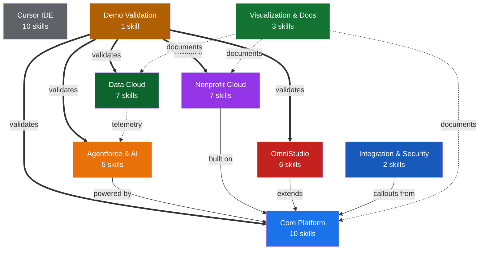
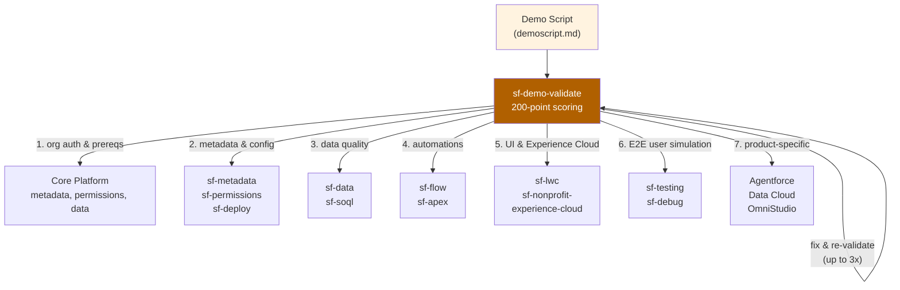
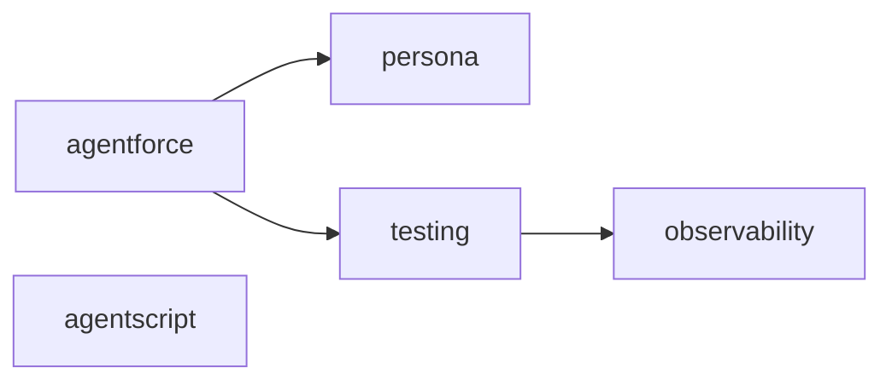
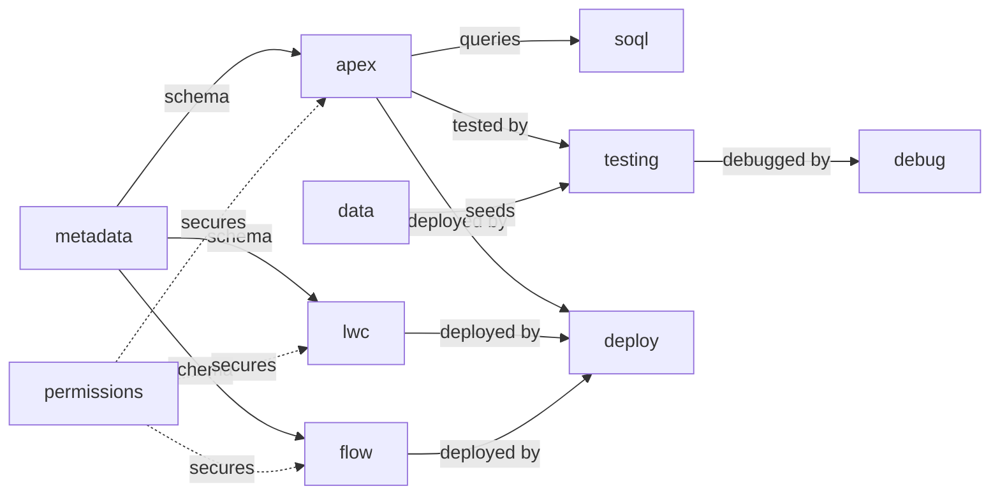
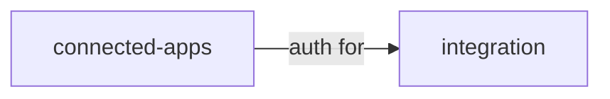
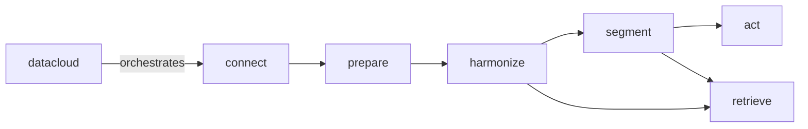
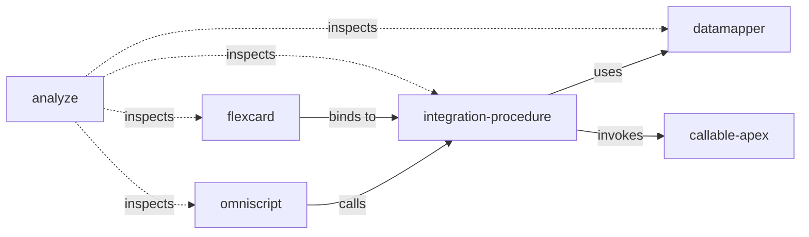
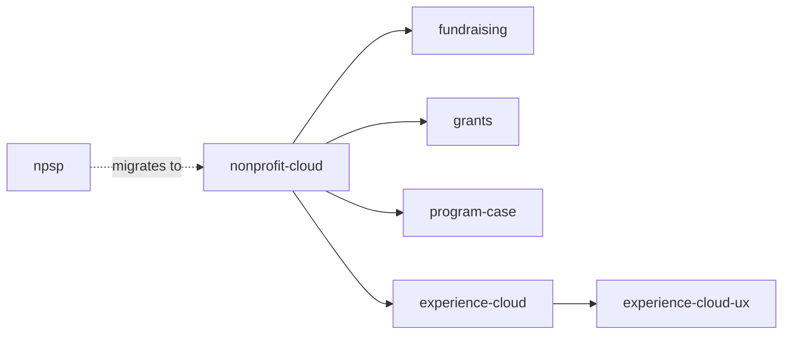

# NGO Salesforce Skills

**Author:** Brian Miller

A curated collection of Cursor Agent Skills I've built and maintain for Salesforce development on the Nonprofit Cloud platform. These skills encode my approach to Salesforce architecture, coding standards, and demo delivery into reusable instructions that give Cursor's AI agent deep, domain-specific knowledge -- so it can generate, review, and validate Salesforce metadata, code, and configuration the way I would, with minimal hand-holding.

## Getting Started

### Installation

Open Cursor and prompt the agent:

```
Clone https://github.com/brianmiller_sfemu/NGOsfskills.git into my
Cursor skills directory and set up all the skills so they're available
in my environment.
```

The agent will clone the repo, copy the skills into the right locations (`~/.cursor/skills/` and `~/.cursor/skills-cursor/`), and confirm they're active.

### Verify it works

Prompt with any trigger phrase to confirm a skill activates:

```
Write an Apex class that handles volunteer intake
```

If the `sf-apex` skill kicks in, you'll see the agent follow its 5-phase workflow and 150-point scoring rubric automatically.

### Updating

When you want the latest skills, prompt:

```
Pull the latest changes from the NGOsfskills repo and update my Cursor skills.
```

---

## Repository Structure

```
skills/                  # Salesforce-domain skills (41 skills)
skills-cursor/           # Cursor IDE workflow skills (10 skills)
```

## Architecture

The skills are organized into layered domains that mirror the Salesforce platform stack. The agent reads a user's prompt, matches it against each skill's trigger conditions, and activates the appropriate skill. Skills that share boundaries have explicit routing rules so only one fires at a time.

### Domain overview



> **Core Platform** is the foundation -- every other Salesforce domain depends on it. **Agentforce**, **Nonprofit Cloud**, and **OmniStudio** each extend Core with domain-specific capabilities. **Data Cloud** feeds telemetry into Agentforce observability. **Integration & Security** provides external connectivity via Apex callouts. **Demo Validation** sits above all domains as the capstone -- it reads a demo script, walks every step, and validates the entire stack end-to-end. **Visualization & Docs** and **Cursor IDE** are cross-cutting utilities.

### Demo Validation in the architecture

Demo Validation (`sf-demo-validate`) is the skill that ties everything together. It operates as an autonomous validation and repair loop that exercises every other domain:



The demo script (`demoscript.md`) is the source of truth. It defines the demo story -- the narrative, the personas, and the step-by-step walkthrough. `sf-demo-validate` reads this script and systematically validates that the org can deliver every step:

1. **Org connection & prerequisites** -- confirms `sf` CLI auth, org type, installed packages, and platform features (Person Accounts, Record Types, queues, etc.)
2. **Metadata & configuration** -- verifies custom objects, fields, page layouts, apps, and permission sets exist and are correctly configured
3. **Data quality & freshness** -- checks that demo data is complete, future-dated, free of stale artifacts, and correctly related
4. **Automations** -- validates Flows, triggers, and scheduled jobs fire as expected
5. **UI & Experience Cloud** -- HTTP-pings public sites, verifies guest and member portal pages render with live data
6. **End-to-end user simulation** -- executes transactional demo paths (form submissions, record creation) as specific demo personas via Anonymous Apex
7. **Product-specific checks** -- validates Agentforce agents, Data Cloud pipelines, OmniStudio components, and any other products referenced in the script

When a step fails, `sf-demo-validate` delegates the fix to the appropriate domain skill (e.g., `sf-apex` for code fixes, `sf-permissions` for access issues, `sf-data` for missing records), then re-validates -- looping up to 3 times before escalating. The result is a scored pass/fail report covering all 10 validation categories.

---

## Salesforce Skills (`skills/`)

### Agentforce & AI



| Skill | Description |
|---|---|
| **sf-ai-agentforce** | Build Agentforce agents via the Setup UI -- topics, actions, PromptTemplates, and `.genAiFunction` / `.genAiPlugin` metadata. |
| **sf-ai-agentforce-observability** | Extract and analyze Agentforce session traces (STDM data) from Data Cloud, including `.parquet` telemetry files. |
| **sf-ai-agentforce-persona** | Deep persona design for Agentforce agents with a 50-point scoring rubric covering identity, tone, voice, and register. |
| **sf-ai-agentforce-testing** | Dual-track testing workflow for Agentforce agents with 100-point scoring -- test specs, topic routing validation, and coverage analysis via `sf agent test`. |
| **sf-ai-agentscript** | Author deterministic Agentforce agents using the Agent Script DSL (`.agent` files) -- FSM-based state machines, slot filling, and instruction resolution. |

<details>
<summary><strong>Under the hood</strong></summary>

The Agentforce skills split agent development into two tracks -- **declarative** (Setup UI) and **programmatic** (Agent Script DSL) -- that never overlap.

- **sf-ai-agentforce** is the entry point. It owns the Setup UI workflow: creating topics, mapping actions to Apex/Flow invocables, authoring PromptTemplates, and generating `.genAiFunction` / `.genAiPlugin` metadata XML. It requires API v66.0+ (Spring '26). When the user needs to define the agent's personality, it hands off to **sf-ai-agentforce-persona**, which runs a 50-point scoring rubric across identity, tone, voice register, and guardrails.
- **sf-ai-agentforce-testing** takes over once the agent is built. It runs `sf agent test` with structured test specs that validate topic routing, action invocation, and response quality using a dual-track workflow (unit tests for individual topics + integration tests for multi-turn conversations). When tests fail or need deeper analysis, it delegates to **sf-ai-agentforce-observability**.
- **sf-ai-agentforce-observability** extracts STDM (Session Trace Data Model) data from Data Cloud, parses `.parquet` telemetry files, and produces session timeline analysis, step distribution reports, and message-level debugging. It includes Python scripts for auth, Data Cloud querying, and analysis.
- **sf-ai-agentscript** is fully independent -- it covers the code-first FSM approach using `.agent` files, slot filling, instruction resolution, and the `sf agent generate/publish` CLI. It never triggers alongside the Setup UI skill.

</details>

### Core Platform Development



| Skill | Description |
|---|---|
| **sf-apex** | Generate and review Apex classes, triggers, batch/queueable/schedulable jobs, and test classes with a 150-point scoring rubric. |
| **sf-lwc** | Lightning Web Components using the PICKLES methodology with 165-point scoring -- wire service, SLDS, Jest tests, and `.js-meta.xml` config. |
| **sf-flow** | Create and validate Salesforce Flows (record-triggered, screen, autolaunched, scheduled) and `.flow-meta.xml` files with 110-point scoring. |
| **sf-metadata** | Generate and query Salesforce metadata -- custom objects, fields, validation rules, and associated `-meta.xml` files with 120-point scoring. |
| **sf-soql** | SOQL/SOSL query generation, optimization, relationship queries, aggregates, and performance analysis with 100-point scoring. |
| **sf-testing** | Apex test execution, code coverage analysis, and test-fix loops with 120-point scoring for `*Test.cls` files. |
| **sf-debug** | Debug log analysis and troubleshooting -- governor limits, stack traces, and `.log` files with 100-point scoring. |
| **sf-deploy** | DevOps automation using `sf` CLI v2 -- metadata deploys, scratch orgs, sandboxes, and CI/CD pipelines. |
| **sf-data** | Salesforce data operations with 130-point scoring -- test data creation, bulk import/export, `sf data` CLI commands, and data factory patterns. |
| **sf-permissions** | Permission Set analysis, hierarchy visualization, and access auditing for `.permissionset-meta.xml` and `.permissionsetgroup-meta.xml`. |

<details>
<summary><strong>Under the hood</strong></summary>

Core Platform is 10 skills that mirror the Salesforce development lifecycle. They follow a build-test-debug-deploy loop:

- **sf-metadata** starts the cycle. It generates custom objects, fields, validation rules, and all `-meta.xml` files. Its output defines the schema that **sf-apex**, **sf-lwc**, and **sf-flow** build on top of.
- **sf-apex** generates and reviews Apex using a 5-phase workflow: (1) gather requirements, (2) scaffold structure, (3) generate code with a 150-point scoring rubric across 8 categories, (4) generate matching test class, (5) validate and deploy. It enforces SOLID principles, bulkification, governor limit awareness, and the Trigger Action Framework (TAF) pattern for triggers.
- **sf-lwc** uses the **PICKLES methodology** -- a structured architecture framework for component design. It scores across 8 categories up to 165 points, covering wire service patterns, SLDS 2 styling with dark mode support, Apex/GraphQL integration, event handling (CustomEvent, LMS, pubsub), lifecycle management, Jest testing, and WCAG accessibility.
- **sf-flow** creates Flow XML for all flow types (record-triggered, screen, autolaunched, scheduled) with 110-point scoring. It generates the full `.flow-meta.xml` and validates decision logic, loop patterns, and fault paths.
- **sf-soql** handles query generation separately from Apex. It optimizes relationship queries, aggregates, TYPEOF, and query plan analysis. It triggers on `.soql` files or when the user is purely focused on query construction.
- **sf-testing** runs Apex tests via `sf apex run test`, analyzes code coverage, and enters a test-fix loop: run tests, identify failures, fix code, re-run. It scores at 120 points and works with `*Test.cls` files.
- **sf-debug** takes over when tests fail unexpectedly. It parses debug logs, identifies governor limit issues, reads stack traces, and analyzes execution timing. It scores at 100 points.
- **sf-deploy** handles the deployment pipeline using `sf` CLI v2 -- metadata deploys, scratch org creation, sandbox management, and CI/CD pipeline configuration.
- **sf-data** manages data operations: test data factories, bulk import/export, `sf data` CLI commands, and JSON tree files for hierarchical data seeding.
- **sf-permissions** audits access. It answers "who has access to X?" by analyzing permission sets, permission set groups, and their hierarchies. It reads `.permissionset-meta.xml` files and can visualize the permission inheritance chain.

The routing rules ensure clean handoffs: Apex-only work stays in `sf-apex`, SOQL-only queries go to `sf-soql`, test execution goes to `sf-testing`, and deployment goes to `sf-deploy`. They never step on each other.

</details>

### Integration & Security



| Skill | Description |
|---|---|
| **sf-integration** | Integration architecture with 120-point scoring -- Named Credentials, External Services, REST/SOAP callouts, Platform Events, and CDC. |
| **sf-connected-apps** | Connected Apps and OAuth configuration with 120-point scoring -- OAuth flows, JWT bearer auth, and `.connectedApp-meta.xml` files. |

<details>
<summary><strong>Under the hood</strong></summary>

These two skills handle external connectivity as a pair:

- **sf-connected-apps** owns the authentication layer. It configures OAuth flows (Authorization Code, JWT Bearer, Client Credentials, Device Authorization, PKCE), generates `.connectedApp-meta.xml` and `.eca-meta.xml` (External Client App) metadata, and sets up certificate-based auth. It scores at 120 points and includes shell scripts for secure credential setup that prompt for API keys via `read -s` (never hardcoded).
- **sf-integration** owns everything after auth is established. It configures Named Credentials, External Credentials, External Services, and callout patterns (REST, SOAP, Platform Events, Change Data Capture). It includes metadata templates for named credential XML and scripts for CSP trusted site setup. It scores at 120 points.

The boundary is clear: Connected Apps handles "how do we authenticate?" and Integration handles "how do we call out?" When both are needed, Connected Apps runs first to establish auth, then Integration builds the callout layer on top.

</details>

### Data Cloud



| Skill | Description |
|---|---|
| **sf-datacloud** | Product orchestrator for the full Data Cloud lifecycle: connect, prepare, harmonize, segment, act. Routes to phase-specific skills. |
| **sf-datacloud-connect** | Data Cloud Connect phase -- manage connections, connectors, source objects, and database configuration. |
| **sf-datacloud-prepare** | Data Cloud Prepare phase -- data streams, DLOs, transforms, Document AI, and ingestion configuration. |
| **sf-datacloud-harmonize** | Data Cloud Harmonize phase -- DMOs, field mappings, relationships, identity resolution, and unified profiles. |
| **sf-datacloud-retrieve** | Data Cloud Retrieve phase -- SQL queries, async queries, vector search, search-index workflows, and metadata introspection. |
| **sf-datacloud-segment** | Data Cloud Segment phase -- segment creation, calculated insights, audience SQL, and membership analysis. |
| **sf-datacloud-act** | Data Cloud Act phase -- activations, activation targets, data actions, and downstream delivery. |

<details>
<summary><strong>Under the hood</strong></summary>

Data Cloud uses a **hub-and-spoke orchestrator pattern**. The orchestrator skill decides which phase-specific skill to invoke:

- **sf-datacloud** is the orchestrator. It doesn't execute commands itself -- it determines which phase the user's work falls into and routes accordingly. It also handles cross-phase concerns: data spaces, data kits, multi-phase pipeline setup, and troubleshooting that spans phases. It uses the external `sf data360` community CLI plugin as its runtime.
- The 5 pipeline phases execute in order: **Connect** (set up source systems and connectors) -> **Prepare** (create data streams, DLOs, transforms) -> **Harmonize** (map to DMOs, configure identity resolution, build unified profiles) -> **Segment** (create audiences, calculated insights) -> **Act** (activate segments to targets, configure data actions).
- **sf-datacloud-retrieve** is cross-cutting -- it serves Harmonize and Segment by providing Data Cloud SQL queries, async query execution, vector search, and metadata introspection. It's the "read" layer that any phase can call into.

Each phase skill uses `sf data360` subcommands specific to its domain. The orchestrator's job is to prevent the user from accidentally working in the wrong phase (e.g., trying to create segments before harmonization is complete).

</details>

### Industries / OmniStudio



| Skill | Description |
|---|---|
| **sf-industry-commoncore-callable-apex** | `System.Callable` class generation and review with 120-point scoring -- OmniStudio extensions, `VlocityOpenInterface` migration. |
| **sf-industry-commoncore-datamapper** | OmniStudio Data Mapper (formerly DataRaptor) creation -- Extract, Transform, Load, and Turbo Extract configurations with 100-point scoring. |
| **sf-industry-commoncore-flexcard** | OmniStudio FlexCard creation with 130-point scoring -- data source bindings, Integration Procedure wiring, and accessibility. |
| **sf-industry-commoncore-integration-procedure** | OmniStudio Integration Procedure orchestration with 110-point scoring -- Data Mapper steps, Remote Actions, and HTTP callouts. |
| **sf-industry-commoncore-omniscript** | OmniStudio OmniScript creation with 120-point scoring -- guided digital experiences, multi-step forms, and element configuration. |
| **sf-industry-commoncore-omnistudio-analyze** | Cross-cutting OmniStudio analysis -- namespace detection (Core vs vlocity_cmt vs vlocity_ins), dependency visualization, and impact analysis. |

<details>
<summary><strong>Under the hood</strong></summary>

OmniStudio skills mirror the component execution stack -- each skill owns one layer:

- **sf-industry-commoncore-omniscript** is the top of the stack. OmniScripts are the declarative equivalent of Screen Flows: multi-step, interactive guided experiences. The skill generates step flows, element configurations, and conditional branching. It scores at 120 points across 6 categories. When an OmniScript needs server-side logic, it calls down to an Integration Procedure.
- **sf-industry-commoncore-integration-procedure** owns server-side orchestration. Integration Procedures chain together Data Mapper actions, Remote Actions (Apex callouts), HTTP callouts, and conditional logic. It scores at 110 points. It delegates data access to Data Mappers and code execution to Callable Apex.
- **sf-industry-commoncore-datamapper** handles data access. Data Mappers (formerly DataRaptors) come in 4 types: Extract (read), Transform (reshape), Load (write), and Turbo Extract (high-performance read). The skill generates field mappings, filter conditions, and formula expressions. It scores at 100 points.
- **sf-industry-commoncore-callable-apex** generates `System.Callable` classes that Integration Procedures invoke. It handles migration from legacy `VlocityOpenInterface` / `VlocityOpenInterface2` patterns and scores at 120 points.
- **sf-industry-commoncore-flexcard** builds at-a-glance UI cards that bind to Integration Procedures as data sources. FlexCards are the read-only complement to OmniScripts (which are read-write). It scores at 130 points and enforces accessibility standards.
- **sf-industry-commoncore-omnistudio-analyze** is the cross-cutting inspector. It detects which namespace the org uses (Core OmniStudio vs `vlocity_cmt` vs `vlocity_ins`), maps dependencies across all component types, and produces impact analysis reports. It's the skill you use before refactoring to understand what will break.

The execution flow at runtime is: **OmniScript -> Integration Procedure -> Data Mapper / Callable Apex**. FlexCards follow the same backend path but for display-only use cases. The analyze skill sits outside this chain and inspects all of them.

</details>

### Nonprofit Cloud



| Skill | Description |
|---|---|
| **sf-nonprofit-cloud** | Nonprofit Cloud architecture, data model design, and NPSP migration guidance with 100-point scoring. |
| **sf-nonprofit-npsp** | NPSP managed package architecture with 120-point scoring -- Opportunity-based donations, Recurring Donations, Household Accounts, Affiliations, Customizable Rollups, Engagement Plans, and `npsp__`/`npe01__`/`npo02__` namespace objects. |
| **sf-nonprofit-experience-cloud** | Nonprofit Experience Cloud architecture with 120-point scoring -- donor/volunteer/client/grantee portals, sharing rules, and guest access. |
| **sf-nonprofit-experience-cloud-ux** | Nonprofit portal UX/UI design with 100-point scoring -- branding, navigation flows, responsive design, accessibility, and wireframes. |
| **sf-nonprofit-fundraising** | Fundraising architecture with 120-point scoring -- donor management, gift entry, campaigns, soft credits, recurring giving, and payment processing. |
| **sf-nonprofit-grants** | Grant management architecture with 110-point scoring -- applications, review workflows, disbursements, budgets, and compliance tracking. |
| **sf-nonprofit-program-case** | Program and case management architecture with 120-point scoring -- enrollment, service delivery, intake, outcome tracking, and referrals. |

<details>
<summary><strong>Under the hood</strong></summary>

The Nonprofit skills use a **platform-detection orchestrator** pattern with domain-specific sub-skills:

- **sf-nonprofit-cloud** is the orchestrator. Its first action is always to determine the platform: "Is this org running Nonprofit Cloud (NPC) or Nonprofit Success Pack (NPSP)?" It looks for signals -- Person Accounts and Gift Transactions mean NPC; Contact + Household Accounts and `npsp__` prefixed objects mean NPSP. Based on the answer, it routes to the correct sub-skill or provides cross-platform migration guidance. It scores at 100 points across 6 categories.
- **sf-nonprofit-npsp** handles legacy NPSP orgs. It knows the full managed package architecture: Opportunity-based donations, Recurring Donations (both legacy and Enhanced), Household Accounts, Affiliations, Customizable Rollups, GAU Allocations, Engagement Plans, Levels, and Address management. It also covers adjacent packages: Outbound Funds Module (`outfunds__`), Volunteers for Salesforce (`GW_Volunteers__`), and Program Management Module (`pmdm__`). It scores at 120 points.
- **sf-nonprofit-fundraising** owns donor management on NPC: gift entry, campaigns, soft credits, recurring giving, payment processing, and donor engagement strategies. It includes reference docs on the donor lifecycle and gift processing workflows.
- **sf-nonprofit-grants** covers the grantmaking pipeline: applications, review workflows, funding awards, disbursements, budgets, compliance tracking, and funder reporting. It includes reference docs on application pipelines and disbursement compliance.
- **sf-nonprofit-program-case** handles service delivery: program enrollment, case management, intake processes, outcome tracking, referral management, and wraparound services. It includes reference docs on enrollment patterns and case management workflows.
- **sf-nonprofit-experience-cloud** builds the portal layer: donor portals, volunteer portals, client portals, grantee portals using LWR or Aura sites. It configures sharing rules, guest access, and site membership. When the portal needs UX design work (branding, navigation, wireframes, responsive design), it hands off to **sf-nonprofit-experience-cloud-ux**.

The orchestrator prevents misrouting -- NPSP-specific questions never land in NPC skills and vice versa. Domain skills (fundraising, grants, program/case) are NPC-only; NPSP work stays in the dedicated NPSP skill.

</details>

### Visualization & Docs

| Skill | Description |
|---|---|
| **sf-diagram-mermaid** | Salesforce architecture diagrams using Mermaid (with ASCII fallback) -- ERDs, sequence diagrams, flowcharts, and class diagrams. |
| **sf-diagram-nanobananapro** | AI-powered image generation via Nano Banana Pro -- PNG/SVG output, UI mockups, wireframes, and visual ERDs. |
| **sf-docs** | Official Salesforce documentation retrieval from developer.salesforce.com and help.salesforce.com, with JS-heavy page extraction. |

<details>
<summary><strong>Under the hood</strong></summary>

These are cross-cutting utility skills that any domain can leverage:

- **sf-diagram-mermaid** generates architecture diagrams as Mermaid code that renders inline on GitHub. It includes a library of pre-built Salesforce diagram templates: OAuth flow sequence diagrams (Authorization Code, JWT Bearer, Client Credentials, Device Authorization, PKCE, Refresh Token), API integration sequences, ERDs, class diagrams, and flowcharts. When Mermaid isn't supported, it falls back to ASCII art.
- **sf-diagram-nanobananapro** uses AI image generation (Nano Banana Pro) to produce PNG/SVG output for UI mockups, wireframes, visual ERDs, and architecture diagrams that need richer visual fidelity than Mermaid can provide.
- **sf-docs** solves the problem of Salesforce documentation pages being JS-heavy and hard to extract. It provides guidance for reliably retrieving authoritative content from developer.salesforce.com and help.salesforce.com.

</details>

### Demo Validation

| Skill | Description |
|---|---|
| **sf-demo-validate** | Autonomous demo script validation and repair with 200-point scoring across 10 categories. Reads a `demoscript.md` that defines the demo story, personas, and step-by-step walkthrough, then validates the entire org can deliver it -- platform prereqs, metadata, data quality, permissions, automations, UI, Experience Cloud sites, and end-to-end user simulation. Delegates fixes to domain skills and re-validates in a loop (up to 3x). Supports Agentforce, Data Cloud, Slack, Marketing Cloud, Tableau/CRM Analytics, and OmniStudio. |

<details>
<summary><strong>Under the hood</strong></summary>

Demo Validation is the most complex skill in the collection. It orchestrates the entire skill ecosystem to guarantee a demo works end-to-end:

**The demoscript.md contract**: Every demo starts with a structured document that has 4 sections: (1) YAML frontmatter with org alias, org type, and required features/packages, (2) prerequisites listing data, users, and config that must exist, (3) ordered demo steps with action, expected outcome, and optional explicit check commands, (4) a cleanup section. The skill includes a [starter template](skills/sf-demo-validate/assets/demoscript-template.md) and a [full format spec](skills/sf-demo-validate/references/demoscript-format.md).

**The 10-category scoring rubric** (200 points total):
1. Org connection & auth (20 pts)
2. Platform prerequisites (20 pts)
3. Metadata & configuration (25 pts)
4. Data quality & freshness (25 pts)
5. Permission content validation (20 pts)
6. Automation verification (15 pts)
7. UI component validation (15 pts)
8. Experience Cloud sites (20 pts)
9. E2E user simulation (25 pts)
10. Product-specific checks (15 pts)

**The repair loop**: When a validation step fails, the skill doesn't just report the failure -- it diagnoses the root cause and delegates the fix to the appropriate domain skill. For example:
- Missing custom field -> delegates to `sf-metadata` to generate the field XML, then `sf-deploy` to push it
- Permission gap -> delegates to `sf-permissions` to identify the missing access, then generates the permission set update
- Stale demo data -> delegates to `sf-data` to re-seed with fresh, future-dated records
- Broken Flow -> delegates to `sf-flow` to analyze and repair the automation
- Experience Cloud 404 -> delegates to `sf-nonprofit-experience-cloud` to verify site config and guest access

After each fix, it re-validates that specific step. If it still fails, it tries again with a different strategy (up to 3 attempts). If all 3 fail, it escalates to the user with a detailed diagnosis.

**Visual and E2E validation**: The skill includes a [Playwright screenshot script](skills/sf-demo-validate/scripts/screenshot.js) for headless browser validation. It captures screenshots of Salesforce pages and Experience Cloud sites to visually verify the UI matches expected state. For transactional paths, it executes Anonymous Apex as specific demo personas to simulate the full user journey (e.g., submitting an intake form, signing up for a volunteer shift).

</details>

---

## Cursor IDE Skills (`skills-cursor/`)

| Skill | Description |
|---|---|
| **babysit** | Keep a PR merge-ready by triaging comments, resolving clear conflicts, and fixing CI in a loop. |
| **create-hook** | Create Cursor hooks -- `hooks.json` authoring and hook script automation around agent events. |
| **create-rule** | Create Cursor rules for persistent AI guidance -- coding standards, project conventions, and `RULE.md` files in `.cursor/rules/`. |
| **create-skill** | Author new Cursor Agent Skills -- skill structure, `SKILL.md` format, and best practices. |
| **create-subagent** | Create Cursor subagents for specialized task delegation. |
| **migrate-to-skills** | Migrate legacy Cursor configurations to the Skills format. |
| **shell** | Shell command execution specialist for terminal operations. |
| **statusline** | Configure a custom status line in the Cursor CLI -- session context above the prompt. |
| **update-cli-config** | View and modify Cursor CLI configuration in `cli-config.json` -- permissions, approval mode, sandbox, and display options. |
| **update-cursor-settings** | Modify Cursor/VSCode `settings.json` -- themes, fonts, formatting, keybindings, and editor preferences. |

<details>
<summary><strong>Under the hood</strong></summary>

Cursor IDE skills manage the agent's own environment and workflow:

- **create-skill** is the meta-skill -- it guides you through authoring new skills with proper `SKILL.md` structure, frontmatter, trigger/anti-trigger conditions, and scoring rubrics. Use it to extend this collection.
- **create-rule** generates persistent `.cursor/rules/RULE.md` files that apply coding standards and conventions automatically to every agent session in a project.
- **create-hook** sets up `hooks.json` and hook scripts that fire on agent events (pre-commit, post-edit, etc.) for automated quality gates.
- **create-subagent** creates specialized subagent configurations for task delegation.
- **migrate-to-skills** converts legacy Cursor configurations (old-style rules, prompts) into the modern Skills format.
- **babysit** is a PR maintenance loop: it triages review comments, resolves merge conflicts where the resolution is clear, and fixes CI failures -- keeping a PR merge-ready without manual intervention.
- **shell** provides a command execution specialist with best practices for terminal operations.
- **statusline** configures the CLI status bar with session context (current org, branch, etc.) displayed above the prompt.
- **update-cli-config** reads and writes `cli-config.json` for permissions, approval mode, sandbox settings, and display options.
- **update-cursor-settings** modifies `settings.json` for editor preferences -- themes, fonts, formatting, keybindings, and extensions.

</details>

---

## Usage

1. Clone this repository into your Cursor skills directory (typically `~/.cursor/skills/`).
2. Skills are automatically discovered by Cursor when their `SKILL.md` frontmatter matches the user's current task context.
3. Each skill contains a `SKILL.md` file with trigger conditions, scoring rubrics, and step-by-step instructions that guide the AI agent.

## Skill Anatomy

Every skill follows the same structure:

```
skill-name/
  SKILL.md          # Frontmatter (name, description, triggers) + detailed instructions
  [supporting files] # Templates, reference data, examples (varies by skill)
```

The `SKILL.md` frontmatter defines:
- **name** -- unique identifier
- **description** -- what the skill does and when it triggers
- **TRIGGER when** -- conditions that activate the skill
- **DO NOT TRIGGER when** -- conditions that should route to a different skill instead
